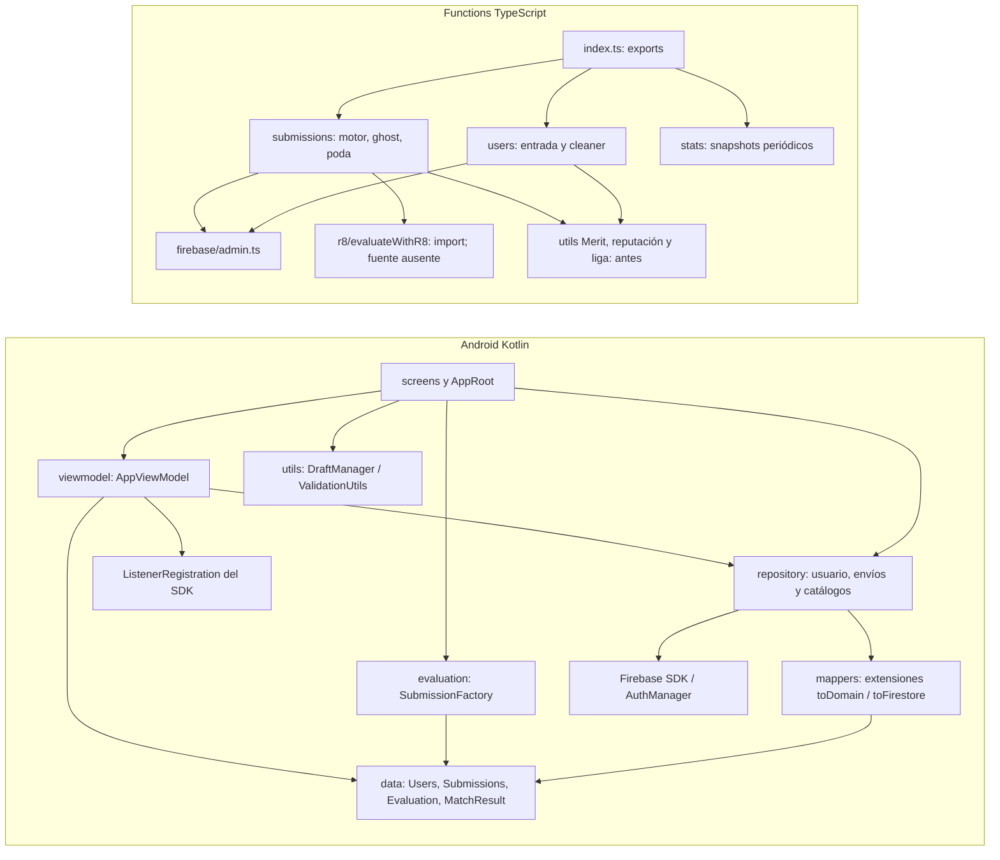
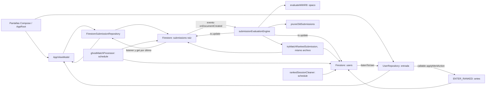
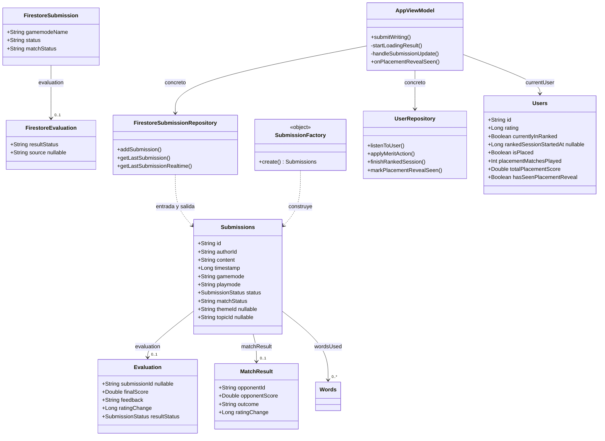
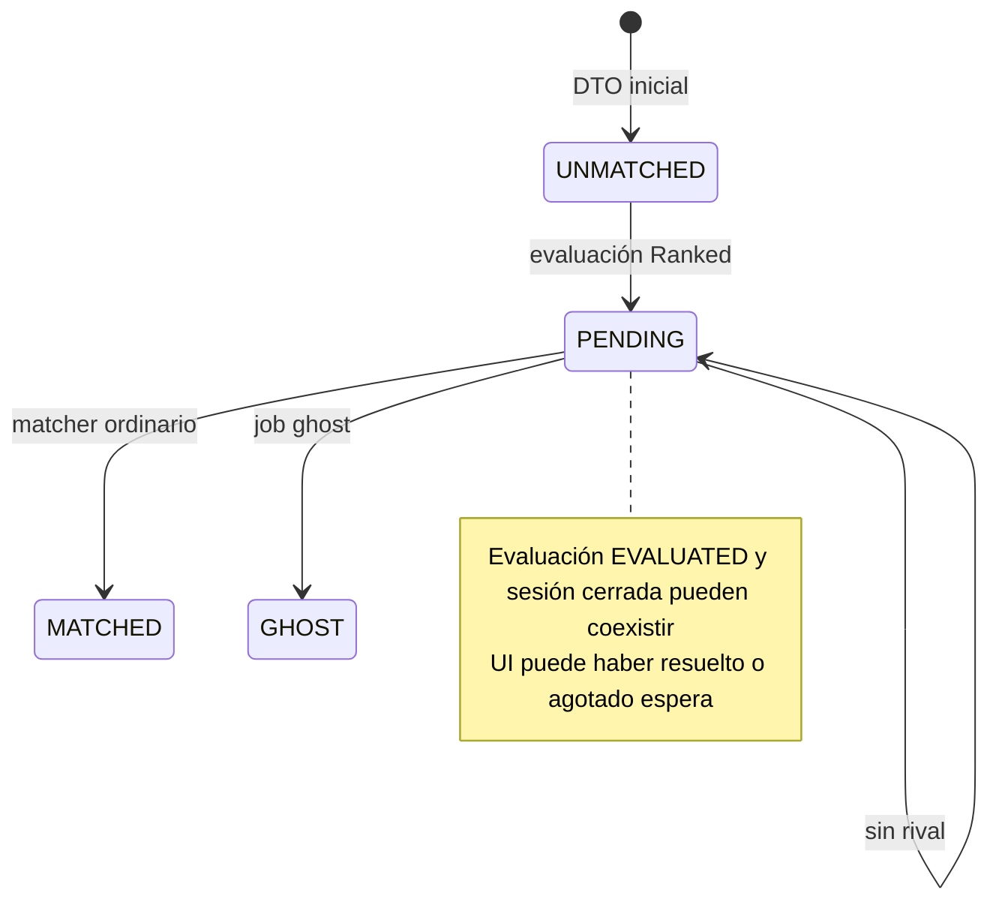
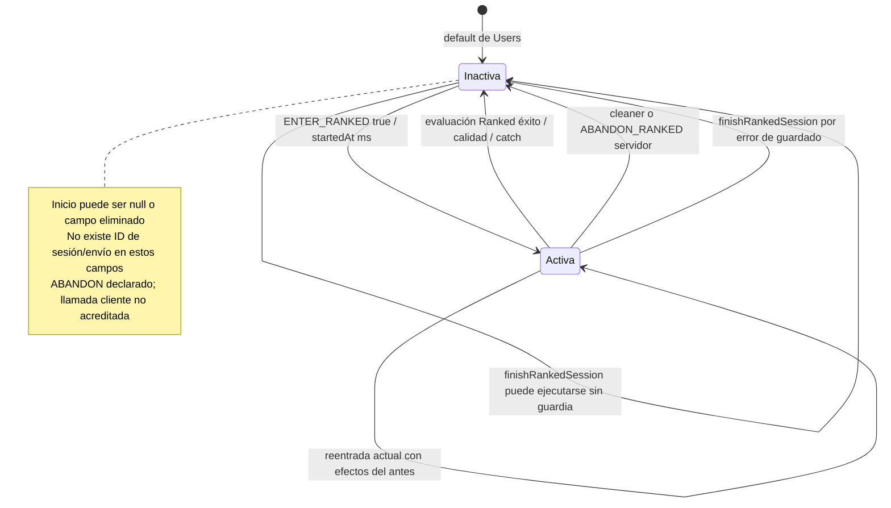
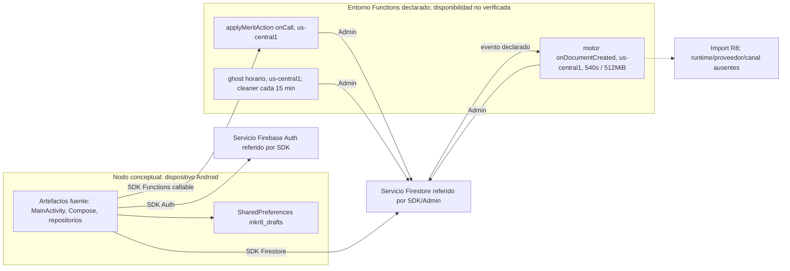

# Arquitectura actual y preparación guiada de UML — Inkr8

**Vigente FIN-002 — 09/10/2026:** cierre y entrega revisable documentados en
[FINAL_DELIVERY.md](FINAL_DELIVERY.md), con 6 Android PASS, reglas nuevas
propuestas y límites externos/académicos explícitos. Los estados inferiores son
antecedentes preservados; no revocan DEC-AI-AUTH-001, las decisiones respondidas
ni el permiso actual de publicar rama/PR, sin fusión o despliegue.

**Versión 0.1 · 04/10/2026 · America/Lima · chat 8, U12/DEC-20.** Documentación derivada con apoyo de Codex, **revisión y rediseño estudiantil pendientes**. [Registro DOC-008](evidence/DOC-008/record.md), [verificación documental](evidence/DOC-008/VERIFICATION.json), [citas y hashes](evidence/DOC-008/SOURCES.json).

Se preparan **12 vistas y 14 bloques Mermaid** para discutir la implementación existente y sus límites. La referencia es exclusivamente **C1 `64983846d6dbf4cdfafcdd508464cd140a2a862e`**, comprobada en copia auténtica, origin oficial y sin cambios. «Actual comprobado» significa lectura estática de esa versión; no ejecución, master remoto ni despliegue verificado. La representación sigue siendo un borrador asistido y selectivo.

## 1. Decisiones y autoridad del modelado

DECISIONS llega hasta DEC-19 antes de este encargo: no hay respuesta estudiantil ni elección registrada para DG-13/09/07/01. DOC-006/007 conservan consultas de aprendizaje sin respuesta. U12 autoriza este análisis y los borradores locales; **pasar al chat 8 no ratifica diagnóstico, patrones ni arquitectura**. Una eventual decisión humana posterior debe indicar autor, razón, fecha conocida y evidencia. Las [12 alternativas](DESIGN_ALTERNATIVES.md) continúan abiertas:

| Hipótesis / opciones | Revisión o elección humana registrada | Qué se representa aquí |
|---|---|---|
| DG-13; ALT-13-0/1/2, coordinación / extracción mínima / frontera con adaptación | Pendiente; SRP/DIP no acreditados como infracción definitiva | Motor actual, efectos, lecturas y transacción; comparación conceptual V12 |
| DG-09; ALT-09-0/1/2, pantalla / funciones mínimas / Strategy condicionada | Pendiente; modos diferentes no demuestran algoritmos intercambiables | Selector heredado y entrada actual; V05 deja reglas objetivo sin completar |
| DG-07; ALT-07-0/1/2, adaptación concreta / decisiones explícitas / DIP + Adapter condicionado | Pendiente; constructor concreto no demuestra inversión | Espera, repositorio, cuenta implícita y ListenerRegistration actuales |
| DG-01; ALT-01-0/1/2, validación local / extracción / Specification condicionada | Pendiente; repetición defensiva cliente-servidor puede ser necesaria | Evento del editor y borrador; sin reglas nuevas ni jerarquías futuras |

**Alcance AL vigente:** conservar escritura/evaluación, Practice, Ranked, rating, autenticación, perfil básico y persistencia/estados; retirar torneos, ligas, reputación y **Merit completo, moneda, ganancias y todos sus usos**, incluido pago Ranked. Temporadas se incorpora por HU 3.27/3.28 con reglas pendientes. D1 excluye detalle posterior de partida para revisar errores, penalización de abandono, ranking/posición global, leaderboard de liga y perfil ajeno desde leaderboard. Resultado inmediato/feedback, perfil propio y ranking/historial estacional tienen alcance distinto. Mostrar un componente retirado en C1 sólo documenta el antes; retirada no autoriza borrar sus datos.

**Tres estados documentales:** ACT = actual comprobado por lectura C1; BP = borrador provisional para discusión; DP = decisión humana pendiente. Se usa ACT sólo para hechos existentes; ninguna vista se presenta como arquitectura objetivo. Los riesgos de asociación, pérdidas y carreras son inferencias sin reproducción. Los **25 escenarios siguen sin ejecutar** y **ningún AC está cerrado íntegramente**. H1 recibido/Q-F resuelta; no se solicita otra copia.

## 2. Contraste directo con I1 y CT-15

Se inspeccionaron las copias disponibles y se comprobó igualdad de sus bytes con las entradas de I1.docx: [5.20](evidence/DOC-005/I1_image52.jpg), [5.22](evidence/DOC-005/I1_image29.jpg), [5.23](evidence/DOC-005/I1_image10.png). [FIGURES](evidence/DOC-005/FIGURES.json) fija rId63/65/66 y `word/media/image52.jpg`, `image29.jpg`, `image10.png`; no se inventan líneas para imágenes. [CT-15](CONTRACT_MATRIX.md#ct-15) organiza el contraste. M1 mantiene disponibilidad limitada: no se recuperó ni verificó aquí un editable o una revisión distinta.

| Antecedente exacto | C1 y responsabilidad/estado observado | Diferencia para revisar |
|---|---|---|
| 5.20, lifeline AppRoot y mensajes onAddSubmission, guardado, getUserById, espera realtime | E01/E05/E06/E07: AppRoot entrega callback a AppViewModel.submitWriting; onSuccess inicia startLoadingResult, sin getUserById en ese callback | Orquestación repartida; users se observa por otra vía. No copiar el orden histórico como garantía de llegada/reveal |
| 5.20, ramas de error a ErrorScreen | Guardado fallido: finishRankedSession y callback Toast; FAILED recibido: Screen.home. E06/E07/E09 | Separar rechazo local, fallo de persistencia, FAILED backend, conversión y timeout; no dibujar ErrorScreen como recorrido comprobado |
| 5.20, EVALUATED con PENDING y rama rival MATCHED; consulta última realtime | E05/E06/E11/E12: mantiene ejes separados; espera consulta último por authorId/timestamp | Coincidencia parcial. El histórico ya distinguía evaluación de match. Ni figura ni consulta acreditan que último sea el envío A esperado |
| 5.22, User/Submission singular, Evaluation 1:1 y Word 2..4 | E04: clases Kotlin Users/Submissions; evaluation y matchResult nullable; wordsUsed lista filtrada | Los nombres reales y la cardinalidad representable difieren. 2..4 palabras asignadas no garantiza 2..4 remitidas; no inferir relación BD desde referencia Kotlin |
| 5.22, User.rating/Evaluation.finalScore pero sin estados ni placement completos | E04/E06/E11: status, matchStatus, matchResult, placement, flags de sesión y espera separados | Añadir explicación de ejes a modelos actuales; el vacío de clases histórico no demuestra ausencia de estados en su secuencia |
| 5.23, users/userId/submissions y themes/themeId/topics | E05/E15: submissions/topics raíz, authorId/themeId como campos de consulta | Rutas distintas; no se prescribe anidación, migración ni eliminación de datos |
| 5.23, username/elo/rank/score frente a 5.22 name/rating/finalScore | E04: name/rating, evaluation.finalScore; rankLeaderboard heredado en evaluación | Incluso las figuras históricas usan vocabularios diferentes. Rating general, score y posición estacional no son intercambiables |
| 5.22/5.23, Tournament y economía; ausencia de contrato estacional completo | E11/E13/E16 y D1/U2/U3/H1: retiradas aprobadas y temporadas pendientes | No conservar esas funciones por aparecer en dibujos; stats periódicas no satisfacen HU 3.27/3.28 |

## 3. Vistas acotadas y su aporte

Mermaid es texto editable de apoyo. Sus flowcharts aproximan paquetes, componentes y despliegue mediante agrupación/etiquetas; **no son notación UML completa ni prueba automática del requisito CASE/especializada**. Clases, secuencias y estados también necesitan revisión de semántica/notación por estudiantes y traslado a los editables finales pertinentes. P1 §§2.3/2.4/2.7 exige juicio, rediseño y explicación humanos; P2 §1.2.4 exige diagramas y fuentes editables elaboradas con herramienta CASE/especializada. P4 §§6.7–6.9 pide paquetes o componentes y clases, componentes UML y despliegue UML; §8.1.2.5 exige mensajes → clases/métodos → código. [Reglas](PROFESSOR_REQUIREMENTS.md), [IA-07/TR-09–11/EN-04](ACADEMIC_COMPLIANCE_MATRIX.md), [extracción directa P4](evidence/DOC-008/P4_EXTRACTS.json).

<a id="v01"></a>

### V01 — Paquetes y dependencias de fuente actuales

**ACT; representación BP selectiva.** Explica ubicación de responsabilidades y dependencia concreta, sin asignar Clean Architecture, MVC u otro estilo. Flecha = uso/importación, no herencia ni llamada de red. Se omiten rutas ajenas a los recorridos, sin declarar un inventario completo. E01–E06/E08–E16.



Aquí no se fija qué dependencias se invertirían. V12 compara sus motivos; recibir repositorio concreto no acredita DIP. Las utilidades retiradas explican dependencia actual, no selección futura.

<a id="v02"></a>

### V02 — Componentes que colaboran en ejecución declarada

**ACT por llamadas/configuración de fuente; representación BP.** Explica quién escribe y quién reacciona. Las flechas no implican una transacción común entre móvil/backend, ni disponibilidad/despliegue comprobados. E05–E16.



La independencia de listeners y trabajos permite discutir orden, repetición, lectura obsoleta y retención. Usar tx no demuestra idempotencia: sus lecturas se precisan en V06–V08. No se dibuja BD futura ni frontera técnica elegida.

<a id="v03"></a>

### V03 — Clases y tipos principales existentes

**ACT; proyección BP de campos/métodos relevantes.** Clases Kotlin con nombres literales; funciones Compose, extensiones y exports TS se mantienen como funciones en las otras vistas. Asociación = referencia de objeto, no clave foránea ni relación nueva de BD. `authorId` y `opponentId` son strings; no se dibujan como asociaciones referenciales garantizadas. E02–E06/E09/E14.



La ausencia gráfica de Merit/reputación/torneos no significa que C1 los haya eliminado: E04 conserva esos campos; se omiten para legibilidad. `Evaluation.metrics/isMock/rankLeaderboard/meritEarned`, otros campos Users y `matchResult` Map del DTO tampoco se modelan exhaustivamente. Los mappers son extensiones de archivo, no métodos miembro de una clase inventada SubmissionMapper. Gamemode/playmode persistidos son strings y `matchStatus` no es enum Kotlin aquí. E15 enlaza sus definiciones y catálogo sin imponer asociaciones nuevas.

<a id="v04"></a>

### V04 — Construcción, persistencia, espera y resultado inmediato

**ACT; secuencia BP del núcleo Practice/Ranked.** Explica la identidad A que se crea/escribe y la consulta que puede devolver L distinto de A. No se promete correlación inexistente. Los mensajes M01–M09 se trazan en §5. La evaluación puede avanzar antes o después del callback de persistencia; V06 detalla su trabajo independiente. E01–E07/E14.

```mermaid
sequenceDiagram
  actor U as Usuario
  participant W as Writing
  participant F as SubmissionFactory
  participant D as DraftManager
  participant A as AppRoot
  participant V as AppViewModel
  participant R as FirestoreSubmissionRepository
  participant DB as Firestore
  U->>W: Submit; validación local
  W->>F: M01 create(texto, modo, palabras usadas, IDs)
  F-->>W: Submissions A; UUID; PENDING; evaluation null
  W->>D: M02 clearDraft(context, draftKey)
  Note over W,D: Antes de confirmar persistencia; luego userText se vacía
  W->>A: M03 onAddSubmission(A)
  A->>V: M03 submitWriting(A, onError)
  V->>R: M04 addSubmission(A con currentUser.id)
  R->>DB: M04 toFirestore; submissions/A.id.set(DTO)
  Note over DB,V: Creación activa evaluación V06; orden con onSuccess no garantizado
  alt Fallo de persistencia
    R-->>V: M05 onError(e)
    V->>DB: M05 finishRankedSession(currentUser.id), vía UserRepository
    V-->>A: M05 onError; Toast
  else Callback de éxito
    R-->>V: M05 onSuccess() sin ID
    V->>V: M06 startLoadingResult(); Screen.loading
    V->>R: M06 getLastSubmissionRealtime(callback)
    R->>DB: M07 authorId auth.uid; timestamp DESC; limit 1
    loop Sondeo mientras sin resolved ni timeout
      V->>V: M09 delay 3s; incrementar elapsed nominal
      alt elapsed mayor que 90 nominal
        V->>V: M09 loadingTimeout=true; terminar sondeo
      else Todavía dentro de espera nominal
        V->>R: M07 getLastSubmission()
        R->>DB: M07 misma consulta por último
        DB-->>R: Documento L; copy(id=doc.id); toDomain
        R-->>V: M08 handleSubmissionUpdate(L)
        alt EVALUATED y espera activa
          V->>V: M09 latestSubmission=L; resolved=true
          V-->>A: M09 navigateTo(results o placementReveal)
        else FAILED y espera activa
          V-->>A: M09 resolved=true; navigateTo(home)
        end
      end
    end
    Note over R,V: Listener también usa M08; después de resolved/timeout se ignoran updates
  end
```

El loop simplifica dos fuentes independientes: el listener entrega callbacks fuera del sondeo. El chequeo de timeout ocurre **antes** de consultar en la iteración 31, a 93 s nominal; no después de procesar un resultado. M09 resume ramas, no fija duración real. Results usa latestSubmission; el reveal depende del listener users y `previousUserIsPlaced`. Un match tardío puede modificar el documento sin refrescar ese objeto. Error de consulta imprime stacktrace; conversiones desconocidas tienen tratamiento desigual, no una rama uniforme inventada. Revisión: demostrar A.id = documento = evaluation.submissionId = resultado visible o reproducir diferencia A/B; RC-02/03/04/05 no se resuelve con el dibujo.

<a id="v05"></a>

### V05 — Ranked: recorrido heredado y discusión después de retiradas

**Primera secuencia ACT/BP; segunda BP con DP.** El antes explica dependencias que no pueden borrarse enteras sin analizar sesión/auth. La segunda sólo delimita responsabilidades y puntos de discusión; no define callable sustituto, clases, BD, algoritmos o nueva API. E08–E11/E14/E15.

```mermaid
sequenceDiagram
  actor U as Usuario
  participant C as Competitions
  participant R as UserRepository
  participant I as applyMeritAction
  participant DB as Firestore
  C->>C: M10 LaunchedEffect: liga, azar, catálogo, fallback
  U->>C: Enter
  C->>C: M11 comprobar Merit frente a entryCost
  C->>R: M11 applyMeritAction(ENTER_RANKED)
  R->>I: M12 getHttpsCallable.call(action)
  I->>I: M12 auth.uid y action requeridos
  I->>DB: M13 runTransaction: get usuario; contar Ranked desde 00 UTC
  Note over I,DB: Antes: rechaza >=5; fallo conteo conserva 0; sesión previa altera reputación/rachas
  I->>DB: M13 tx.update: cobro, currentlyInRanked=true, startedAt
  I-->>R: M14 updatedFields
  R-->>C: M14 onSuccess o onError
  C-->>U: M14 onNavigateToWriting o Toast
  Note over DB,U: Cierre actual: evaluación/error/cleaner; Back navega sin ABANDON en callback leído
```

```mermaid
sequenceDiagram
  actor U as Usuario
  participant P as Presentación del núcleo, responsabilidad conceptual
  participant B as Admisión y sesión, responsabilidad conceptual
  Note over P,B: BP: no son clases futuras ni mensajes implementados
  U->>P: Elegir Ranked On-Topic conforme a HU 3.13
  Note over U,P: DP Q-R: oferta Standard, catálogo/fallback y restricciones pendientes
  P->>B: Solicitar entrada con cuenta/contexto; operación por decidir
  Note over P,B: AL: sin liga, Merit, reputación ni castigo; auth y soporte de sesión conservados
  Note over B: DP Q-R: límites, conteo/error, reentrada, causas y momento de cierre
  B-->>P: Respuesta de admisión por definir con aceptación
  Note over P,B: Evaluación y cierre requieren correlación; un evento viejo no demuestra cierre válido de sesión nueva
  Note over U,B: Q-D: reanudar/conservar borrador e históricos; no se prescribe borrado ni conversión
```

La segunda no acredita implementación de HU 3.13 ni decide el resto de Q-R. Los nombres genéricos designan responsabilidades que el estudiante debe ubicar o descartar en alternativas ALT-09/07/13. Cierre/limpieza no equivale a abandono penalizado; retirar el cobro no decide el límite de cinco ni UTC. Evaluación A después de entrada B, error Practice con Ranked activo y cleaner concurrente son intercalaciones pendientes, no garantías dibujadas.

<a id="v06"></a>

### V06 — Evaluación, placement y efectos de usuario

**ACT/BP; R8 opaco.** Sólo se conoce llamada y campos consumidos; no implementación, esquema completo ni resultado real R8. Se dibuja camino principal y error, omitiendo logs/retornos sin snapshot/TOURNAMENT. E10/E11/E16.

```mermaid
sequenceDiagram
  participant DB as Firestore
  participant E as submissionEvaluationEngine
  participant R as evaluateWithR8, fuente ausente
  DB-)E: M15 onDocumentCreated(submissions/A.id)
  E->>E: M16 autor, status PENDING, calidad; requiredWords de wordsUsed
  E->>DB: M16 conteo diario y usuario para contexto, fuera de tx
  E->>R: M17 evaluateWithR8(content, gamemode, requiredWords, nombres, contexto)
  R-->>E: M17 finalScore, feedback, source accedidos; respuesta real sin verificar
  E->>DB: M18 runTransaction; tx.get(users/authorId)
  Note over E,DB: No se relee submission actual dentro de esta tx
  alt Ranked y usuario no placed
    E->>E: M19 incrementar evaluaciones y totalPlacementScore
    Note over E: >=6: promedio total/6; rating inicial min(120,floor(promedio/100*120))
  end
  E->>DB: M20 tx.update envío: evaluation, EVALUATED, match PENDING o UNMATCHED
  E->>DB: M20 tx.update usuario: métricas, placement y cierre Ranked; economía del antes
  Note over E,DB: Merit/reputación/ligas retirados del objetivo; aquí siguen en C1
  opt Ranked
    E-)E: M21 tryMatchRankedSubmission(A.id,...), catch de log
  end
  E-)E: M22 pruneOldSubmissions(authorId), catch de log
  Note over E,DB: Calidad/catch: FAILED y cierre Ranked; missing author: FAILED sin ese cierre
```

Placement contabiliza **evaluaciones**, no seis duelos MATCHED. `evaluation.ratingChange` inicial puede ser rating inicial; después se sobrescribe con delta de duelo. `users.rating` se actualiza en placement/matcher/ghost por caminos diferentes. La fórmula, seis y métricas son HE, sin aceptación funcional ratificada. DTO envía gamemodeName e IDs, pero M17 lee gamemode y nombres; REQUIRED deriva de sólo palabras usadas. R8 ausente impide completar el contrato o predecir score. No se interpreta error de R8 como timeout local.

La tx lee usuario y escribe envío/usuario; no garantiza unicidad de efectos frente a evento repetido con snapshot antiguo PENDING. Stats de ligas fuera de tx, match y poda no awaited no forman una sola operación atómica. Retención puede retirar un envío todavía requerido por ghost/lectores: RC-08/09/10 necesitan comprobación independiente.

<a id="v07"></a>

### V07 — Match ordinario y actualización de rating

**ACT/BP.** Separa consulta de elegibilidad, comparación y escrituras. E11/E12. Las lifelines son funciones/SDK, no clases TS futuras.

```mermaid
sequenceDiagram
  participant E as submissionEvaluationEngine
  participant M as tryMatchRankedSubmission
  participant DB as Firestore
  E-)M: M21 A.id, autor, score, rating y nombre
  M->>DB: M23 candidatos Ranked EVALUATED/PENDING; timestamp >= ahora-48h
  M->>DB: M23 usuario candidato; autor distinto; distancia rating <=20
  M->>M: M24 comparar score; empate por igualdad
  M->>DB: M25 runTransaction; tx.get ambos usuarios
  Note over M,DB: Envíos candidatos no se releen en tx; query no filtra gamemode/tema
  M->>M: M24 calculateDynamicRatingChange para cada usuario
  M->>DB: M25 ambos envíos MATCHED; matchResult y evaluation.ratingChange
  opt Usuario isPlaced
    M->>DB: M25 rating=max(0,actual+delta); rachas de resultado
  end
  Note over M,DB: Sin candidato: M26 matchStatus=PENDING; liga/metadata del antes siguen aparte
```

El filtro ±20 usa ratings obtenidos antes de tx; delta usa ratings releídos dentro. `matchResult.opponentId` identifica autor rival, no su submission; no inventar asociación 1:1 a otro envío. Ambas submissions reciben delta aun si el usuario no placed no recibe variación en users.rating. La fórmula actual distingue WIN/LOSS/DRAW y tramos; su existencia no ratifica Q-R ni define rating de temporada. Dos triggers que eligen el mismo candidato y match/ghost al borde de 48 h requieren verificar estados y número de efectos; la tx no acredita exclusión de esos eventos por sí sola.

<a id="v08"></a>

### V08 — Ghost y rating tardío

**ACT/BP.** Explica fallback de resolución competitiva, separado de evaluación, sesión y espera. E13/E11/E16.

```mermaid
sequenceDiagram
  participant S as Scheduler declarado
  participant G as ghostMatchProcessor
  participant DB as Firestore
  S-)G: M27 every 1 hours
  G->>DB: M28 hasta 50 Ranked EVALUATED/PENDING; timestamp <= ahora-48h
  G->>DB: M29 usuario y recentScores, fuera de tx
  G->>G: M30 promedio ultimos 10 si >=3; si no benchmark 65
  G->>G: M30 margen +/-2; WIN +2, LOSS -4, DRAW +1
  G->>DB: M31 runTransaction; update envío GHOST, matchResult y delta
  opt isPlaced leído fuera de tx
    G->>DB: M31 rating=max(0,rating leído+delta); ligas del antes
  end
  Note over G,DB: Callback tx sin tx.get usuario/envío; rachas no se actualizan aquí
```

H1 confirma intención de comparar contra promedio propio tras 48 h, pero no benchmark 65, población, tamaño/margen/deltas. recentScores puede incluir el propio envío y otros productores históricos. Job horario/lote no garantiza resolver exactamente a 48 h; timestamp es del cliente, no evaluatedAt. No se dibuja ghost como cierre de temporada ni cancelación de la evaluación. Match ordinario usa ≥cutoff y ghost ≤cutoff: ambos incluyen igualdad; carrera/repetición y sobrescritura de rating leído fuera son RI sin reproducción.

<a id="v09"></a>

### V09 — Ejes persistidos de evaluación y match

**ACT/BP; transiciones principales, sin garantía de terminalidad ante repetición.** E04/E11–E13. Dos diagramas separados evitan combinar toda la aplicación en un único estado.

```mermaid
stateDiagram-v2
  [*] --> PENDING: Factory / DTO
  PENDING --> EVALUATED: evaluación exitosa
  PENDING --> FAILED: autor ausente / calidad / catch
  state NOT_EVALUABLE
  note right of NOT_EVALUABLE
    Enum existente; sin productor identificado en este motor
  end note
  note right of EVALUATED
    Practice puede seguir UNMATCHED
    Ranked pasa matchStatus a PENDING
  end note
```



No hay transición probada NOT_EVALUABLE→FAILED ni reevaluación por actualizar PENDING. Un catch posterior a escrituras exitosas, entrega repetida o carrera requiere estudiar la ejecución; estos borradores no declaran EVALUATED/MATCHED/GHOST inmutables. Retención/borrado no se dibuja como estado funcional autorizado. La lectura de status inválido→PENDING tampoco constituye una transición de backend.

<a id="v10"></a>

### V10 — Sesión Ranked y espera local

**ACT/BP; nombres Activa/Inactiva y Esperando/Resuelta/Timeout son proyecciones de campos, no enums ni clases.** E06/E09–E11/E14. Autenticación Firebase es otro eje: cerrar auth no equivale a completar Ranked.

```mermaid
stateDiagram-v2
  [*] --> Esperando: startLoadingResult reinicia flags
  Esperando --> Resuelta: EVALUATED o FAILED
  Esperando --> Timeout: elapsed nominal mayor que 90
  Resuelta --> Esperando: nueva espera
  Timeout --> Esperando: nueva espera
  note right of Resuelta
    EVALUATED: Results o reveal; FAILED: Home
    Handler ignora actualizaciones posteriores
  end note
  note right of Timeout
    No escribe FAILED ni cancela backend
    Listener se retira al reiniciar o onCleared
  end note
```





Para sesión faltan reglas objetivo Q-R y correlación de cierres: un evento A antiguo puede escribir sobre el usuario después de abrir B. Para espera, cancelación/remoción del listener termina observación local; no demuestra cancelación del trabajo remoto. Placement usa otro listener; su orden modifica la ruta de reveal. No dibujar una derrota o reducción de rating por abandono en el objetivo: D1 la excluye.

<a id="v11"></a>

### V11 — Despliegue hasta lo declarado por fuentes

**ACT de declaraciones; BP parcial, despliegue real sin verificar.** E17/E11/E13/E10. Dispositivo Android, SDK Firebase Auth/Firestore/Functions y Admin se identifican por código; MainActivity se declara en manifest. `us-central1` está declarado en motor/entrada/ghost, no acredita ubicación de la BD, del cleaner ni de todo el producto.



No se fija APK/build exitoso, proyecto/instancia Firebase, reglas, IAM, índices operativos, endpoints/protocolos concretos de transporte, topología de red, SLA o versiones SDK. C1 carece de configuración Android/Functions/Firebase y fuente R8 necesarias para reproducibilidad. `OPENAI_API_KEY` es una dependencia secret declarada; no se consultó valor ni se puede deducir una llamada/proveedor/modelo desplegado sin R8. El [baseline](TESTING_BASELINE.md) sólo describe ejecución JVM histórica. Recuperar fuentes auténticas; no reconstruir configuración ni evaluador desde el diagrama.

<a id="v12"></a>

### V12 — Opciones conceptuales de evolución, sin solución completa

**BP y DP.** Comparación de responsabilidades/dependencias; no clases o relaciones futuras. Cada terna mantiene las alternativas de chat 7, incluso la posibilidad de conservar organización. Corrección contractual, retirada/incorporación y refactorización que conserva comportamiento se justifican por separado.

| Candidato y opciones | Frontera conceptual que se podría discutir | Lo que no resuelve; argumento estudiantil necesario |
|---|---|---|
| ALT-13-0/1/2 | Coordinación central actual / separar cálculos conservados de escrituras / aislar necesidades del evaluador/persistencia con adaptación si existe contrato útil | Demostrar razones independientes de cambio tras retiradas y coherencia de tx; R8/RC-01/08/09/10 pendientes. No partir transacciones ni inventar API por dibujar frontera |
| ALT-09-0/1/2 | Pantalla coordina / separar selección, carga y petición de entrada / políticas intercambiables sólo con variación real | Q-R determina regla; Strategy no elige Standard/fallback, ni justifica conservar liga/azar. Defender mínima frente a conservación; demostrar dos políticas vigentes si se considera Strategy |
| ALT-07-0/1/2 | Adaptación concreta existente / distinguir decisiones de espera de registro/cancelación / dependencia hacia necesidad pequeña del consumidor y adaptación de infraestructura | Explicar qué escenario A/B/error/tardío se aísla, dirección de dependencia y coste. Mantener consulta por último seguiría dejando RC-02. Doble no valida Firebase |
| ALT-01-0/1/2 | Respuesta local y validación servidor / decisiones reutilizables con utilidades actuales / composición de criterios sólo si se necesita | Distinguir admisibilidad/cumplimiento y qué conoce R8. Specification no recupera palabras filtradas ni contexto y no decide borrador. Justificar composición real o descartar |

RC-01–RC-10 siguen aplicando a **todas** las opciones: identidad y contexto; errores; borrador; sesión; tardíos; concurrencia; placement/rating y retención. Poda sigue siendo operación observada, sin permiso de ejecución o borrado. Temporadas exige DP Q-T/Q-D; no se definen seasonId, colecciones, relaciones, reset, calendario, desempate o jobs futuros. Una responsabilidad conceptual de «considerar pertenencia y cierre» sólo enumera preguntas para el equipo, no introduce componente estacional ni transforma stats en temporadas.

## 4. Matriz de trazabilidad de vistas

Cada fila tiene los nueve campos solicitados. E01–E17 se expanden en §6 con ruta completa, líneas y C1; I1 usa figura/entrada interna. HU/AC/S se enlazan a [aceptación y catálogo](ACCEPTANCE_MATRIX.md) y [H1 por hoja/celda](evidence/DOC-004_BACKLOG_RECOVERY.md). S son propuestas sin ejecución; ACT de «actual comprobado» en la leyenda no cambia el estado de los criterios AC-01–07.

| Vista / propósito | Estado | HU / AC / escenarios / CT | Componentes, mensajes y métodos existentes | Evidencia exacta | Responsabilidades y dependencias observadas | Diferencias históricas | Impacto de alternativas abiertas | Verificación, pendientes y argumento estudiantil |
|---|---|---|---|---|---|---|---|---|
| **V01** paquetes; localizar dependencia de fuente | ACT; representación BP | HU 2.1–2.4, 3.7–3.16; AC-01/02/03/07; S01–S11/S20/S22; CT-01–06/09/12/14/15 | Writing, Factory, VM, repositorios, mappers, motor, imports; M01–M22 | [E01](#e01)–[E06](#e06), [E08](#e08)–[E17](#e17), I1 5.22 | UI/VM usan concretos; repositorios traducen; motor coordina y delega parcialmente | 5.22 no representa esta dependencia concreta ni exports TS | ALT-01/07/09/13, RC todas | Distinguir uso, llamada y asociación; defender cohesión o razón separable sin etiquetar estilo final |
| **V02** componentes; identificar escritores/eventos | ACT por fuente; BP | HU 2.3/2.4, 3.7–3.12; AC-02/03/07; S04–S10/S20; CT-04–13/15 | Repos/SDK, motor/matcher/ghost/cleaner/poda; M04–M31 | [E05](#e05)–[E16](#e16), I1 5.20/5.23 | Callbacks, evento creación, jobs y tx separados; users compartido | AppViewModel y trabajos tardíos amplían responsables del histórico | ALT-13/07; RC-02/05–10 | Recuperar entorno y verificar orden/repetición; explicar qué lectura protege cada tx |
| **V03** clases; tipos y referencias | ACT; proyección BP | HU 2.2–2.4, 1.9/1.10, 3.8–3.12; AC-03/07; S08–S11/S20/S22; CT-01–05/10–15 | Users/Submissions/Evaluation/MatchResult/DTO, Factory/VM/Repos; M01/04/08/19/25 | [E02](#e02)–[E06](#e06), [E09](#e09), [E14](#e14), I1 5.22/5.23 | Objetos nullable; strings de identidad/estado; extensiones de conversión | 1:1 evaluation y 2..4 words históricos no describen todos los payloads actuales | ALT-01/07/13; RC-01/03/09 | Fixtures nulos/desconocidos; explicar referencia Kotlin frente a ruta/relación BD; Q-D |
| **V04** envío A, persistencia, espera y resultado | ACT; BP del recorrido | HU 2.2–2.4, 3.14–3.16, 1.7/1.11; AC-03/07; S03/S07–S10/S20/S22/S23; CT-01–06/10/11/14/15 | M01–M09; Writing/Factory/Draft/AppRoot/VM/Repo | [E01](#e01)–[E07](#e07), [E14](#e14); I1 5.20 | Crea A, persiste A, consulta L; callback éxito sin ID; UI resuelve por status | Orquestación VM, Toast/Home, borrador y sondeo visibles | ALT-01/07, RC-01–05/07/09 | A/B/orden/cuenta/errores/tardíos; Q-R/Q-D/R8; estudiante sigue el mismo ID en todas las fronteras |
| **V05** selección, entrada y cierre tras retiradas | Antes ACT/BP; después BP/DP | HU 3.7 sin economía, 3.13–3.16, 1.3/1.4; AC-01/02/07; S01–S07/S22; CT-01/02/09/12/14/15 | Antes M10–M14; Comp/UserRepo/callable. Después responsabilidades sin método implementado | [E08](#e08)–[E11](#e11), [E14](#e14)/[E15](#e15); H1-C E27/E29/E53/E55 | UI elige y bloquea económicamente; servidor auth/conteo/estado; cierres por usuario | Modelos históricos incluyen retiradas; no especifican selector objetivo | ALT-09/07/13, RC-01/06/07 | Q-R límite/UTC/error/reentrada/cierre/Standard; Q-C registro; Q-D borrador. Explicar qué retira y qué conserva cada causa |
| **V06** evaluación, placement, cierre y persistencia | ACT/BP; R8 ausente | HU 2.3/2.4, 3.8–3.12; placement sin HU propia; AC-02/03/07; S07–S10/S20; CT-01–05/09–13 | M15–M22; callback motor, R8, runTransaction/prune/matcher | [E10](#e10)/[E11](#e11)/[E16](#e16), I1 5.20/5.22 | Contexto externo; tx lee user; placement precede match; cierre Ranked | Añade contador/reveal y múltiples efectos no completos en clases I1 | ALT-13/01, RC-01/03/06–10 | R8 auténtico, sexta evaluación, evento repetido; Q-R/Q-D; explicar rating inicial frente a delta y alcance transaccional |
| **V07** match ordinario y rating | ACT/BP | HU 3.8–3.12; AC-03/06; S09/S10/S18/S19; CT-07/10/11/12 | M21/M23–M26; tryMatchRankedSubmission/calculateDynamicRatingChange/SDK | [E11](#e11)/[E12](#e12), I1 5.20 | Elegibilidad fuera tx; users dentro; escribe dos envíos y rating placed | Coincide MATCHED separado; precisa consultas, identidad rival y tx | ALT-13, RC-08/09/10 | Dos autores/un rival, repetición, delta aplicado/no placed; Q-R/Q-T; demostrar invariante, no garantía por tx |
| **V08** ghost y resolución tardía | ACT/BP | HU 3.8–3.12; AC-03/06/07; S09/S10/S18/S19/S21; CT-08/10/11/13/16 | M27–M31; ghostMatchProcessor/SDK | [E13](#e13)/[E11](#e11)/[E16](#e16); H1-C E31/E33 | Lectura/cálculo externo; job lote; escribe envío/rating; no rachas | Ghost/48 h y lecturas no explicitados por esas tres figuras | ALT-13; RC-08/09/10 | Población/sin historial/borde 48 h/rating concurrente; Q-R/Q-T/Q-D. Justificar promedio y contrastar delta con variación real |
| **V09** evaluación frente a match | ACT; estados BP selectivos | HU 2.3/3.8–3.12; AC-03/06/07; S08–S10/S18–S20; CT-05–08/10/11 | Status enum y strings; M15/16/20/25/26/31 | [E04](#e04)/[E11](#e11)–[E13](#e13), I1 5.20/5.22 | Dos ejes persistidos; productores distintos | I1 secuencia ya los separa; clases no contienen todos | ALT-13/07; RC-03/05/08/09 | Estados desconocidos, repetición/catch tardío; explicar EVALUATED+PENDING sin inventar terminalidad |
| **V10** sesión y espera local | ACT; proyecciones BP | HU 3.7, 1.3/1.4, 2.3; soporte sin HU propia; AC-02/03/07; S04/S06/S07/S09/S10/S22; CT-06/09/10/14 | VM.startLoadingResult/handleSubmissionUpdate/onCleared; entry/cleaner/finish | [E06](#e06)/[E09](#e09)–[E11](#e11)/[E14](#e14), I1 5.20 | Cuenta, sesión, listener y backend separados; flags sin ID de sesión | Completa tiempos/cierres; FAILED Home en C1 | ALT-07/09/13; RC-05/06/07 | A cierre viejo/B entrada, orden users/submission, timeout; Q-R/Q-D. Explicar observación local frente a cancelación remota |
| **V11** despliegue parcial de declaraciones | ACT por fuente; BP; real ausente | HU 1.3/1.4, 2.2–2.4/3.7–3.12; AC-02/03/07; S04/S08–S10/S20/S22; CT-04/06/08/09/12/14 | Manifest/MainActivity/AuthManager/SDK/Admin; onCall/onDocumentCreated/onSchedule | [E17](#e17)/[E10](#e10)/[E11](#e11)/[E13](#e13); P4 §6.9 | Cliente y servicios declarados; SharedPreferences local; R8 opaco | Tres figuras examinadas no acreditan topología o despliegue completo | ALT-07/13 no determina host/proveedor | Config/R8/dependencias/reglas auténticos; estudiante distinguir import, configuración y despliegue observado |
| **V12** comparar fronteras; impacto estacional sin arquitectura final | BP/DP | HU conservadas de filas anteriores y 3.27/3.28; AC-01–07; S01–S25; CT-01–16 | Opciones conceptuales ALT; **sin clases/métodos futuros comprobados** | DESIGN_ALTERNATIVES E13/E09/E07/E01 + RC-01–10; [E16](#e16); H1-C E109/E111/E113/E115 | Responsabilidades por discutir; stats actuales no implementan temporadas | Retiradas y ausencia estacional impiden usar I1 como objetivo | Las 12 ALT permanecen abiertas | Q-R/Q-T/Q-D/Q-C y revisión humana; elegir/descartar con razón, coste/contraargumento y expected; no fijar BD por dibujo |

## 5. Correspondencia mensajes → tipos/funciones → código

Los números M son localizadores documentales, no firmas añadidas al producto. Un callback, función Compose, extensión de archivo, export TS y operación SDK se distinguen de método de clase. El escenario conceptual de V05 no tiene código objetivo: su correspondencia está **pendiente**, no se completa con una función inventada. Fragmentos de retornos/updates se agrupan en el mismo M; los mensajes principales de las secuencias comprobadas tienen fila.

| Mensaje | Vista / receptor y naturaleza | Clase, método o función existente y significado | Archivo/líneas/versionado exacto |
|---|---|---|---|
| **M01** | V04 Factory, objeto Kotlin | SubmissionFactory.create: UUID, conteos y timestamp; Writing filtra wordsUsed y transmite IDs | E01 324–340; E02 9–34, C1 |
| **M02** | V04 Draft, objeto Kotlin | DraftManager.clearDraft; precede callback remoto; userText se vacía después | E01 342–346; E14 19–25, C1 |
| **M03** | V04 callbacks UI y método VM | Writing.onAddSubmission → AppRoot callback → AppViewModel.submitWriting | E01 345; E07 84–87; E06 140–175, C1 |
| **M04** | V04 Repo / extensión / SDK | addSubmission → Submissions.toFirestore → document(id).set | E05 19–34; E03 35–61, C1 |
| **M05** | V04 callbacks de guardado | onSuccess sin ID; onError → UserRepository.finishRankedSession y error a Toast | E05 32–34; E06 165–173; E09 339–342; E07 84–87, C1 |
| **M06** | V04 VM y repositorio | startLoadingResult; remove listener previo; getLastSubmissionRealtime; nueva espera | E06 278–290; E05 151–172, C1 |
| **M07** | V04 consultas SDK/sondeo | getLastSubmission / Realtime: AuthManager.uid, where authorId, order timestamp DESC, limit(1) | E05 137–172; E06 292–309, C1 |
| **M08** | V04 callbacks y conversión | copy(id=doc.id).toDomain; handleSubmissionUpdate; EvaluationMapper extensión separada | E05 143–169; E03 6–33 y EvaluationMapper 7–19; E06 313–327, C1 |
| **M09** | V04 VM/navegación y UI | Flags, latestSubmission, navigateTo Screen; AppRoot construye Results; timeout comprobado antes de get | E06 295–327; E07 164–190, C1 |
| **M10** | V05 función Compose/effect | Competitions.LaunchedEffect: liga/azar, getRandomTheme/getRandomTopicFromTheme, fallback | E08 82–110; E15 catálogos, C1 |
| **M11** | V05 botón UI / repositorio | Guard de Merit; UserRepository.applyMeritAction(action=ENTER_RANKED) | E08 216–245; E09 245–265, C1 |
| **M12** | V05 SDK/callback export TS | getHttpsCallable(APPLY_MERIT_ACTION).call; applyMeritAction onCall valida request.auth.uid/action | E09 254–263; E10 34–64; E15 SystemConfig 22, C1 |
| **M13** | V05 SDK tx / rama TS | runTransaction, tx.get user y query Ranked; >=5, cobro/estado/rachas antes; tx.update | E10 52–64/164–230, C1 |
| **M14** | V05 retorno/callback/navegación | updatedFields leído en cliente; onSuccess navega a Writing, onError Toast | E09 257–263; E08 226–235; E10 309–312, C1 |
| **M15** | V06 SDK evento/export TS | submissionEvaluationEngine = onDocumentCreated, snapshot.id/ref | E11 95–158, C1 |
| **M16** | V06 callback TS / lecturas SDK | Calidad/FAILED; requiredWords; query diaria y user context fuera tx | E11 140–214, C1 |
| **M17** | V06 función importada sin implementación | evaluateWithR8 llamada; result.finalScore/feedback/source consumidos. Clase/implementación de R8 no disponible | E11 216–226/342–355 y import 1–7, C1 |
| **M18** | V06 SDK transacción | db.runTransaction → tx.get(userRef); envío no releído aquí | E11 237–247, C1 |
| **M19** | V06 lógica callback TS, sin clase propia | Placement contador/totalScore y rating inicial al played>=6 | E11 303–339, C1 |
| **M20** | V06 SDK escrituras | tx.update(submissionRef/userRef); EVALUATED y matchStatus independiente; efectos económicos antes | E11 281–369, C1 |
| **M21** | V06/V07 función TS local no awaited | tryMatchRankedSubmission y catch de log; recibe ID de snapshot y datos | E11 380–393; E12 420–426, C1 |
| **M22** | V06 función export TS no awaited | pruneOldSubmissions; query 100 no guardadas, conserva 10 y batch.delete resto | E11 396–398; E16 prune 8–41, C1 |
| **M23** | V07 función TS / SDK | tryMatchRankedSubmission query y lectura usuario; autor distinto/rango actual | E12 431–450, C1 |
| **M24** | V07 cálculo local TS | Comparar scores; calculateDynamicRatingChange con ratings releídos | E12 452–487 y motor 24–48, C1 |
| **M25** | V07 SDK tx | tx.get ambos users; tx.update dos envíos y rating/rachas placed; sin tx.get envíos | E12 463–562, C1 |
| **M26** | V07 SDK update sin candidato | mySubmissionRef.update({matchStatus:PENDING}) | E12 577–578, C1 |
| **M27** | V08 SDK schedule/export TS | ghostMatchProcessor = onSchedule every 1 hours | E13 1–12, C1 |
| **M28** | V08 SDK query | EVALUATED/PENDING/RANKED, timestamp<=cutoff; limit50 | E13 15–21, C1 |
| **M29** | V08 SDK lectura antes de tx | userRef.get; recentScores/isPlaced/rating | E13 27–38/59, C1 |
| **M30** | V08 callback TS cálculo inline | Promedio o benchmark; umbrales/outcome/delta ghost | E13 25–59, C1 |
| **M31** | V08 SDK tx escritura | runTransaction con tx.update; sin lecturas internas; GHOST/rating placed/ligas antes | E13 61–95, C1 |

La tabla prepara P4 §8.1.2.5; **no acredita transformación de un diseño nuevo en implementación estudiantil**. V09/V10 se trazan a productores/lectores en las filas de vistas y fuentes. onPlacementRevealSeen→markPlacementRevealSeen (E06/E09), cleaner/ABANDON/finish (E09/E10) y mappings (E03) completan los colaboradores omitidos de las secuencias para mantenerlas acotadas. No se asigna Release/Sprint, autor de método o ejecución de escenario ausentes.

## 6. Catálogo exacto de evidencia de código

Cada enlace es un localizador del commit C1 leído **localmente**, sin consulta a GitHub. Los rangos completos y SHA-256 del archivo/pasaje se conservan en SOURCES. Las abreviaturas de §4/5 heredan este catálogo. Una cita válida no demuestra por sí sola que el razonamiento o una regla funcional sea correcto.

<a id="e01"></a>

- **E01:** [Writing.kt 50–134](https://github.com/Rnz5/Inkr8-ISW2/blob/64983846d6dbf4cdfafcdd508464cd140a2a862e/app/src/main/java/com/inkr8/screens/Writing.kt#L50-L134), [310–346](https://github.com/Rnz5/Inkr8-ISW2/blob/64983846d6dbf4cdfafcdd508464cd140a2a862e/app/src/main/java/com/inkr8/screens/Writing.kt#L310-L346): borrador/reto/admisibilidad/evento.

<a id="e02"></a>

- **E02:** [SubmissionFactory.kt 9–34](https://github.com/Rnz5/Inkr8-ISW2/blob/64983846d6dbf4cdfafcdd508464cd140a2a862e/app/src/main/java/com/inkr8/evaluation/SubmissionFactory.kt#L9-L34).

<a id="e03"></a>

- **E03:** [SubmissionMapper.kt 6–61](https://github.com/Rnz5/Inkr8-ISW2/blob/64983846d6dbf4cdfafcdd508464cd140a2a862e/app/src/main/java/com/inkr8/mappers/SubmissionMapper.kt#L6-L61), [EvaluationMapper.kt 7–33](https://github.com/Rnz5/Inkr8-ISW2/blob/64983846d6dbf4cdfafcdd508464cd140a2a862e/app/src/main/java/com/inkr8/mappers/EvaluationMapper.kt#L7-L33).

<a id="e04"></a>

- **E04:** [Submissions.kt 3–20](https://github.com/Rnz5/Inkr8-ISW2/blob/64983846d6dbf4cdfafcdd508464cd140a2a862e/app/src/main/java/com/inkr8/data/Submissions.kt#L3-L20), [Evaluation.kt 3–13](https://github.com/Rnz5/Inkr8-ISW2/blob/64983846d6dbf4cdfafcdd508464cd140a2a862e/app/src/main/java/com/inkr8/data/Evaluation.kt#L3-L13), [MatchResult.kt 3–9](https://github.com/Rnz5/Inkr8-ISW2/blob/64983846d6dbf4cdfafcdd508464cd140a2a862e/app/src/main/java/com/inkr8/data/MatchResult.kt#L3-L9), [Users.kt 3–37](https://github.com/Rnz5/Inkr8-ISW2/blob/64983846d6dbf4cdfafcdd508464cd140a2a862e/app/src/main/java/com/inkr8/data/Users.kt#L3-L37), [SubmissionStatus.kt 3–8](https://github.com/Rnz5/Inkr8-ISW2/blob/64983846d6dbf4cdfafcdd508464cd140a2a862e/app/src/main/java/com/inkr8/data/SubmissionStatus.kt#L3-L8), [FirestoreSubmission.kt 6–24](https://github.com/Rnz5/Inkr8-ISW2/blob/64983846d6dbf4cdfafcdd508464cd140a2a862e/app/src/main/java/com/inkr8/repository/FirestoreSubmission.kt#L6-L24), [FirestoreEvaluation.kt 3–12](https://github.com/Rnz5/Inkr8-ISW2/blob/64983846d6dbf4cdfafcdd508464cd140a2a862e/app/src/main/java/com/inkr8/repository/FirestoreEvaluation.kt#L3-L12).

<a id="e05"></a>

- **E05:** [FirestoreSubmissionRepository.kt 14–34](https://github.com/Rnz5/Inkr8-ISW2/blob/64983846d6dbf4cdfafcdd508464cd140a2a862e/app/src/main/java/com/inkr8/repository/FirestoreSubmissionRepository.kt#L14-L34), [137–174](https://github.com/Rnz5/Inkr8-ISW2/blob/64983846d6dbf4cdfafcdd508464cd140a2a862e/app/src/main/java/com/inkr8/repository/FirestoreSubmissionRepository.kt#L137-L174).

<a id="e06"></a>

- **E06:** [AppViewModel.kt 19–24](https://github.com/Rnz5/Inkr8-ISW2/blob/64983846d6dbf4cdfafcdd508464cd140a2a862e/app/src/main/java/com/inkr8/viewmodel/AppViewModel.kt#L19-L24), [71–94](https://github.com/Rnz5/Inkr8-ISW2/blob/64983846d6dbf4cdfafcdd508464cd140a2a862e/app/src/main/java/com/inkr8/viewmodel/AppViewModel.kt#L71-L94), [140–175](https://github.com/Rnz5/Inkr8-ISW2/blob/64983846d6dbf4cdfafcdd508464cd140a2a862e/app/src/main/java/com/inkr8/viewmodel/AppViewModel.kt#L140-L175), [278–327](https://github.com/Rnz5/Inkr8-ISW2/blob/64983846d6dbf4cdfafcdd508464cd140a2a862e/app/src/main/java/com/inkr8/viewmodel/AppViewModel.kt#L278-L327), [449–468](https://github.com/Rnz5/Inkr8-ISW2/blob/64983846d6dbf4cdfafcdd508464cd140a2a862e/app/src/main/java/com/inkr8/viewmodel/AppViewModel.kt#L449-L468).

<a id="e07"></a>

- **E07:** [AppRoot.kt 84–94](https://github.com/Rnz5/Inkr8-ISW2/blob/64983846d6dbf4cdfafcdd508464cd140a2a862e/app/src/main/java/com/inkr8/AppRoot.kt#L84-L94), [164–190](https://github.com/Rnz5/Inkr8-ISW2/blob/64983846d6dbf4cdfafcdd508464cd140a2a862e/app/src/main/java/com/inkr8/AppRoot.kt#L164-L190).

<a id="e08"></a>

- **E08:** [Competitions.kt 51–56](https://github.com/Rnz5/Inkr8-ISW2/blob/64983846d6dbf4cdfafcdd508464cd140a2a862e/app/src/main/java/com/inkr8/screens/Competitions.kt#L51-L56), [82–110](https://github.com/Rnz5/Inkr8-ISW2/blob/64983846d6dbf4cdfafcdd508464cd140a2a862e/app/src/main/java/com/inkr8/screens/Competitions.kt#L82-L110), [216–245](https://github.com/Rnz5/Inkr8-ISW2/blob/64983846d6dbf4cdfafcdd508464cd140a2a862e/app/src/main/java/com/inkr8/screens/Competitions.kt#L216-L245).

<a id="e09"></a>

- **E09:** [UserRepository.kt 31–50](https://github.com/Rnz5/Inkr8-ISW2/blob/64983846d6dbf4cdfafcdd508464cd140a2a862e/app/src/main/java/com/inkr8/repository/UserRepository.kt#L31-L50), [245–265](https://github.com/Rnz5/Inkr8-ISW2/blob/64983846d6dbf4cdfafcdd508464cd140a2a862e/app/src/main/java/com/inkr8/repository/UserRepository.kt#L245-L265), [339–342](https://github.com/Rnz5/Inkr8-ISW2/blob/64983846d6dbf4cdfafcdd508464cd140a2a862e/app/src/main/java/com/inkr8/repository/UserRepository.kt#L339-L342), [399–407](https://github.com/Rnz5/Inkr8-ISW2/blob/64983846d6dbf4cdfafcdd508464cd140a2a862e/app/src/main/java/com/inkr8/repository/UserRepository.kt#L399-L407).

<a id="e10"></a>

- **E10:** [applyMeritAction.ts 34–64](https://github.com/Rnz5/Inkr8-ISW2/blob/64983846d6dbf4cdfafcdd508464cd140a2a862e/functions/src/users/applyMeritAction.ts#L34-L64), [164–230](https://github.com/Rnz5/Inkr8-ISW2/blob/64983846d6dbf4cdfafcdd508464cd140a2a862e/functions/src/users/applyMeritAction.ts#L164-L230), [309–312](https://github.com/Rnz5/Inkr8-ISW2/blob/64983846d6dbf4cdfafcdd508464cd140a2a862e/functions/src/users/applyMeritAction.ts#L309-L312), [rankedSessionCleaner.ts 1–38](https://github.com/Rnz5/Inkr8-ISW2/blob/64983846d6dbf4cdfafcdd508464cd140a2a862e/functions/src/users/rankedSessionCleaner.ts#L1-L38).

<a id="e11"></a>

- **E11:** [submissionEvaluationEngine.ts 1–7](https://github.com/Rnz5/Inkr8-ISW2/blob/64983846d6dbf4cdfafcdd508464cd140a2a862e/functions/src/submissions/submissionEvaluationEngine.ts#L1-L7), [95–226](https://github.com/Rnz5/Inkr8-ISW2/blob/64983846d6dbf4cdfafcdd508464cd140a2a862e/functions/src/submissions/submissionEvaluationEngine.ts#L95-L226), [237–415](https://github.com/Rnz5/Inkr8-ISW2/blob/64983846d6dbf4cdfafcdd508464cd140a2a862e/functions/src/submissions/submissionEvaluationEngine.ts#L237-L415).

<a id="e12"></a>

- **E12:** [mismo motor 24–48](https://github.com/Rnz5/Inkr8-ISW2/blob/64983846d6dbf4cdfafcdd508464cd140a2a862e/functions/src/submissions/submissionEvaluationEngine.ts#L24-L48), [420–578](https://github.com/Rnz5/Inkr8-ISW2/blob/64983846d6dbf4cdfafcdd508464cd140a2a862e/functions/src/submissions/submissionEvaluationEngine.ts#L420-L578).

<a id="e13"></a>

- **E13:** [ghostMatchProcessor.ts 1–98](https://github.com/Rnz5/Inkr8-ISW2/blob/64983846d6dbf4cdfafcdd508464cd140a2a862e/functions/src/submissions/ghostMatchProcessor.ts#L1-L98).

<a id="e14"></a>

- **E14:** [DraftManager.kt 5–25](https://github.com/Rnz5/Inkr8-ISW2/blob/64983846d6dbf4cdfafcdd508464cd140a2a862e/app/src/main/java/com/inkr8/utils/DraftManager.kt#L5-L25), [LoadingScreen.kt 48–75](https://github.com/Rnz5/Inkr8-ISW2/blob/64983846d6dbf4cdfafcdd508464cd140a2a862e/app/src/main/java/com/inkr8/screens/LoadingScreen.kt#L48-L75), [Results.kt 217–287](https://github.com/Rnz5/Inkr8-ISW2/blob/64983846d6dbf4cdfafcdd508464cd140a2a862e/app/src/main/java/com/inkr8/screens/Results.kt#L217-L287), [PlacementRevealScreen.kt 16–40](https://github.com/Rnz5/Inkr8-ISW2/blob/64983846d6dbf4cdfafcdd508464cd140a2a862e/app/src/main/java/com/inkr8/screens/PlacementRevealScreen.kt#L16-L40).

<a id="e15"></a>

- **E15:** [SystemConfig.kt 12–22](https://github.com/Rnz5/Inkr8-ISW2/blob/64983846d6dbf4cdfafcdd508464cd140a2a862e/app/src/main/java/com/inkr8/utils/SystemConfig.kt#L12-L22), [Gamemodes.kt 19–42](https://github.com/Rnz5/Inkr8-ISW2/blob/64983846d6dbf4cdfafcdd508464cd140a2a862e/app/src/main/java/com/inkr8/data/Gamemodes.kt#L19-L42), [ThemeRepository.kt 13–34](https://github.com/Rnz5/Inkr8-ISW2/blob/64983846d6dbf4cdfafcdd508464cd140a2a862e/app/src/main/java/com/inkr8/repository/ThemeRepository.kt#L13-L34), [TopicRepository.kt 13–35](https://github.com/Rnz5/Inkr8-ISW2/blob/64983846d6dbf4cdfafcdd508464cd140a2a862e/app/src/main/java/com/inkr8/repository/TopicRepository.kt#L13-L35).

<a id="e16"></a>

- **E16:** [pruneOldSubmissions.ts 8–41](https://github.com/Rnz5/Inkr8-ISW2/blob/64983846d6dbf4cdfafcdd508464cd140a2a862e/functions/src/submissions/pruneOldSubmissions.ts#L8-L41), [index.ts 1–27](https://github.com/Rnz5/Inkr8-ISW2/blob/64983846d6dbf4cdfafcdd508464cd140a2a862e/functions/src/index.ts#L1-L27), [dailyStatsSnapshot.ts 12–25](https://github.com/Rnz5/Inkr8-ISW2/blob/64983846d6dbf4cdfafcdd508464cd140a2a862e/functions/src/stats/dailyStatsSnapshot.ts#L12-L25), [50–65](https://github.com/Rnz5/Inkr8-ISW2/blob/64983846d6dbf4cdfafcdd508464cd140a2a862e/functions/src/stats/dailyStatsSnapshot.ts#L50-L65), [weeklyStatsSnapshot.ts 15–37](https://github.com/Rnz5/Inkr8-ISW2/blob/64983846d6dbf4cdfafcdd508464cd140a2a862e/functions/src/stats/weeklyStatsSnapshot.ts#L15-L37), [monthlyStatsSnapshot.ts 4–30](https://github.com/Rnz5/Inkr8-ISW2/blob/64983846d6dbf4cdfafcdd508464cd140a2a862e/functions/src/stats/monthlyStatsSnapshot.ts#L4-L30). CT-16 conserva búsqueda/ausencia localizada, sin prueba universal de ausencia en despliegue.

<a id="e17"></a>

- **E17:** [AndroidManifest.xml 2–25](https://github.com/Rnz5/Inkr8-ISW2/blob/64983846d6dbf4cdfafcdd508464cd140a2a862e/app/src/main/AndroidManifest.xml#L2-L25), [MainActivity.kt 62–98](https://github.com/Rnz5/Inkr8-ISW2/blob/64983846d6dbf4cdfafcdd508464cd140a2a862e/app/src/main/java/com/inkr8/MainActivity.kt#L62-L98), [AuthManager.kt 13–24](https://github.com/Rnz5/Inkr8-ISW2/blob/64983846d6dbf4cdfafcdd508464cd140a2a862e/app/src/main/java/com/inkr8/AuthManager.kt#L13-L24), [firebase/admin.ts 1–6](https://github.com/Rnz5/Inkr8-ISW2/blob/64983846d6dbf4cdfafcdd508464cd140a2a862e/functions/src/firebase/admin.ts#L1-L6).

## 7. Pendientes y guía de revisión humana

| Pendiente | Qué ya consta | Qué todavía impide cerrar el modelo/aceptación |
|---|---|---|
| **Q-R** parcial | Ranked/rating sin funciones retiradas; On-Topic explícito, resultados/feedback, timeout/reintento como intención, promedio propio tras 48 h en H1 | Standard/fallback/restricciones, condiciones no económicas/límite/zona/error/reentrada/rachas/cierre; placement/fórmulas/poblaciones; recuperación/notificación. No adoptar valores C1 |
| **Q-T** parcial | HU 3.27: rating de temporada/posición resaltada; 3.28: posición final/rating de cierre y errores de consulta | Calendario/zona/evento/pertenencia/elegibilidad/cálculo/dirección/empates/extensión, relación rating/placement, cierre/tardíos/vacíos y precisión de recompensas sin Merit |
| **Q-D** | Retirada no permite borrado; accesos actuales y borradores inventariados estáticamente | Muestras auténticas anonimizadas y política humana de lectura/reanudación/retención/previos sin temporada; sin migración/backfill elegido |
| **Q-C** | Autenticación conservada; HU 1.3/1.4 recuperadas | Corregir desde fuente auténtica HU 1.1: criterios E2/E4 repiten oración de ejemplo. No reconstruir por diagrama |
| Fuentes técnicas y UML | C1 leído y figuras literales I1; H1 disponible | R8/configuración/recursos/reglas/dependencias auténticos y fixtures; M1/versiones editables y BD histórica sólo PNG; ejecución y validación CASE de modelos finales |
| Autoría y selección | Marco autoriza esta documentación; alcance humano conservado | Revisión/rediseño, explicación, aceptación/descarte de hipótesis/opciones por estudiantes; contribuciones reales y declaración IA individual, sin porcentaje automático |

Preguntas de revisión preparadas, **sin respuestas atribuidas ni nueva exigencia de permiso**:

1. Sigue A.id desde Factory hasta pantalla. Señala dónde se consulta L y aporta la condición que haría L=A o un escenario que refute esa condición.
2. Explica una combinación EVALUATED/PENDING con sesión cerrada y UI resuelta. Distingue qué evento produce cada eje y qué cambia si el match llega después.
3. Para cada cierre, separa limpieza de penalización y justifica quién puede cerrar qué intento; usa A viejo/B nuevo y error Practice para revisar la hipótesis.
4. Explica qué protege cada tx de evaluación/matcher/ghost, qué lee antes y qué debería observarse bajo repetición/concurrencia. No deduzcas garantía por la palabra «transacción».
5. Distingue score, rating inicial, delta calculado, cambio aplicado y rating de temporada. Identifica fuente de la regla o marca Q-R/Q-T, sin unificar fórmulas por conveniencia.
6. Defiende conservación o mínima para una hipótesis, con cambio independiente, coste y contraargumento; considera Adapter/Strategy/Specification sólo si la necesidad se acredita.
7. Rediseña y explica el editable final a partir de decisiones humanas y código final; corrige los borradores asistidos y registra su aporte. Una firma/revisión declarada sin evidencia no cierra P1/P2/P4.

## 8. Comprobación y traspaso al chat 9

La comprobación documental contrasta HEAD/origin/status/diff, los rangos/hash de citas, literalidad de figuras y solicitud, enlaces/anclas, presencia de trazabilidad de vistas/mensajes e integridad de todos los archivos previos salvo README/STATUS/DECISIONS autorizados. La lectura semántica IA contrasta diagramas con los métodos; validar rango/enlace no prueba exactitud funcional. El control textual de Mermaid **no es render ni validación UML/CASE**. [Salida efectiva](evidence/DOC-008/VERIFICATION.json).

Sin builds, ejecución de S01–S25, nuevas pruebas JVM, implementación/refactorización, cambios en configuración/originales/baseline/datos/servicios/GitHub o decisiones finales. No se modifican diagnósticos/alternativas anteriores para que aparenten aprobación. No se creó ni se envió mensaje a otro chat.

**Para chat 9, «Inkr8 — Baseline y reproducibilidad»:** llevar B1/XML y sus SHAs/entorno/comando auténtico, C1 comprobado, esta tabla de métodos/mensajes y CT para separar cobertura JVM de flujos Android/Functions/Firebase. Inventariar configuración/R8/dependencias/recursos/reglas e índices disponibles/faltantes sin reconstruir versiones. Preparar procedimiento y entorno auténticos según autorización de ese chat; conservar bloqueos cuando falte fuente. Distinguir caracterización del antes, retirada funcional y futura aceptación de temporadas; no convertir suite económica histórica en obligación objetivo. Mantener Q-R/Q-T/Q-D/Q-C y expected pendientes, sin afirmar reproducibilidad completa ni repartir pruebas individuales retrospectivamente. Llevar revisión/selecciones humanas y editables M1 si llegan; no son resultados ya obtenidos.


## Vistas finales FIN-002

Seis fuentes PlantUML y sus PNG/SVG en delivery/uml: componentes, clases, despliegue,
persistencia/consulta, temporada/cierre y rutas de datos. Modelos selectivos de Codex
del código final, sin revisión humana inventada; mapa exacto source-map.json.

La protección de borrado final conserva firmas del repositorio y añade el callable
owner/estado/ACK; source-map.json.support_messages registra sus dos funciones.
Los seis diagramas son vistas selectivas, no un inventario de todos los métodos.

UML final actualizado: accountAccess y Admin Auth en componentes/despliegue;
accountClosed/accountClosedAt sólo servidor en mapa Firestore, no en DTO Users.
La política procede de Marco; los modelos y revisión son de Codex.
