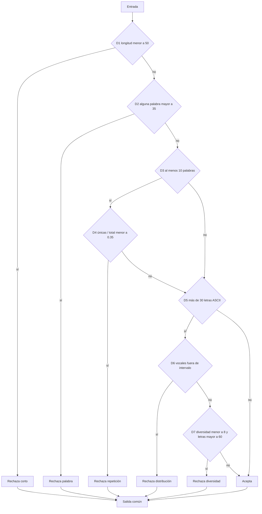

# Pruebas y trazabilidad por integrante — Inkr8

**Vigente FIN-002 — 09/10/2026:** cierre y entrega revisable documentados en
[FINAL_DELIVERY.md](FINAL_DELIVERY.md), con 6 Android PASS, reglas nuevas
propuestas y límites externos/académicos explícitos. Los estados inferiores son
antecedentes preservados; no revocan DEC-AI-AUTH-001, las decisiones respondidas
ni el permiso actual de publicar rama/PR, sin fusión o despliegue.

**Versión:** 0.1 · 04/10/2026 · America/Lima · chat 10, DEC-22/23. Preparación documental asistida por Codex. **Ninguna prueba nueva ejecutada, ningún paquete individual acreditado.** Selección, cálculo validado por estudiantes, autoría de lógica, análisis, ejecución y revisión individuales pendientes.

Se confirmó el equipo actual de seis personas y sus roles; Marco indicó que todavía no hay reparto ni evidencias disponibles. Hay tres candidatos de caja blanca con umbral sustentado estáticamente y casos unitarios propuestos sobre métodos reales. **No queda acreditada una funcionalidad con más de cuatro campos de entrada elegible sin aclarar el criterio docente sobre contexto y datos derivados.** No se agregaron campos para cubrir la rúbrica.

Fuentes: [requisitos](PROFESSOR_REQUIREMENTS.md), [matriz académica](ACADEMIC_COMPLIANCE_MATRIX.md), [alcance](REFACTOR_SCOPE.md), [aceptación/H1](ACCEPTANCE_MATRIX.md), [contratos](CONTRACT_MATRIX.md), [mapa](TECHNICAL_MAP.md), [mensajes UML](ARCHITECTURE_UML.md), [baseline y reproducción](BASELINE_REPRODUCIBILITY.md), [decisiones](DECISIONS.md), [protocolo propuesto](EVIDENCE_PROTOCOL.md) y [DOC-010](evidence/DOC-010/record.md). Esta preparación no ratifica hipótesis SOLID, alternativas, arquitectura o reglas pendientes.

## 1. Exigencias contrastadas directamente

Se leyeron las copias originales [P1.pdf](evidence/sources/P1.pdf), [P3.xlsx](evidence/sources/P3.xlsx) y [P4.docx](evidence/sources/P4.docx). Pasajes/celdas y hashes en [OFFICIAL_READ.json](evidence/DOC-010/OFFICIAL_READ.json). No se consultaron revisiones posteriores del aula virtual.

| Regla oficial | Localizador exacto | Aplicación y límite |
|---|---|---|
| Caja blanca: una por integrante sobre módulo o método de CC **>4** | P3 `Rubrica!D18`; P4 §10.2, párrafos XML 2038–2040 | Para CC entera, mínimo **5**. Deben sustentarse unidad, versión, cálculo, rutas, casos, ejecución y cobertura realmente medida. |
| Caja negra: una por integrante sobre funcionalidad con **>4 campos de entrada** | P3 D18; P4 §10.3, párrafos 2042–2043 | Mínimo **5 campos genuinos**. Un parámetro, atributo, salida o assert no acredita por sí mismo un campo de entrada funcional. |
| Unitaria: un método por integrante con **≥4 casos** | P3 D18; P4 §10.4, párrafos 2044–2046 | Cuatro casos pertinentes de **un mismo método**; no cuatro métodos de un caso ni cuatro asserts de un caso. |
| Participación ordenada, sustentada y equitativa de todos; falta de uno deja el criterio en 0 | P3 D18; D17 asigna 2 puntos a este criterio | La suite grupal no acredita cumplimiento de cada integrante. No se calcula nota actual. PO y Scrum Master también forman parte del inventario individual. |
| Resultados verificables y defectos/acciones correctivas cuando corresponda | P3 D18; P4 §§10.2/10.4/10.5, párrafos 2039–2050 | Conservar esperado, observado, versión y evidencia; no ocultar fallos o reemplazarlos con el último PASS. No se encontró porcentaje mínimo general de cobertura. |
| Casos IA permitidos; validación y ejecución obligatorias; pruebas sobre lógica ya escrita por alumno | P1 p. física 6 §2.5 y p. 7 §2.7 | Los casos de este documento son propuestas IA. La existencia de C1 no acredita quién escribió manualmente su lógica. |
| BD/relaciones, algoritmos críticos e integración frontend/backend reservados al estudiante | P1 p. 7 §2.7 | Esta preparación no implementa lógica ni integración, ni certifica su autoría histórica. |
| Declarar IA, conservar prompts/respuestas, analizar y evidenciar intervención humana | P1 pp. 10–11 §3.2, 14–17 §§5–6 | Influencia individual y revisión permanecen pendientes. No reconstruir interacciones ausentes. |
| HU/aceptación, clases, secuencia y código; demostrar las tres pruebas y dominio autónomo | P3 C28/C38:C41, E28/E38:E40, F28/G28; P1 pp. 12–13 §3.3 y p. 18 §7.3 | Preparación para SU-01–03; no sustentación evaluada. IA prohibida durante sustentación real (P1 pp. 12/20). |
| Relacionar mensajes principales → clases/métodos → implementación | P4 §8.1.2.5, párrafos 1847–1852 | M01–M31 son localizadores documentales del chat 8. Los ejemplos de empleados y las instrucciones de plantilla no son hechos de Inkr8. |

P3 D18 **no exige explícitamente métodos distintos entre integrantes**, ni que caja blanca y unitaria usen métodos diferentes. No se añade esa exigencia. Tampoco se deduce que una selección compartida o copiar casos comunes baste: la participación/evidencia individual debe ser sustentada y coherente con la funcionalidad que cada persona explique. Una eventual aclaración docente se registrará con su fuente.

## 2. Inventario humano respaldado y matriz individual

**Fuente U15:** respuesta de Marco a la consulta agrupada de este chat y corrección posterior: «Adrianzén Vía, Renzo Ubaldo es el product owner». **U16:** «Todavía no hay reparto ni evidencias disponibles». Textos disponibles en [HUMAN_INPUT_2026-10-04.md](evidence/DOC-010/HUMAN_INPUT_2026-10-04.md). Fecha de recepción conocida; no se atribuye fecha de elección de roles.

| Integrante actual | Rol comunicado | Asignación humana de HU/método y fuente | Autoría de lógica / integración | Caja blanca / negra / unitaria elegidas | Ejecutor, revisión, resultados y evidencia | Explicación/aporte individual e IA |
|---|---|---|---|---|---|---|
| Adrianzén Vía, Renzo Ubaldo | Product Owner | Pendiente; U16 | No disponible en esta preparación | Pendientes; candidatos §3 sin asignar | No disponible; no ejecución nueva | Pendiente |
| Bocanegra Carrión, Marco Antonio | Developer | Pendiente; U16 | No disponible en esta preparación | Pendientes; candidatos §3 sin asignar | No disponible; no ejecución nueva | Pendiente |
| Camarena Paredes, Victor Manuel | Developer | Pendiente; U16 | No disponible en esta preparación | Pendientes; candidatos §3 sin asignar | No disponible; no ejecución nueva | Pendiente |
| Pacheco Castro, Pedro Iván | Developer | Pendiente; U16 | No disponible en esta preparación | Pendientes; candidatos §3 sin asignar | No disponible; no ejecución nueva | Pendiente |
| Rado Delgado, Jean Carlo de Jesús | Developer | Pendiente; U16 | No disponible en esta preparación | Pendientes; candidatos §3 sin asignar | No disponible; no ejecución nueva | Pendiente |
| Villar Córdova Alva, Matías Gonzalo | Scrum Master | Pendiente; U16 | No disponible en esta preparación | Pendientes; candidatos §3 sin asignar | No disponible; no ejecución nueva | Pendiente |

D2/DEC-06 respalda coordinación de Marco/Renzo, **no reparto de pruebas**. No se dedujo roster de I1, tareas H1 o commits. U15 es la fuente actual; U16 no afirma que nadie haya trabajado antes, sino la falta de reparto/evidencias disponibles para este inventario. No se reparten retrospectivamente los 22 tests.

## 3. Inventario técnico y cadena de trazabilidad sin asignación

**C1:** `64983846d6dbf4cdfafcdd508464cd140a2a862e`; **PRE:** `3d107ae6bb93f7c9d4bf9e103eccac1ae2d931de`. Copia localizada por DOC-009, origin oficial, HEAD exacto y status/diff vacíos comprobados en DOC-010. No se comprobó master remoto actual. [GIT_READ](evidence/DOC-010/GIT_READ.json) y [CODE_READ con rangos/blobs/hashes](evidence/DOC-010/CODE_READ.json). Los enlaces C1 siguientes derivan de lectura local, sin consulta remota.

**Expected:** H = caracterización estática del antes; OR/AL = texto H1 o alcance aprobado; AU = decisión/fuente pendiente. H no reemplaza OR/AL/AU. Todos los candidatos tienen **elección humana pendiente** y no acreditan autoría, revisión, ejecución ni explicación.

| ID / método o funcionalidad real y propósito | Archivo/rango/versión y fuentes | HU → AC → S → CT → secuencia/mensaje | Capa y elegibilidad provisional | Expected y casos | Entorno/bloqueo |
|---|---|---|---|---|---|
| CP-01 `ValidationUtils.isContentLowQuality`: rechazo por calidad y aceptación | [ValidationUtils.kt 9–41](https://github.com/Rnz5/Inkr8-ISW2/blob/64983846d6dbf4cdfafcdd508464cd140a2a862e/app/src/main/java/com/inkr8/utils/ValidationUtils.kt#L9-L41), C1; tests 8–41, B1/XML | HU 2.1/2.2/3.14 → AC-01/03 → S03/S08 → CT-03 → V04; llamada local Writing 313 **previa a M01/M03**, E01/E11 | Kotlin pura; blanca CC 8/10 cumple umbral; unitaria ≥4 diseñable; negra 1 argumento, insuficiente como selección aislada | H; UQ-01–12. H1 no confirma todos los parámetros de calidad | Único candidato ya incluido en arnés histórico. JVM futuro, sin Android/R8; autoría/elección y revisión faltan |
| CP-02 `isContentLowQuality` TS: contraste de filtro servidor | [submissionEvaluationEngine.ts 51–83](https://github.com/Rnz5/Inkr8-ISW2/blob/64983846d6dbf4cdfafcdd508464cd140a2a862e/functions/src/submissions/submissionEvaluationEngine.ts#L51-L83), C1 | HU 2.3/3.14–3.16 → AC-01/03 → S03/S08 → CT-03/05 → V06/M16; E11 | TS función local; blanca CC 8/10 cumple umbral; unitaria ≥4 diseñable; negra 1 argumento | H; UQ-01–04 reutilizables como datos, con **retorno TS distinto** (§6) | Sin suite TS/package/lock/tsconfig; función no exportada y módulo importa R8 ausente. No se crea export ni aislamiento en esta etapa |
| CP-03 `calculateDynamicRatingChange`: rutas WIN/LOSS/DRAW y límites | [mismo motor 24–48](https://github.com/Rnz5/Inkr8-ISW2/blob/64983846d6dbf4cdfafcdd508464cd140a2a862e/functions/src/submissions/submissionEvaluationEngine.ts#L24-L48), C1; invocaciones 477–487 | HU 3.8–3.12 → AC-03 → S09/S10 → CT-07/11 → V07/M24 y M25; E11/E12 | TS cálculo puro dentro de módulo; blanca CC **5**; unitaria ≥4 diseñable; negra 3 argumentos, insuficiente | H; UR-01–08. Fórmula objetivo AU/Q-R; delta calculado ≠ aplicado | Mismos bloqueos TS/R8/export. Casos no prueban usuarios/placement/concurrencia; no atribuirlos a ghost |
| CP-04 `SubmissionFactory.create`: conteos y transmisión de contexto | [SubmissionFactory.kt 9–34](https://github.com/Rnz5/Inkr8-ISW2/blob/64983846d6dbf4cdfafcdd508464cd140a2a862e/app/src/main/java/com/inkr8/evaluation/SubmissionFactory.kt#L9-L34), C1; E02 | HU 2.2/3.14 → AC-03/07 → S03/S08/S20 → CT-01–04 → V04/M01 | Kotlin objeto; blanca CC **2**, no cumple >4; unitaria ≥4 diseñable; **7 parámetros no acreditan caja negra funcional** | H; UF-01–04. Identidad/auth/contratos integrales pendientes | Fuera del sourceSet histórico; Submissions/Words tienen dependencias Firebase; UUID/reloj no inyectables aquí. No se modifica arnés |
| CP-05 `FirestoreSubmission.toDomain`: estados, defaults y match | [SubmissionMapper.kt 6–33](https://github.com/Rnz5/Inkr8-ISW2/blob/64983846d6dbf4cdfafcdd508464cd140a2a862e/app/src/main/java/com/inkr8/mappers/SubmissionMapper.kt#L6-L33), C1; E03/E04/E05 | HU 2.3/2.4/1.7/1.11 → AC-03/07 → S08/S10/S20 → CT-04/05/12/13 → V04/M08 | Kotlin extensión; unitaria ≥4 diseñable. **CC no calculada; blanca no elegida**. DTO con muchos atributos no acredita funcionalidad negra | H; UM-01–04. Política de compatibilidad AU/Q-D | DTO/evaluación anidada/Firebase fuera del arnés; fixtures auténticos anonimizados pendientes. Campos retirados no se usan para umbral |
| CN-01 Enviar escritura Practice/Ranked Standard/On-Topic y recibir resultado | Writing 98–134/259–283/310–346; Factory; VM 140–175; motor 160–226; C1, E01–E07/E11 | HU 2.1–2.4/3.13–3.16 → AC-01/03/07 → S02/S03/S08/S10/S20 → CT-01–06 → V04/V06/M01–M09/M15–M20 | Funcionalidad conservada; negra **elegibilidad pendiente**: 1 campo escrito más contexto real, detalle §5 | OR/AL parcial; H de payload; score/feedback numérico real AU sin R8, Q-R/Q-D | Android/Functions/Firebase/R8/integración sin reproducirse; discrepancias modos/IDs/nombres/palabras usadas; ningún PASS integral |
| CN-02 Autenticación/perfil básico propio | CT-12/E17 y mapa §4; C1 como antecedente | HU 1.1 defectuosa/1.2–1.4/1.9/1.10 → AC-02/03/07 → S04/S11/S20 → CT-12; V11/M12 sólo uso de auth en callable | No se identificó formulario del núcleo con ≥5 entradas editables. **No elegible acreditado** | OR/AL parcial, Q-C fuente 1.1; métricas de perfil son salidas | Configuración/reglas/ejecución faltan. Datos de Google o campos Users no se cuentan como formulario sin fuente funcional |
| CN-03 Temporadas incluidas, sin método implementado identificado | H1-C E109/E111/E113/E115, CT-16/BR-21–23 | HU 3.27/3.28 → AC-04–06/07 → S12–S19/S21/S24/S25 → V12; **M/método/código estacional pendientes** | Incorporación futura, no candidato actual para satisfacer umbral. No se inventan entradas | OR: rating temporada/posición destacada, posición final/rating cierre y errores. Reglas AU/Q-T/Q-D | Falta decisión/autoría/implementación/entorno; inclusión no fija calendario, desempates, reset o recompensa |

La cadena individual continúa desde esta matriz: **integrante/asignación humana → HU/AC/S/CT → V/M/método/código C1 o versión futura real → técnica/eligibilidad/expected → entorno/bloqueo → ejecución/evidencia → análisis/revisión/explicación individual**. Los cinco métodos inspeccionados no cubren todos los mensajes M01–M31. El [catálogo completo del chat 8](ARCHITECTURE_UML.md) conserva esos mensajes; [BR-01–23](BASELINE_REPRODUCIBILITY.md) enumera las brechas de los restantes sin simular pruebas.

## 4. Caja blanca: cálculo justificable propuesto por IA

**Convención C0:** grafo intraprocedimental normal de la función, entrada única y salida común virtual para los retornos; cada `if`/`else if` añade 1 a `V(G)=1+decisiones` (equivalente `E−N+2` para un componente). Cada predicado compuesto es una decisión en C0. No se suman internamente bibliotecas, callbacks/lambdas como otros métodos, excepciones implícitas o ramas ocultas de `any/some/filter/count`. Una herramienta puede definir otra métrica; debe conservarse su configuración y no mezclar cifras.

**Convención C1P:** además de C0, se divide cada `||`/`&&` dentro de un **predicado de control** en decisiones de cortocircuito. Es una ampliación explícita, no una medición automática. Se muestran ambas para que el umbral no dependa de adoptar una cifra inflada. Validación estudiantil pendiente; **no hay cobertura dinámica**.

| Candidato / rango de cuerpo cerrado | Decisiones exactas | C0 | C1P | Interpretación |
|---|---|---|---|---|
| CP-01 Kotlin 9–41 | `if` en **11,15,19,21,27,30,35**; cortocircuitos `\|\|`30 y `&&`35 | 1+7 = **8** | 8+2 = **10** | >4 aun con predicados compuestos colapsados. `any`15 se trata como un predicado, sin sumar sus iteraciones internas |
| CP-02 TS 51–83 | `if` en **53,57,61,63,69,72,77**; `\|\|`72 y `&&`77 en predicados | **8** | **10** | >4. `match(...) \|\| []`70 es fallback de datos, **excluido de C1P**; una métrica que cuente ese operador dará otra cifra. Arrow functions/librerías excluidas |
| CP-03 rating 24–48 | `if`33, `if`36, `else if`38, `else if`43 | 1+4 = **5** | **5** | >4. `else`45 no añade otra decisión. `Math.min/max/round` no introducen ramas del método contadas aquí |
| CP-04 Factory 9–34 | Expresión `if(content.isBlank())`18 | 1+1 = **2** | **2** | No cumple >4. Siete parámetros o UUID no elevan automáticamente CC |

### Grafo de filtros CP-01/02

Nodos D1–D7 corresponden en orden a las siete filas de `if`; Rt=texto corto, Rw=palabra larga, Rr=repetición, Rv=vocales, Rd=diversidad, A=aceptación, X=salida común. Cada retorno R/A llega a X.



C0 tiene **N=15, E=21**, `21−15+2=8`. Al dividir los dos predicados compuestos: N=17, E=25, CC=10. Es grafo propuesto del flujo normal, no editable CASE final ni evidencia de rutas recorridas.

| Ruta estructural propuesta | Camino abreviado | Datos candidatos / estado |
|---|---|---|
| RQ-01 | D1 sí → Rt | UQ-01/05; descarte temprano |
| RQ-02 | D1 no, D2 sí → Rw | UQ-02 |
| RQ-03 | D1/D2 no, D3 sí, D4 sí → Rr | UQ-03 |
| RQ-04 | D1/D2 no, D3 no, D5 no → A | UQ-06; dígitos, sin letras ASCII |
| RQ-05 | D1/D2 no, D3 no, D5 sí, D6 sí → Rv | UQ-07/08; distinguir rama baja/alta en C1P |
| RQ-06 | D1/D2 no, D3 no, D5 sí, D6 no, D7 sí → Rd | UQ-09 |
| RQ-07 | D1/D2 no, D3 no, D5 sí, D6/D7 no → A | UQ-10 |
| RQ-08 | D1/D2 no, D3 sí, D4 no, D5 no → A | UQ-11/12 |

Estas ocho rutas forman una base candidata en el grafo C0. Su factibilidad/datos deben revisarse y ejecutarse por el estudiante; ocho dibujos o casos no acreditan cobertura de caminos, ramas, condiciones o MC/DC. UQ-04 agrega la aceptación histórica con D3/D5 sí. En C1P habrá que cubrir por separado los operandos y efectos del cortocircuito; no declarar 100% por contar retornos.

CP-03 tiene cinco rutas: WIN con rating <150, WIN 150–179, WIN ≥180, LOSS y DRAW. En grafo con cuatro decisiones, tres retornos, entrada y salida: N=9, E=12, `12−9+2=5`. UR-01–05 ofrecen datos para esas rutas; UR-06–08 exploran ajuste/fronteras adicionales. El valor y grafo son cálculo IA por validar, no resultados estudiantiles.

## 5. Caja negra: campos reales y brecha docente

**CN-01:** funcionalidad de enviar escritura y obtener evaluación, dentro del objetivo. Se inspeccionaron Writing, Factory, VM y preparación de entrada del motor. El editor contiene **un TextField `userText`** (259–283); el reto y la cuenta aportan contexto. No se cuentan caracteres, cuatro palabras obligatorias como cuatro campos, respuestas del evaluador ni número de asserts.

| Campo genuino observado | Origen / localizador C1 | Tipo en funcionalidad | Qué puede contarse y límite |
|---|---|---|---|
| `content` | `userText`, Writing 259–261/325 | Ingresado por usuario | **1 campo escrito** confirmado |
| `gamemode` | Objeto reto → STANDARD/ON_TOPIC, Writing 326–329; Factory 11 | Contextual, modalidad del ejercicio | Entrada real a construcción/envío, no otro TextField. DTO escribe `gamemodeName`; motor lee `gamemode` (CT-01) |
| `playMode`/`playmode` | Practice/Ranked del recorrido, Writing 330–332; Factory 12 | Contextual, modalidad de participación | Entrada real; TOURNAMENT se excluye de selección objetivo |
| `topicId` | Contexto On-Topic, Writing 338; Factory 14 | Contextual nullable | Entrada real identificada, depende de modalidad/catálogo; no libremente ingresada. No equivale a topicName que lee R8 |
| `themeId` | Contexto On-Topic, Writing 339; Factory 15 | Contextual nullable | Otra propiedad real; relacionada con topicId, no campo editable independiente; CT-02 |
| `authorId` | Factory 16 default vacío; VM 141–142 sustituye por currentUser.id | Contextual de autenticación | Entrada genuina al guardado; **no dato que el usuario elija en editor**; identidad debe preservarse |
| `wordsUsed` | Factory 13; Writing 335–337 filtra selectedWords por normalizedUserWords | Derivado del texto y palabras asignadas | Argumento real, pero no entrada independiente controlada por usuario. No sumar cada objeto/palabra como un campo nuevo |
| `wordCount`, `characterCount`, `id`, `timestamp` | Factory 18/20/23–25 | Derivados/generados | Salen de construcción, no campos escritos extra |
| `evaluation`, `status`, score/feedback, `matchResult` | Factory 30–31; motor/CT-05/07 | Salidas/estados | No elevan el número de entradas funcionales |

La firma Factory tiene **7 parámetros**. En CN-01 se identifican un campo escrito y **5 propiedades contextuales** antes de considerar wordsUsed derivado. Es un inventario real de frontera; **no acredita automáticamente ≥5 campos elegibles según P3**. La dependencia topic/theme, el significado de «campos» y la frontera funcional aceptable requieren aclaración. No se elige Factory como «funcionalidad» por tener siete argumentos. El contrato real R8 tampoco está disponible; sus argumentos de contexto no certifican un formulario ni se completan con apiKey o secretos.

CP-03 tiene 3 argumentos; CP-01/02, 1. `RankedCostCalculator.calculateCost` tiene **4 parámetros**, insuficientes para >4 y pertenece a economía retirada. `TournamentEconomyProjection` contiene salidas; torneos retirados. No sirven para resolver la brecha del objetivo. Autenticación/perfil y temporadas no aportan en las fuentes revisadas un candidato inequívoco de cinco entradas editables; no se declara inexistencia en toda versión futura.

**Consulta preparada para el profesor, no enviada:** En Inkr8 conservamos envío/evaluación Practice/Ranked y retiramos torneos, ligas, reputación y Merit. P3 D18 exige una funcionalidad con más de cuatro campos de entrada. El editor recibe texto; el flujo transmite modalidad, tipo de participación, tema, tópico e identidad de cuenta como contexto, y deriva palabras usadas/conteos. ¿Para este criterio cuentan propiedades contextuales de la frontera funcional, aunque no sean campos editables e independientes del formulario? ¿Qué frontera y evidencia admite para esta funcionalidad? Si no califican, ¿qué ajuste de aplicación del requisito autoriza para el alcance real? También conviene precisar cómo relacionar la selección de cada integrante con la funcionalidad que sustentará. **Hasta respuesta auténtica, brecha abierta; sin equivalencia automática.**

Preparación funcional posible sin cerrar elegibilidad: Standard/On-Topic × Practice/Ranked, contexto presente/ausente, texto válido/corto, palabras asignadas presentes/omitidas, fallo de persistencia y resultado de A/B. HU/H1 confirma restricciones/feedback/error parcialmente; [S02/S03/S08/S10](ACCEPTANCE_MATRIX.md) preserva expected faltantes. No se inventa score, mensaje, fallback o criterio de temporada a partir de fixtures.

## 6. Casos unitarios propuestos; ningún resultado actual

### CP-01, un solo método Kotlin

Todos los expected siguientes son **H: caracterización del C1**, no aprobación funcional de sus constantes. UQ-01–04 coinciden con datos/expected de los cuatro tests históricos de un mismo método. [ValidationUtilsTest.kt 8–41](https://github.com/Rnz5/Inkr8-ISW2/blob/64983846d6dbf4cdfafcdd508464cd140a2a862e/testing-baseline/src/test/kotlin/com/inkr8/utils/ValidationUtilsTest.kt#L8-L41) y [XML histórico](evidence/baseline/TEST-com.inkr8.utils.ValidationUtilsTest.xml). UQ-05–12 son datos propuestos nuevos, **no nuevos tests ejecutables ni PASS**.

Abreviaturas de razón literal: **T** = `Transmission too short (min 50 chars)` (11); **W** = `Nonsense detected (excessive word length)` (16); **R** = `Repetitive content detected` (22); **V** = `Unnatural character distribution (nonsense)` (31); **D** = `Low character diversity (nonsense)` (36). Retorno esperado `true to razón`, o `false to null`. Capa: llamada JVM al método real, **sin dobles**; no UI, Firestore, tokenización del reto ni R8.

| Caso | Entrada exacta o construcción de datos | Partición/frontera/ruta | Expected H / fuente |
|---|---|---|---|
| UQ-01 | `A short but otherwise readable message.` | <50 tras trim; RQ-01 | true/T; test 9–13 y método 11 |
| UQ-02 | `"a" repetida 36 veces + " followed by enough readable words to pass the length check"` | palabra 36, longitud global suficiente; RQ-02 | true/W; test 17–23 y método 15–16 |
| UQ-03 | Diez `repeat` unidos con un espacio | 10 palabras, 1 única, razón 0.1; RQ-03 | true/R; test 27–33 y método 19–22 |
| UQ-04 | `Bright rivers carry patient stories across quiet valleys every morning.` | aceptación diversa; D3/D5 sí, D4/D6/D7 no | false/null; test 37–40 y método 40 |
| UQ-05 | UQ-01 rodeada por espacios | trim y descarte temprano | true/T; método 10–11 |
| UQ-06 | Cinco tokens `1234567890` unidos con un espacio | 54 caracteres, 5 palabras, 0 letras ASCII; RQ-04 | false/null; método 11/15/19/26–27/40. Aceptar dígitos es comportamiento C1, no validación lingüística confirmada |
| UQ-07 | Tres tokens `bcdfghjklmnpqrstvwxyz` unidos con un espacio | 60 letras, 0 vocales; RQ-05 baja | true/V; método 27–31 |
| UQ-08 | Tres tokens `aeiouaeiouaeiouaeiou` unidos con un espacio | 60 letras, razón vocales 1; RQ-05 alta | true/V; método 27–31 |
| UQ-09 | Cuatro tokens `abecidabecidabecid` unidos con un espacio | 72 letras, 6 únicas, vocales 0.5, 4 palabras; RQ-06 | true/D; método 30/34–36; evita activar repetición de 10 palabras |
| UQ-10 | Tres tokens `abecidabecidabecid` unidos con un espacio | 54 letras, 6 únicas, vocales 0.5; RQ-07 | false/null; 35 requiere **>60**, no sólo diversidad baja |
| UQ-11 | 20 tokens `12345` salvo últimos seis reemplazados por `23456`, `34567`, `45678`, `56789`, `67890`, `78901` | 7 únicas/20 = **0.35**, 0 letras; RQ-08 | false/null; 21 compara **<0.35** |
| UQ-12 | UQ-11 salvo último token reemplazado por `12345` | 6 únicas/20 = **0.30** | true/R; 19–22. Frontera de razón, no oráculo lingüístico |

Las entradas nuevas se describen para diseñar casos, sin ejecutar una traducción del método. Falta cubrir de forma sistemática 49/50 caracteres, palabra 35/36, 9/10 palabras, 30/31 letras, 60/61 letras, 7/8 únicas y vocales exactamente 0.15/0.8, normalización/minúsculas y caracteres no ASCII. La rúbrica ≥4 no equivale a suficiencia de cobertura. Las comprobaciones de calidad tampoco demuestran que se hayan usado todas las palabras obligatorias del reto.

**CP-02:** UQ-01–04 permiten preparar cuatro casos del **mismo filtro TS**. Expected H: UQ-01 `{isLowQuality:true, reason:"Content too short (min 50 chars)"}` (53); UQ-02/03 razones W/R; UQ-04 `{isLowQuality:false}` (82), con reason ausente. No copiar `Pair` Kotlin ni `reason:null`. Método TS local, sin doble para la lógica; importarlo como está requiere dependencias/R8, no resueltas. Prueba aislada con copia del algoritmo no acreditaría el método real; una futura opción de aislamiento debe decidirse/autorizarse y registrarse.

### CP-03, un solo método de rating

Datos y expected **H** se derivan por aritmética de 24–48; **no se ejecutó la función**. Math.round de casos no ambiguos salvo fronteras enteras aquí elegidas. Sin doble en cálculo; el módulo TS/arnés sigue bloqueado. No son nuevas fórmulas objetivo ni aceptación de Q-R.

| Caso | Entrada `(myRating, opponentRating, outcome)` | Partición/ruta | Expected H y razón |
|---|---|---|---|
| UR-01 | (100,100,WIN) | WIN <150 | 4: gap 0, round(4) |
| UR-02 | (150,150,WIN) | frontera 150, segunda rama | 3: min(4,3) |
| UR-03 | (180,180,WIN) | frontera 180, primera rama | 2: min(4,2) |
| UR-04 | (100,100,LOSS) | LOSS | −6: min(−1,−6) |
| UR-05 | (100,100,DRAW) | else del dominio tipado | +1; no cero por intuición |
| UR-06 | (100,0,WIN) | gap −100, ajuste −5 y piso | +1: max(1,round(−1)) |
| UR-07 | (100,300,WIN) | gap +200, ajuste limitado +5 | +9: max(1,round(9)) |
| UR-08 | (100,300,LOSS) | ajuste +5, techo pérdida | −1: min(−1,round(−1)) |

Fronteras 149/150 y 179/180, redondeo fraccional, datos numéricos fuera del dominio y equivalencia entre delta presentado/aplicado requieren casos/revisión adicional cuando se acuerde alcance de caracterización. WIN/LOSS/DRAW proviene de scores en M24; no se suministra por un formulario de tres entradas. `users.rating` sólo cambia si placed y tiene piso, fuera de este método (M25/CT-11). Los expected no se transfieren a ghost.

### Otros métodos con cuatro casos posibles

| Caso / método único por grupo | Entrada propuesta | Partición y expected H | Capa/dobles/límite |
|---|---|---|---|
| UF-01 / Factory.create | content vacío, gamemode STANDARD, playMode PRACTICE, wordsUsed vacía, topic/theme null, authorId explícito de prueba | wordCount 0, characterCount 0; PENDING/evaluation null y contexto conservado; 18–32 | Unidad Kotlin; dominio Firebase fuera del arnés. No afirmar rechazo del vacío: Factory no valida calidad |
| UF-02 / mismo método | content `"   "`; mismos demás argumentos | wordCount 0, characterCount **3** (content sin trim); 18/25 | Sin doble de lógica; no app válida por este resultado |
| UF-03 / mismo método | content `"  hello   world  "`; mismos demás argumentos | wordCount 2, characterCount **17**; 18/25 | No hardcodear reloj/UUID. En ejecución futura se comprueba formato/identidad y rango temporal observado, sin fingir valores deterministas |
| UF-04 / mismo método | content `"hello world"`, gamemode ON_TOPIC, playMode RANKED, lista/IDs/autor de prueba explícitos | 2 palabras/11 caracteres, preserva argumentos, estado PENDING/evaluation null; 18–32 | Valores sintéticos no son fixture real, regla de selector ni identidad autenticada. No autoriza inventar Words/contexto de producción |
| UM-01 / FirestoreSubmission.toDomain | DTO con status PENDING, evaluation y matchResult null | status PENDING, ambos null; 20–23 | Unidad extensión; fuente DTO real C1, datos de prueba por preparar; no doble de lógica |
| UM-02 / mismo método | status EVALUATED, evaluation y matchResult null | status EVALUATED; no evaluación/match inventados; 20–23 | No prueba que backend deba producir ese estado |
| UM-03 / mismo método | status `UNKNOWN`, evaluation/matchResult null | fallback PENDING por catch; 21 | Caracterización, política objetivo Q-D pendiente. No confundir con EvaluationMapper que puede lanzar |
| UM-04 / mismo método | status PENDING y matchResult mapa vacío, evaluation null | MatchResult("","",0.0,"",0L), 25–29 | Distinto de matchResult null. Defaults no acreditan datos auténticos ni seguridad de deserialización completa |

Los cuatro casos de cada grupo son del mismo método. UF/UM aún requieren entorno de dominio y revisión de fixtures; no se añaden a testing-baseline. Se inspeccionó CP-05 para unitaria, sin proponer cifra de CC basada en su tamaño o cantidad de atributos.

## 7. Propósitos y aceptación separados

| Grupo | Evidencia disponible | Plan documental / qué falta |
|---|---|---|
| Caracterización histórica del antes | 22 casos XML/B1 del 02/10/2026, sin atribución individual; 18 economía/torneos/reputación y 4 Kotlin calidad | Custodiar. Se releyeron hashes/XML, no se repitió suite. B1 declara 26 s/0.099 s; G1 reejecución 47 s; XML suma suites 0.128 s y casos 0.123 s. Son medidas/registros diferentes |
| Núcleo conservado | CP-01–05 y CT/M; cuatro casos Kotlin históricos | Elección/autoría/revisión/ejecución humana, expected de caracterización frente a aceptación real, nuevos bloques de evidencia. No sustituir integración por unidades |
| Aceptación de retiradas | AL de D1/U2/U3/U8; BR-20; S01/S05/S07/S11/S23 | Acceso/navegación/efectos sin torneos/ligas/reputación/Merit, moneda/ganancias/todos sus usos, sin sustituto ni penalización; conservar núcleo. No ejecutar ni borrar datos en esta etapa |
| Temporadas nuevas | HU 3.27/3.28 y OR parcial, BR-21–23 | Q-T/Q-D y ejemplo esperado humano antes de casos concretos. Sin métodos/código/ejecución estacionales identificados |

D1 excluye detalle posterior de partida, penalización de abandono, ranking/posición global, leaderboard de liga y perfil desde leaderboard; resultados inmediatos, perfil propio, limpieza de sesión y ranking/historial de temporada siguen separados. Los 18 casos retirados **no son cobertura del producto objetivo** ni se contabilizan para solucionar umbrales individuales.

Bloqueos de reproducción: JVM histórico aislado disponible con procedimiento, pero sin ejecución actual ni instalación limpia acreditada; Android sin build/settings/dependencias/wrapper principal completo; Functions sin package/lock/tsconfig y R8; Firebase sin configuración/reglas, índices insuficientes; drawables faltantes por inspección; UI/servicios/integración no probados. [Inventario de cinco capas y 38 rutas](BASELINE_REPRODUCIBILITY.md). No se reconstruyen versiones o evaluador. S01–S25 siguen sin ejecutar; **ningún AC cerrado íntegramente**.

**Pendientes funcionales:** Q-R selector/restricciones/entrada/cierre/placement/fórmulas/presentación; Q-T períodos/admisión/rating estacional/empates/cierre/tardíos/recompensas sin Merit; Q-D datos y borradores previos; Q-C fuente correcta HU 1.1. H1 ya recibido, Q-F resuelta. No se vuelven a pedir magnitud ni campos estacionales recuperados.

## 8. Plantilla individual vacía y ficha futura de ejecución

**Plantilla explícitamente sin completar.** No representa otra persona, asignación, ejecución o aporte. Se completará por cada integrante confirmado usando evidencias reales, sin convertirla en procedimiento de firmas grupales.

| Eslabón individual | Dato por registrar |
|---|---|
| Identidad/rol y asignación humana con fecha/fuente | **Pendiente** |
| HU/celda H1, AC/subcriterio y S | **Pendiente** |
| Contrato CT, V/M o llamada local y método/archivo/rango/commit | **Pendiente** |
| Autoría estudiantil de lógica e integración, referencia verificable | **Pendiente** |
| Blanca: método, convención, decisiones/grafo/CC validada y rutas | **Pendiente** |
| Negra: funcionalidad/frontera, campos genuinos, aclaración docente/elegibilidad | **Pendiente** |
| Unitaria: método único, ≥4 casos, partición/frontera/ruta | **Pendiente** |
| Expected y su fuente: OR/AL/H/AU | **Pendiente** |
| Entorno/dobles/bloqueo y límites | **Pendiente** |
| Ejecución/versión/fecha/ejecutor, observado y resultado | **Pendiente** |
| Evidencia original, fallos/defectos/repruebas | **Pendiente** |
| Análisis, revisión/correcciones y explicación individual | **Pendiente** |
| Herramienta/objetivo/interacción IA e influencia estimada fundada | **Pendiente** |
| Capítulo/anexo final y correspondencia R1/R2 real | **Pendiente** |

**Ficha vacía de ejecución futura; no comando autorizado ni ensayo realizado:**

```text
ID de ejecución y caso/técnica:
Integrante/ejecutor y evidencia de asignación:
Autoría de lógica probada y referencia:
HU/AC/subcriterio/S/CT/V/M/método y versión:
Tarea que autoriza esta ejecución futura:
Objetivo: caracterización / núcleo / retirada / incorporación:
Elegibilidad y convención de conteo, validación humana:
Entrada, estado inicial y origen/anonimización de datos:
Ruta/partición/frontera y razón del caso:
Expected, clasificación y fuente verificable:
Entorno/OS/JDK o runtime/dependencias/configuración reales:
Capa, dobles y qué representan/qué dejan fuera:
Procedimiento/comando realmente usado y fecha/zona:
Observado, salida original y resultado: pendiente / bloqueado / PASS / FAIL / ERROR / SKIPPED:
Métrica de cobertura, herramienta/configuración y reporte real:
Defecto si corresponde: impacto/severidad/causa/estado/evidencia:
Corrección humana, versión y ejecución de reprueba enlazadas:
Revisión/análisis/explicación por estudiante y evidencia:
Aporte IA, interacción disponible, cambios humanos e influencia fundada:
Capítulo/anexo, contribución individual y pendientes:
```

Cuando una ejecución esté bloqueada, registrar motivo sin escribir PASS/FAIL inventado. Conservar primera salida/fallo; cada corrección/reprueba recibe nueva versión/registro enlazado. Medir cobertura sólo con herramienta/reporte real y su denominador/capa; no extrapolar JVM a producto. Un doble R8 sólo demostraría cómo el consumidor maneja una respuesta controlada, nunca que el evaluador real puntúa bien. Dobles Firebase/reloj/UUID tampoco demuestran reglas/permisos, concurrencia real o red; no están implementados aquí.

## 9. Plan guiado por integrante y explicación

Propuesta para **cada una de las seis personas**, sin asignar retrospectivamente trabajo:

1. Acordar y registrar funcionalidad/método con referencia humana, HU y fuentes; comprobar procedencia de la lógica y vínculo con lo que sustentará.
2. Revisar elegibilidad antes de implementar pruebas: recalcular CC a mano con convención/grafo y validar campos de caja negra con aclaración auténtica si hace falta.
3. Justificar al menos cuatro casos de un método: qué ruta/partición/frontera distingue cada entrada, por qué otra entrada equivalente no añade cobertura y qué expected respalda la fuente.
4. Separar decisiones del producto de caracterización C1; indicar cómo cambian deliberadamente los expected ante retiradas/temporadas, conservando los registros del antes.
5. Recuperar entorno auténtico y autorizar la tarea de ejecución cuando corresponda. Ejecutar y conservar resultados por estudiante, con fallos y repruebas; luego relacionar con modelo/mensajes y aceptación.
6. Escribir análisis propio: esperado frente a observado, alcance del resultado, limitaciones del doble, defecto/evidencia, corrección y qué sigue sin demostrar. Registrar aportes y revisión reales, sin porcentajes IA automáticos.

Para práctica previa, cada integrante debe poder explicar: «Elegí este caso porque…; recorre esta ruta o representa esta partición…; espero esto por esta fuente…; observé esto en esta versión…; el doble deja fuera…; el resultado demuestra sólo…; el fallo y su reprueba están en…». Son preguntas de aprendizaje, no respuestas humanas inventadas. Durante la sustentación real no se usa IA.

## 10. Resultado verificable y traspaso al chat 11

Se prepararon inventario humano de seis integrantes, cinco métodos inspeccionados y tres frentes funcionales, cálculos CC para cuatro métodos, trazabilidad sin reparto, casos de unitaria, consulta docente, plantilla individual y ficha futura. Se comprobaron fuentes oficiales/citas C1, enlaces/estructura, hashes de originales/baseline/paquetes anteriores y cambios locales autorizados; [VERIFICATION.json](evidence/DOC-010/VERIFICATION.json). **Verificación documental estática**, sin builds/tests/escenarios, servicios/datos/GitHub ni acreditación de paquetes/revisión/aportes individuales. La aprobación académica no se deduce del documento.

Para chat 11, **«Inkr8 — Evidencias de IA y decisiones»**, llevar U14–U16/corrección del rol PO, DEC-22/23, DOC-010, matrices individuales pendientes, elecciones humanas cuando existan, fuentes P1 §§3/5/6/7, A1 disponible sólo por inventario y registros DOC-001–009. Inventariar prompts/respuestas originales realmente accesibles y límites de exportación; enlazar cada aporte con análisis/adopción/descarte/corrección humano auténtico y su artefacto. Mantener pendientes roster de pruebas/autoría/ejecución, aclaración docente caja negra, Q-R/Q-T/Q-D/Q-C, reproducción y selección/revisión de alternativas/UML. El roster actual ya está resuelto; **no volver a pedirlo**. No crear ni enviar mensajes a chat 11 sin instrucción explícita.
