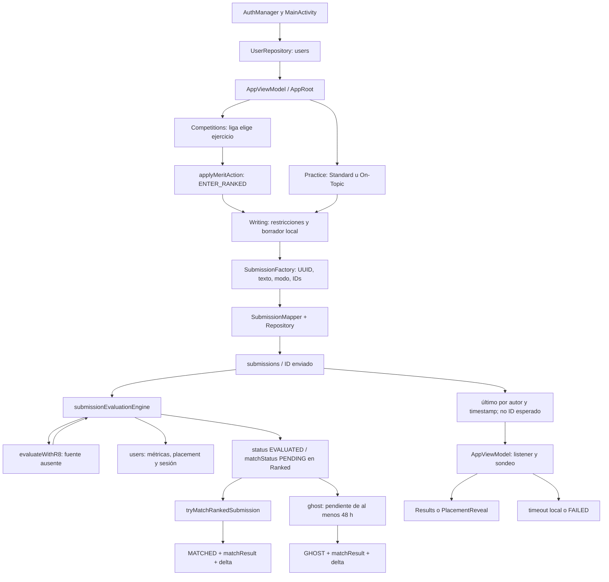
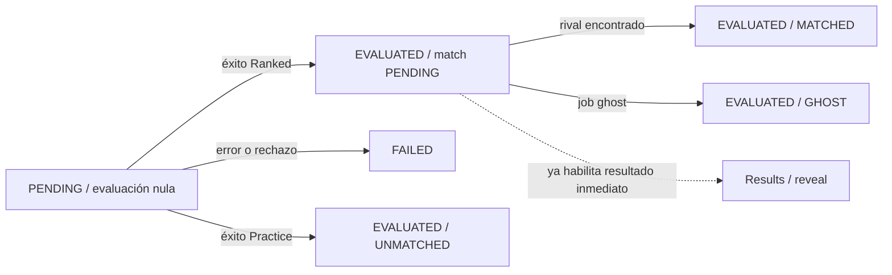

# Mapa técnico actual y contratos de Inkr8

## Código vigente FIN-002

AppRoot conecta WritingEditor→AppViewModel.submitWriting→FirestoreSubmissionRepository.
Task success confirma revisión y luego startLoadingResult(UUID); listener y sondeo del
mismo ID, generaciones y reintento sólo lectura. DraftManager posee claves UID/ejercicio/
palabras y revisiones; WritingEditor conserva edición. Results se refresca del mismo ID.
Functions: submissionEvaluationEngine aplica evaluación una vez; rankedMatching valida
ambas submissions PENDING dentro de la TX recíproca; dynamicRatingChange conserva
expresión; ghost contiende sobre el mismo guard. seasonal delta es movimiento real con
clamp, no nueva fórmula. seasonLedger registra createTime+acuse y terminal una vez;
closeSeason comprueba pendingCount y creaciones no acusadas. seasonFunctions provee
rank/historial por callable autenticado. userInitializer TX no pisa perfil existente.
Philosopher elimina sólo log sensible; verificación de compras sigue placeholder previo.
Rutas/firmas/líneas/SHA actuales: [mapa exacto](../delivery/source-map.json).
Vistas finales: [UML editable e imágenes](../delivery/uml/README.md).

**Vigente FIN-002 — 09/10/2026:** cierre y entrega revisable documentados en
[FINAL_DELIVERY.md](FINAL_DELIVERY.md), con 6 Android PASS, reglas nuevas
propuestas y límites externos/académicos explícitos. Los estados inferiores son
antecedentes preservados; no revocan DEC-AI-AUTH-001, las decisiones respondidas
ni el permiso actual de publicar rama/PR, sin fusión o despliegue.

**Versión:** 0.1 · 04/10/2026 · America/Lima · chat 5, U9/DEC-17. Análisis derivado local con apoyo de Codex; revisión crítica humana pendiente. [Matriz de 16 contratos](CONTRACT_MATRIX.md), [aceptación 0.2](ACCEPTANCE_MATRIX.md), [alcance](REFACTOR_SCOPE.md), [decisiones](DECISIONS.md), [fuentes](SOURCE_INDEX.md).

## 1. Qué se comprobó

Se localizó la copia auténtica ya disponible en Temp, se comprobó origin del repositorio y HEAD **64983846d6dbf4cdfafcdd508464cd140a2a862e**, y se comparó la copia con HEAD: sin diferencias versionadas ni archivos no versionados según status. No se actualizó ni consultó GitHub; las referencias describen exclusivamente ese commit, no master actual ni servicio desplegado. La carpeta de esta tarea sigue siendo documental.

Se releyeron productores, DTOs/mappers, repositorios, coordinación, evaluación, matcher, ghost, sesión, escritores compartidos y estadísticas. También se extrajeron sin modificar las imágenes de I1 y se inspeccionaron las figuras 5.20 (secuencia Ranked), 5.22 (clases) y 5.23 (BD). Los editables M1 no se recuperaron de nuevo. [Procedimiento y evidencias DOC-005](evidence/DOC-005/record.md).

**HE** = lectura estática; **RI** = riesgo inferido; **OR** = criterio original H1; **AL** = alcance humano; **PR** = verificación propuesta. No hubo builds, pruebas del producto, consultas de datos/servicios ni escenarios de aceptación ejecutados. B1 sigue siendo evidencia histórica de 22 PASS JVM, fuera de la mayoría de estos contratos.

G2 se conserva intacto como snapshot del 03/10. Este mapa lo precisa con lectura directa actual de la misma versión; no cambia decisiones pendientes ni transforma sus hechos históricos en requisitos objetivo.

## 2. Recorrido existente

Las flechas muestran llamadas y persistencia observadas; los nombres son componentes existentes. No es una arquitectura propuesta.

| Paso observado | Contratos y localizadores exactos |
|---|---|
| Autenticación y usuario | [MainActivity.kt:62–98](https://github.com/Rnz5/Inkr8-ISW2/blob/64983846d6dbf4cdfafcdd508464cd140a2a862e/app/src/main/java/com/inkr8/MainActivity.kt#L62); [UserRepository.kt:76–101](https://github.com/Rnz5/Inkr8-ISW2/blob/64983846d6dbf4cdfafcdd508464cd140a2a862e/app/src/main/java/com/inkr8/repository/UserRepository.kt#L76); CT-12. La identidad Firebase y el documento users no son la sesión Ranked. |
| Selección Practice | [Practice.kt:43–45](https://github.com/Rnz5/Inkr8-ISW2/blob/64983846d6dbf4cdfafcdd508464cd140a2a862e/app/src/main/java/com/inkr8/screens/Practice.kt#L43) y [Practice.kt:86–107](https://github.com/Rnz5/Inkr8-ISW2/blob/64983846d6dbf4cdfafcdd508464cd140a2a862e/app/src/main/java/com/inkr8/screens/Practice.kt#L86); CT-01/02/03. Standard directo; On-Topic requiere tema y tópico cargados. |
| Selección/entrada Ranked | [Competitions.kt:82–110](https://github.com/Rnz5/Inkr8-ISW2/blob/64983846d6dbf4cdfafcdd508464cd140a2a862e/app/src/main/java/com/inkr8/screens/Competitions.kt#L82) y [Competitions.kt:216–245](https://github.com/Rnz5/Inkr8-ISW2/blob/64983846d6dbf4cdfafcdd508464cd140a2a862e/app/src/main/java/com/inkr8/screens/Competitions.kt#L216); CT-09. Liga/azar/fallback y cobro son conducta anterior; ligas/Merit están retirados. H1 3.13 pide selección explícita On-Topic: la diferencia permanece abierta en AC-01. |
| Editor y construcción | [Writing.kt:324–346](https://github.com/Rnz5/Inkr8-ISW2/blob/64983846d6dbf4cdfafcdd508464cd140a2a862e/app/src/main/java/com/inkr8/screens/Writing.kt#L324); [SubmissionFactory.kt:18–32](https://github.com/Rnz5/Inkr8-ISW2/blob/64983846d6dbf4cdfafcdd508464cd140a2a862e/app/src/main/java/com/inkr8/evaluation/SubmissionFactory.kt#L18); CT-01–04/14. Asigna UUID; transporta sólo IDs temáticos y palabras detectadas como usadas. |
| Guardado del núcleo | [AppViewModel.kt:140–175](https://github.com/Rnz5/Inkr8-ISW2/blob/64983846d6dbf4cdfafcdd508464cd140a2a862e/app/src/main/java/com/inkr8/viewmodel/AppViewModel.kt#L140); [FirestoreSubmissionRepository.kt:19–34](https://github.com/Rnz5/Inkr8-ISW2/blob/64983846d6dbf4cdfafcdd508464cd140a2a862e/app/src/main/java/com/inkr8/repository/FirestoreSubmissionRepository.kt#L19). Ruta raíz por ID. onSuccess inicia espera sin pasar ese ID; onError intenta cerrar sesión del usuario. |
| Evaluación y estado | [submissionEvaluationEngine.ts:95–180](https://github.com/Rnz5/Inkr8-ISW2/blob/64983846d6dbf4cdfafcdd508464cd140a2a862e/functions/src/submissions/submissionEvaluationEngine.ts#L95) y [submissionEvaluationEngine.ts:216–226](https://github.com/Rnz5/Inkr8-ISW2/blob/64983846d6dbf4cdfafcdd508464cd140a2a862e/functions/src/submissions/submissionEvaluationEngine.ts#L216); [submissionEvaluationEngine.ts:303–356](https://github.com/Rnz5/Inkr8-ISW2/blob/64983846d6dbf4cdfafcdd508464cd140a2a862e/functions/src/submissions/submissionEvaluationEngine.ts#L303); CT-05/09/10. R8 ausente impide confirmar su contrato/respuesta real. |
| Resolución competitiva | [submissionEvaluationEngine.ts:420–578](https://github.com/Rnz5/Inkr8-ISW2/blob/64983846d6dbf4cdfafcdd508464cd140a2a862e/functions/src/submissions/submissionEvaluationEngine.ts#L420); [ghostMatchProcessor.ts:5–98](https://github.com/Rnz5/Inkr8-ISW2/blob/64983846d6dbf4cdfafcdd508464cd140a2a862e/functions/src/submissions/ghostMatchProcessor.ts#L5); CT-07/08/11. Evaluar no equivale a conseguir rival. |
| Espera/pantalla | [AppViewModel.kt:278–327](https://github.com/Rnz5/Inkr8-ISW2/blob/64983846d6dbf4cdfafcdd508464cd140a2a862e/app/src/main/java/com/inkr8/viewmodel/AppViewModel.kt#L278); [AppRoot.kt:164–190](https://github.com/Rnz5/Inkr8-ISW2/blob/64983846d6dbf4cdfafcdd508464cd140a2a862e/app/src/main/java/com/inkr8/AppRoot.kt#L164); CT-04/06. Resultado inmediato no es la consulta posterior de detalle retirada por D1. |

No se elimina Ranked/rating por retirar los efectos económicos, ni se conserva la economía porque comparta métodos con el núcleo. Temporadas es incorporación aprobada, sin contrato implementado identificado en C1.

## 3. Tres ejes de estado y sus tiempos

### Evaluación y emparejamiento

| Eje | Valores observados y productores | Lectores y límites |
|---|---|---|
| Evaluación | Cliente inicia PENDING/evaluation=null. Motor escribe EVALUATED o FAILED y evaluationError. NOT_EVALUABLE existe en enum, sin escritura identificada en este motor. | DTO/String → enum; envío desconocido cae a PENDING, evaluación resultStatus desconocido puede lanzar excepción. Handler sólo resuelve EVALUATED/FAILED. CT-05/06. |
| Emparejamiento | DTO inicia UNMATCHED. Evaluación Ranked lo pasa a PENDING; matcher a MATCHED; ghost a GHOST. Evaluation.status permanece separado. | Results muestra Pending o resultado/delta si disponible; no interpreta EVALUATED como garantía de MATCHED. CT-07/08/11. |
| Sesión Ranked | users.currentlyInRanked y rankedSessionStartedAt: true/ms al entrar; false/null o campo eliminado al cerrar. | No contiene ID de sesión/envío. Cierre de sesión puede suceder al evaluar con match aún PENDING. Auth signOut es otro evento. CT-09/12. |
| Espera de UI | loadingResolved/loadingTimeout y latestSubmission son estado local. | Timeout local no escribe FAILED ni cancela la función backend en el código leído. Tras resolved/timeout handler ignora nuevos updates. CT-06. |

**Combinaciones derivadas del código, no resultados ejecutados:** EVALUATED + PENDING + sesión cerrada es posible tras evaluar Ranked; EVALUATED + MATCHED/GHOST representa resolución competitiva; FAILED puede carecer de evaluation; timeout de UI puede coexistir con backend aún pendiente o actualizado.

| Tiempo / evento | Qué significa realmente | No permite inferir |
|---|---|---|
| 3 s de autosave | Espera local tras texto no vacío en Writing; CT-14. | Persistencia de contexto ni éxito remoto. |
| 3 s de sondeo, >90 nominal | Cada iteración suma 3; a 93 nominal marca timeout. El tiempo real depende de ejecución. | Deadline R8, match o una regla funcional ratificada. |
| timeoutSeconds 540 | Configuración declarada del trigger; CT-06. | Duración medida o garantía del entorno desplegado. |
| 00:00 UTC / ≥5 Ranked | Consulta actual de admisión cuenta documentos, cualquiera sea status. Fallo deja cero. | Regla futura no económica o período de temporada. |
| ≥60 min / job cada 15 min | Cleaner actual por inicio de sesión, con penalización retirada. | Cierre exacto a 60 min ni derrota por abandono en producto objetivo. |
| 48 h | Matcher mira timestamp≥cutoff; ghost timestamp≤cutoff, job horario hasta 50. H1 confirma intención de fallback a las 48 h. | Ejecución justo a las 48 h, promedio/benchmark aceptado o ventana de cierre estacional. |
| score/match después de respuesta inicial | Backend sigue escribiendo; latestSubmission de Results no se reasigna desde el handler ya resuelto. | Notificación/reintento implementados o historial estacional corregido automáticamente. |

Fuente de cada reloj y representación: CT-06/08/09/14 en la [matriz](CONTRACT_MATRIX.md). En el borde 48 h ambas consultas incluyen igualdad; una carrera es RI por verificar, sin fallo reproducido.

## 4. Lectores y escritores de datos anteriores

Inventario estático de accesos relevantes en C1. Una función declarada/exportada no acredita ejecución, configuración de despliegue ni autorización para ejecutarla ahora. La tabla no asigna dueños futuros de colecciones o clases.

### Users

| Acceso | Lector / escritor observado y efecto | Fuente exacta C1 / clasificación |
|---|---|---|
| Crear/cargar perfil | Cliente ensure lee users/{uid}, hace set si falta; Auth onCreate hace set del perfil sin merge. | [UserRepository.kt:76–101](https://github.com/Rnz5/Inkr8-ISW2/blob/64983846d6dbf4cdfafcdd508464cd140a2a862e/app/src/main/java/com/inkr8/repository/UserRepository.kt#L76); [userInitializer.ts:4–30](https://github.com/Rnz5/Inkr8-ISW2/blob/64983846d6dbf4cdfafcdd508464cd140a2a862e/functions/src/users/userInitializer.ts#L4). Núcleo con campos retirados compartidos; orden concurrente pendiente. |
| Observar/consultar | listenToUser, getUserById y getAllUsers deserializan Users; getUsersByIds usa campo id, sin tomar siempre doc.id como identidad. | [UserRepository.kt:31–50](https://github.com/Rnz5/Inkr8-ISW2/blob/64983846d6dbf4cdfafcdd508464cd140a2a862e/app/src/main/java/com/inkr8/repository/UserRepository.kt#L31); [UserRepository.kt:267–283](https://github.com/Rnz5/Inkr8-ISW2/blob/64983846d6dbf4cdfafcdd508464cd140a2a862e/app/src/main/java/com/inkr8/repository/UserRepository.kt#L267); [UserRepository.kt:345–373](https://github.com/Rnz5/Inkr8-ISW2/blob/64983846d6dbf4cdfafcdd508464cd140a2a862e/app/src/main/java/com/inkr8/repository/UserRepository.kt#L345). Núcleo/perfil y otros consumidores. |
| Cambiar datos básicos | claimUsername escribe name/hasChosenUsername y usernames; updateEmail; markPlacementRevealSeen. deleteAccount borra usuario y nombre (declarado, no ejecutado). | [UserRepository.kt:124–173](https://github.com/Rnz5/Inkr8-ISW2/blob/64983846d6dbf4cdfafcdd508464cd140a2a862e/app/src/main/java/com/inkr8/repository/UserRepository.kt#L124); [UserRepository.kt:217–242](https://github.com/Rnz5/Inkr8-ISW2/blob/64983846d6dbf4cdfafcdd508464cd140a2a862e/app/src/main/java/com/inkr8/repository/UserRepository.kt#L217); [UserRepository.kt:286–288](https://github.com/Rnz5/Inkr8-ISW2/blob/64983846d6dbf4cdfafcdd508464cd140a2a862e/app/src/main/java/com/inkr8/repository/UserRepository.kt#L286); [UserRepository.kt:399–407](https://github.com/Rnz5/Inkr8-ISW2/blob/64983846d6dbf4cdfafcdd508464cd140a2a862e/app/src/main/java/com/inkr8/repository/UserRepository.kt#L399). Inventario, sin aprobación de toda acción histórica. |
| Entrada/abandono/guardado/compras | applyMeritAction lee usuario y mezcla sesión, rachas, saldo, reputación, nombre y savedSubmissionsCount. | [applyMeritAction.ts:34–64](https://github.com/Rnz5/Inkr8-ISW2/blob/64983846d6dbf4cdfafcdd508464cd140a2a862e/functions/src/users/applyMeritAction.ts#L34); [applyMeritAction.ts:121–230](https://github.com/Rnz5/Inkr8-ISW2/blob/64983846d6dbf4cdfafcdd508464cd140a2a862e/functions/src/users/applyMeritAction.ts#L121); [applyMeritAction.ts:233–283](https://github.com/Rnz5/Inkr8-ISW2/blob/64983846d6dbf4cdfafcdd508464cd140a2a862e/functions/src/users/applyMeritAction.ts#L233). Cobros/ganancias/usos Merit y castigo retirados; estado conservado requiere Q-R. |
| Evaluar | Incrementa submissionsCount de Practice/Ranked evaluado; actualiza currentStreak/lastSubmissionDay, economía; recentScores/bestScore sólo rama competitiva; placement/sesión Ranked. | [submissionEvaluationEngine.ts:249–358](https://github.com/Rnz5/Inkr8-ISW2/blob/64983846d6dbf4cdfafcdd508464cd140a2a862e/functions/src/submissions/submissionEvaluationEngine.ts#L249). Campos del núcleo y retirados. |
| Match humano | Lee ambos users dentro de transacción; cambia rating/rachas sólo placed; contadores ligas fuera de transacción. | [submissionEvaluationEngine.ts:463–571](https://github.com/Rnz5/Inkr8-ISW2/blob/64983846d6dbf4cdfafcdd508464cd140a2a862e/functions/src/submissions/submissionEvaluationEngine.ts#L463). Rating conservado; ligas retiradas. |
| Ghost | Lee users fuera de transacción; actualiza rating placed y contadores ligas. | [ghostMatchProcessor.ts:32–94](https://github.com/Rnz5/Inkr8-ISW2/blob/64983846d6dbf4cdfafcdd508464cd140a2a862e/functions/src/submissions/ghostMatchProcessor.ts#L32). Conservación/retirada separadas. |
| Limpiar sesión | rankedSessionCleaner consulta activos viejos y hace batch false/delete más reputación; cliente finishRankedSession false/null al fallar guardado. | [rankedSessionCleaner.ts:5–36](https://github.com/Rnz5/Inkr8-ISW2/blob/64983846d6dbf4cdfafcdd508464cd140a2a862e/functions/src/users/rankedSessionCleaner.ts#L5); [UserRepository.kt:333–342](https://github.com/Rnz5/Inkr8-ISW2/blob/64983846d6dbf4cdfafcdd508464cd140a2a862e/app/src/main/java/com/inkr8/repository/UserRepository.kt#L333); [AppViewModel.kt:165–173](https://github.com/Rnz5/Inkr8-ISW2/blob/64983846d6dbf4cdfafcdd508464cd140a2a862e/app/src/main/java/com/inkr8/viewmodel/AppViewModel.kt#L165). Limpieza distinta de castigo. |
| Rating/reputación cliente declarados | updateRatingAndStreak, updateReputation y startRankedSession existen; búsqueda de llamadas en Kotlin sólo devolvió definiciones para ellos. | [UserRepository.kt:291–303](https://github.com/Rnz5/Inkr8-ISW2/blob/64983846d6dbf4cdfafcdd508464cd140a2a862e/app/src/main/java/com/inkr8/repository/UserRepository.kt#L291); [UserRepository.kt:329–342](https://github.com/Rnz5/Inkr8-ISW2/blob/64983846d6dbf4cdfafcdd508464cd140a2a862e/app/src/main/java/com/inkr8/repository/UserRepository.kt#L329). No presentar declaración como writer activo comprobado. |
| Contador de guardadas | SAVE_SUBMISSION incrementa; cambios isSaved true→false y delete de guardada decrementan. | [applyMeritAction.ts:121–160](https://github.com/Rnz5/Inkr8-ISW2/blob/64983846d6dbf4cdfafcdd508464cd140a2a862e/functions/src/users/applyMeritAction.ts#L121); [submissionSavedTrigger.ts:7–37](https://github.com/Rnz5/Inkr8-ISW2/blob/64983846d6dbf4cdfafcdd508464cd140a2a862e/functions/src/submissions/submissionSavedTrigger.ts#L7). Compatibilidad; retirada de cobro no borra datos. |
| Torneos y propinas | Crear/inscribir/reembolsar/evaluar torneo y tipProcessor escriben saldos; evaluación torneo también submissionsCount/bestScore/recentScores/rachas/contadores torneo. | [createUserTournament.ts:54–90](https://github.com/Rnz5/Inkr8-ISW2/blob/64983846d6dbf4cdfafcdd508464cd140a2a862e/functions/src/tournaments/createUserTournament.ts#L54); [enrollInTournament.ts:57–86](https://github.com/Rnz5/Inkr8-ISW2/blob/64983846d6dbf4cdfafcdd508464cd140a2a862e/functions/src/tournaments/enrollInTournament.ts#L57); [refundEngine.ts:25–63](https://github.com/Rnz5/Inkr8-ISW2/blob/64983846d6dbf4cdfafcdd508464cd140a2a862e/functions/src/tournaments/refundEngine.ts#L25); [evaluationEngine.ts:101–145](https://github.com/Rnz5/Inkr8-ISW2/blob/64983846d6dbf4cdfafcdd508464cd140a2a862e/functions/src/tournaments/evaluationEngine.ts#L101); [tipProcessor.ts:50–114](https://github.com/Rnz5/Inkr8-ISW2/blob/64983846d6dbf4cdfafcdd508464cd140a2a862e/functions/src/tips/tipProcessor.ts#L50). Áreas retiradas con campos compartidos; no obligaciones futuras. |
| Jobs económicos / complemento | Liberación Merit y impuestos actualizan saldos; philosopherController escribe flags de suscripción. | [meritReleaseController.ts:5–37](https://github.com/Rnz5/Inkr8-ISW2/blob/64983846d6dbf4cdfafcdd508464cd140a2a862e/functions/src/users/meritReleaseController.ts#L5); [systemTaxController.ts:18–52](https://github.com/Rnz5/Inkr8-ISW2/blob/64983846d6dbf4cdfafcdd508464cd140a2a862e/functions/src/users/systemTaxController.ts#L18) y [systemTaxController.ts:78–99](https://github.com/Rnz5/Inkr8-ISW2/blob/64983846d6dbf4cdfafcdd508464cd140a2a862e/functions/src/users/systemTaxController.ts#L78); [philosopherController.ts:37–61](https://github.com/Rnz5/Inkr8-ISW2/blob/64983846d6dbf4cdfafcdd508464cd140a2a862e/functions/src/users/philosopherController.ts#L37). Merit retirado; complemento inventariado sin nueva decisión de producto en esta tarea. |
| Consultas globales/ligas | Top100 rating y metadata.rankings/leagueCounts; cabecera/perfil los consumen. | [UserRepository.kt:54–73](https://github.com/Rnz5/Inkr8-ISW2/blob/64983846d6dbf4cdfafcdd508464cd140a2a862e/app/src/main/java/com/inkr8/repository/UserRepository.kt#L54); [UserRepository.kt:306–326](https://github.com/Rnz5/Inkr8-ISW2/blob/64983846d6dbf4cdfafcdd508464cd140a2a862e/app/src/main/java/com/inkr8/repository/UserRepository.kt#L306). Visualizaciones globales/ligas excluidas; no son ranking estacional. |

Los defaults de [Users.kt:3–37](https://github.com/Rnz5/Inkr8-ISW2/blob/64983846d6dbf4cdfafcdd508464cd140a2a862e/app/src/main/java/com/inkr8/data/Users.kt#L3) facilitan lecturas con campos ausentes, pero no prueban identidad válida ni compatibilidad de todas las formas antiguas. lastSubmissionDay/currentStreak (actividad UTC), rankedWinStreak/rankedLossStreak (resultados o abandono antiguo) y placementMatchesPlayed (evaluaciones) significan cosas diferentes. Su presencia no decide cuáles se mantendrán tras retirar economía/castigo.

### Submissions, catálogos y borradores

| Acceso | Lectores / escritores y identidad | Fuente exacta / riesgo pendiente |
|---|---|---|
| Raíz del núcleo | set por UUID; listener/lista por authorId/timestamp; recientes Ranked 48 h/10; último autor/timestamp/1; lectura de content por ID. | [FirestoreSubmissionRepository.kt:19–34](https://github.com/Rnz5/Inkr8-ISW2/blob/64983846d6dbf4cdfafcdd508464cd140a2a862e/app/src/main/java/com/inkr8/repository/FirestoreSubmissionRepository.kt#L19); [FirestoreSubmissionRepository.kt:64–172](https://github.com/Rnz5/Inkr8-ISW2/blob/64983846d6dbf4cdfafcdd508464cd140a2a862e/app/src/main/java/com/inkr8/repository/FirestoreSubmissionRepository.kt#L64). CT-04/13: último no es necesariamente el enviado. |
| Evaluación y match | Trigger creación; escrituras status/evaluation/error/match; matcher y ghost escriben sobre documentos existentes. | [submissionEvaluationEngine.ts:342–415](https://github.com/Rnz5/Inkr8-ISW2/blob/64983846d6dbf4cdfafcdd508464cd140a2a862e/functions/src/submissions/submissionEvaluationEngine.ts#L342); [submissionEvaluationEngine.ts:489–511](https://github.com/Rnz5/Inkr8-ISW2/blob/64983846d6dbf4cdfafcdd508464cd140a2a862e/functions/src/submissions/submissionEvaluationEngine.ts#L489); [ghostMatchProcessor.ts:61–78](https://github.com/Rnz5/Inkr8-ISW2/blob/64983846d6dbf4cdfafcdd508464cd140a2a862e/functions/src/submissions/ghostMatchProcessor.ts#L61). CT-05–08. |
| Guardar/eliminar/podar | SAVE_SUBMISSION marca isSaved; cliente delete por ID; poda consulta hasta 100 no guardados, conserva 10 y borra resto del lote. No filtra matchStatus/status/modalidad. | [applyMeritAction.ts:134–160](https://github.com/Rnz5/Inkr8-ISW2/blob/64983846d6dbf4cdfafcdd508464cd140a2a862e/functions/src/users/applyMeritAction.ts#L134); [FirestoreSubmissionRepository.kt:54–61](https://github.com/Rnz5/Inkr8-ISW2/blob/64983846d6dbf4cdfafcdd508464cd140a2a862e/app/src/main/java/com/inkr8/repository/FirestoreSubmissionRepository.kt#L54); [pruneOldSubmissions.ts:8–41](https://github.com/Rnz5/Inkr8-ISW2/blob/64983846d6dbf4cdfafcdd508464cd140a2a862e/functions/src/submissions/pruneOldSubmissions.ts#L8). CT-13: pendiente podría desaparecer antes del fallback; no se ejecutó borrado. |
| Lectores servidores | Admisión diaria; conteo/contexto de evaluación; selección rival; ghost; stats diarios. | [applyMeritAction.ts:164–183](https://github.com/Rnz5/Inkr8-ISW2/blob/64983846d6dbf4cdfafcdd508464cd140a2a862e/functions/src/users/applyMeritAction.ts#L164); [submissionEvaluationEngine.ts:197–225](https://github.com/Rnz5/Inkr8-ISW2/blob/64983846d6dbf4cdfafcdd508464cd140a2a862e/functions/src/submissions/submissionEvaluationEngine.ts#L197); [submissionEvaluationEngine.ts:431–450](https://github.com/Rnz5/Inkr8-ISW2/blob/64983846d6dbf4cdfafcdd508464cd140a2a862e/functions/src/submissions/submissionEvaluationEngine.ts#L431); [ghostMatchProcessor.ts:15–21](https://github.com/Rnz5/Inkr8-ISW2/blob/64983846d6dbf4cdfafcdd508464cd140a2a862e/functions/src/submissions/ghostMatchProcessor.ts#L15); [dailyStatsSnapshot.ts:22–65](https://github.com/Rnz5/Inkr8-ISW2/blob/64983846d6dbf4cdfafcdd508464cd140a2a862e/functions/src/stats/dailyStatsSnapshot.ts#L22). La retención afecta varios lectores. |
| Torneo histórico separado | tournaments/{id}/submissions/{userId}; usa dominio directamente, no el mismo DTO de la raíz. | [FirestoreTournamentRepository.kt:80–124](https://github.com/Rnz5/Inkr8-ISW2/blob/64983846d6dbf4cdfafcdd508464cd140a2a862e/app/src/main/java/com/inkr8/repository/FirestoreTournamentRepository.kt#L80); [evaluationEngine.ts:147–160](https://github.com/Rnz5/Inkr8-ISW2/blob/64983846d6dbf4cdfafcdd508464cd140a2a862e/functions/src/tournaments/evaluationEngine.ts#L147). Función retirada, sin convertir/borrar sus envíos. |
| Themes/topics | Colecciones raíz; topic filtrado por themeId. Pantalla recibe nombre/ID; envío sólo IDs. | [ThemeRepository.kt:13–34](https://github.com/Rnz5/Inkr8-ISW2/blob/64983846d6dbf4cdfafcdd508464cd140a2a862e/app/src/main/java/com/inkr8/repository/ThemeRepository.kt#L13); [TopicRepository.kt:13–35](https://github.com/Rnz5/Inkr8-ISW2/blob/64983846d6dbf4cdfafcdd508464cd140a2a862e/app/src/main/java/com/inkr8/repository/TopicRepository.kt#L13); CT-02/15. No se verificó catálogo desplegado. |
| Borrador local | Writing/DraftManager, clave modo/modalidad/torneo y texto String en inkr8_drafts. Sin cuenta/contexto/versión. | [DraftManager.kt:5–25](https://github.com/Rnz5/Inkr8-ISW2/blob/64983846d6dbf4cdfafcdd508464cd140a2a862e/app/src/main/java/com/inkr8/utils/DraftManager.kt#L5); [Writing.kt:50–93](https://github.com/Rnz5/Inkr8-ISW2/blob/64983846d6dbf4cdfafcdd508464cd140a2a862e/app/src/main/java/com/inkr8/screens/Writing.kt#L50); [Writing.kt:342–346](https://github.com/Rnz5/Inkr8-ISW2/blob/64983846d6dbf4cdfafcdd508464cd140a2a862e/app/src/main/java/com/inkr8/screens/Writing.kt#L342). CT-14: limpia antes de confirmación. |

### Qué falta para conocer los datos reales

No se leyeron Firestore ni preferencias privadas. Faltan muestras auténticas anonimizadas que distingan documentos de cada productor/versión, campos ausentes/desconocidos, timestamps y contexto de borradores. El inventario es de accesos en código; no certifica que todos estén desplegados ni que no haya otros clientes/importaciones externas. La política Q-D sigue abierta; no se define migración, backfill, conversión de torneos ni borrado.

## 5. Contraste directo de modelos históricos

Fuentes: I1.docx §5.6/figura 5.23, figura 5.22 de clases y figura 5.20 Ranked. [Imágenes extraídas y correspondencia interna](evidence/DOC-005/FIGURES.json). El DOCX original conserva sus bytes; M1 editable/otra revisión continúa sin contraste directo nuevo.

| Fuente histórica y región exacta | Contrato observado en C1 | Diferencia y límite |
|---|---|---|
| BD 5.23: users→userId→submissions; themes→themeId→topics | [SystemConfig.kt:12–19](https://github.com/Rnz5/Inkr8-ISW2/blob/64983846d6dbf4cdfafcdd508464cd140a2a862e/app/src/main/java/com/inkr8/utils/SystemConfig.kt#L12); [FirestoreSubmissionRepository.kt:16–32](https://github.com/Rnz5/Inkr8-ISW2/blob/64983846d6dbf4cdfafcdd508464cd140a2a862e/app/src/main/java/com/inkr8/repository/FirestoreSubmissionRepository.kt#L16); [TopicRepository.kt:13–35](https://github.com/Rnz5/Inkr8-ISW2/blob/64983846d6dbf4cdfafcdd508464cd140a2a862e/app/src/main/java/com/inkr8/repository/TopicRepository.kt#L13): submissions/topics raíz y vínculos authorId/themeId. | Rutas anidadas dibujadas frente a consultas raíz. No se elige cuál será el modelo futuro ni se deduce una migración. |
| BD 5.23: username/elo/rank en userId, score en submissionId | [Users.kt:3–13](https://github.com/Rnz5/Inkr8-ISW2/blob/64983846d6dbf4cdfafcdd508464cd140a2a862e/app/src/main/java/com/inkr8/data/Users.kt#L3) y [FirestoreEvaluation.kt:3–11](https://github.com/Rnz5/Inkr8-ISW2/blob/64983846d6dbf4cdfafcdd508464cd140a2a862e/app/src/main/java/com/inkr8/repository/FirestoreEvaluation.kt#L3): name/rating y evaluation.finalScore. | Distinto vocabulario/ubicación. El propio UML 5.22 ya muestra rating/finalScore; los históricos no son uniformes entre sí. |
| Clases 5.22: Submission y Evaluation sin ejes status/matchStatus ni detalle placement | [Submissions.kt:3–20](https://github.com/Rnz5/Inkr8-ISW2/blob/64983846d6dbf4cdfafcdd508464cd140a2a862e/app/src/main/java/com/inkr8/data/Submissions.kt#L3); [Users.kt:30–36](https://github.com/Rnz5/Inkr8-ISW2/blob/64983846d6dbf4cdfafcdd508464cd140a2a862e/app/src/main/java/com/inkr8/data/Users.kt#L30); CT-05/07/10. | Diagrama incompleto para ese contrato del código; no significa ausencia de estados en otras figuras. Su asociación Evaluation 1:1 no describe evaluation nullable durante espera. |
| Secuencia Ranked 5.20: AppRoot orquesta envío/usuario/espera; rama FAILED a ErrorScreen | [AppRoot.kt:84–94](https://github.com/Rnz5/Inkr8-ISW2/blob/64983846d6dbf4cdfafcdd508464cd140a2a862e/app/src/main/java/com/inkr8/AppRoot.kt#L84); [AppViewModel.kt:140–175](https://github.com/Rnz5/Inkr8-ISW2/blob/64983846d6dbf4cdfafcdd508464cd140a2a862e/app/src/main/java/com/inkr8/viewmodel/AppViewModel.kt#L140) y [AppViewModel.kt:313–325](https://github.com/Rnz5/Inkr8-ISW2/blob/64983846d6dbf4cdfafcdd508464cd140a2a862e/app/src/main/java/com/inkr8/viewmodel/AppViewModel.kt#L313): AppViewModel coordina; FAILED navega Home. | Diferencia de responsable/errores, sin afirmar ejecución ni elegir responsable futuro. |
| Secuencia 5.20: EVALUATED + matchStatus PENDING; rama rival cambia MATCHED; consulta última realtime | CT-04/06/07, mismos puntos de código arriba. | Coincidencia histórica parcial. No atribuir al diagrama una equivalencia EVALUATED=MATCHED que no dibuja; tampoco omitir la pérdida de seguimiento del ID en el código actual. |
| Figuras incluyen torneos/Merit/reputación y no contrato completo estacional | Alcance D1/U2/U3/H1 y CT-16. | Antecedentes del antes; sus relaciones no restablecen funciones retiradas ni especifican temporadas. |

## 6. Riesgos que requieren comprobación

| Prioridad de verificación propuesta | Evidencia estática | Qué habría que observar para acreditar un fallo |
|---|---|---|
| Contexto equivocado o incompleto | CT-01/02/03: gamemodeName frente a gamemode; IDs frente a nombres; sólo palabras usadas. | Payload real/argumentos R8/evaluación y restricciones esperadas para el mismo envío. |
| Resultado asociado a otro envío o que queda desactualizado | CT-04/06: último por timestamp; handler deja de procesar tras resolved/timeout. | IDs y orden de A/B, evaluación y match tardíos; pantalla/recuperación y estado de usuario. |
| Duplicación/conflicto de match/rating | CT-07/08: envíos no releídos en transacción; ghost calcula con usuario previo. | Ejecución concurrente o evento repetido; número de duelos/deltas por documento y rating final. |
| Sesión nueva cerrada por evento anterior | CT-09: estado por usuario sin correlación de sesión; distintos escritores. | Entrada B mientras evaluación/error/cleaner de A llega; antes/después del estado. |
| Lectura/persistencia histórica y retención | CT-05/12/13/14: defaults/enum, múltiples inicializadores, poda y limpieza temprana de borrador. | Fixtures y fallos/orden reproducibles, preservación de texto/identidad y documentos necesarios para historial/fallback. |
| Interpretación falsa de temporadas | CT-16: sólo stats agregadas y búsqueda sin coincidencias. | Fuentes auténticas que definan implementación/contrato, o desarrollo posterior con criterios humanos completos. |

La prioridad es PR de análisis, sin calificación P0/P1 de defectos ni decisión de refactorizar. Ningún riesgo de esta tabla está acreditado mediante ejecución.

## 7. Verificaciones pendientes y decisiones funcionales pendientes

| Tipo | Pendiente | Qué permite avanzar mientras falta |
|---|---|---|
| Fuente técnica | evaluateWithR8 auténtico/tipos/feedback; Gradle Android, manifiestos/tsconfig/lockfile Functions, configuración/reglas Firebase y recursos originales. | Diagnóstico estático de los componentes disponibles; señalar la frontera opaca. No reconstruir archivos ni ejecutar builds aquí. |
| Verificación técnica | Serialización/lectura con fixtures; identidad, errores, timeout, concurrencia/repetición, tardíos, retención, borrador y orden de placement. | Preparar preguntas/casos de caracterización desde CT; todavía no declarar comportamiento extremo a extremo. |
| Fuente de datos | Documentos/borradores anonimizados y productores/versiones reales; editables M1 si se necesita actualizarlos. | Inventario estático y diferencias con I1, sin elección de modelo futuro. |
| Q-R / OPEN-03 | Standard/fallback/restricciones, condiciones no económicas de entrada/cierre, fórmulas/placement/población y recuperación/notificación. | Separar estado/rating/evaluación conservados de efectos retirados; H1 ya resuelve On-Topic, feedback, 48 h y resultados originales. |
| Q-T / OPEN-02 | Períodos/zona/evento, participantes/envíos, rating estacional/empates/elegibilidad, vínculo placement/general, cierre/tardíos/recompensas sin Merit. | Caracterizar eventos existentes y riesgos temporales; no trasladar UTC/día/mes ni inventar reset/colecciones. |
| Q-D / OPEN-04 | Compatibilidad/retención/consulta de documentos y borradores previos; pertenencia estacional. | Localizar accesos y ausencia de identidad/contexto; no borrar ni transformar datos. |
| Q-C / OPEN-01 | Criterios correctos HU 1.1, cuyos E2/E4 repiten oración de ejemplo. | Analizar auth existente y requisitos válidos 1.3/1.4; no fabricar aceptación defectuosa. |

DECISIONS no contiene respuestas posteriores a DEC-16 que cierren Q-R/Q-T/Q-D/Q-C. U9 autoriza este análisis; no elige parámetros funcionales. No hubo una decisión necesaria para terminar el mapa actual que exigiera repetir preguntas ya pendientes del chat 4. AC-01–AC-07 y S01–S25 conservan su estado: ninguno cerrado íntegramente, ningún escenario ejecutado.

## 8. Paso recomendado al chat 6: Diagnóstico SOLID guiado

**Puede comenzar con estas fuentes.** Analizar un recorrido acotado de envío/espera en AppViewModel y el contrato con repositorio/mappers; la entrada Ranked de Competitions/applyMeritAction; y la mezcla de evaluación/placement/sesión/economía/match en submissionEvaluationEngine. Usar distribución de llamadas, datos y cambios concretos como evidencia; tamaño del archivo o un riesgo contractual no prueban por sí solos una infracción SOLID.

| Puede analizarse ahora | Depende de fuentes o decisiones humanas |
|---|---|
| Responsabilidades observadas, razones distintas de cambio, dependencias concretas, coordinación duplicada, manejo de errores y fronteras opacas. | Internos/tipos/algoritmos R8; comportamiento real de concurrencia/integración y despliegue. |
| Qué mezcla núcleo conservado, retiradas e incorporaciones; qué lectores quedan expuestos por una futura retirada. | Reglas no económicas Ranked, temporadas y compatibilidad; aceptación final de una intervención. |
| Hipótesis de problema SOLID y contraejemplos, preguntas para que estudiantes validen razonamiento y consecuencias. | Selección/justificación de alternativas, patrones, clases, relaciones BD y arquitectura final en chats 7/8. |
| Necesidades de caracterización y trazabilidad a escenarios disponibles. | Ejecución, revisión crítica, autoría y pruebas por integrante conforme a P1/P3; no cubiertas por este documento. |

**Salida sugerida del chat 6:** tabla componente/método → hecho con fuente → principio potencialmente afectado → explicación y contraargumento → impacto → validación humana y aceptación/fuente de la que depende. Mantener diferencia entre defecto de contrato, problema estructural y cambio funcional; sin elegir patrones o implementar.

Mensaje inicial reutilizable:

> Actúa como apoyo para el diagnóstico SOLID guiado de Inkr8 (chat 6). Lee AGENTS, README, STATUS, DECISIONS, REFACTOR_SCOPE, ACCEPTANCE_MATRIX, TECHNICAL_MAP y CONTRACT_MATRIX, junto a PROFESSOR_REQUIREMENTS/ACADEMIC_COMPLIANCE_MATRIX. C1 está fijado a 64983846d6dbf4cdfafcdd508464cd140a2a862e; comprueba la copia si consultas código. Analiza un flujo acotado con hechos de responsabilidades/dependencias, posibles problemas SOLID, contraargumentos e impacto. Distingue hallazgo contractual estático de fallo reproducido. Conserva núcleo/Practice/Ranked/rating; torneos/ligas/reputación/Merit están retirados. Temporadas y Q-R/Q-T/Q-D/Q-C siguen con precisiones pendientes; H1 ya está recibido. Guía al estudiante para validar/justificar el diagnóstico y registra sólo revisión humana real. No selecciones patrones/clases/modelos BD/arquitectura futura, no implementes ni cambies originales/baseline/configuración/datos/servicios/GitHub, no ejecutes builds desde esta carpeta y no crees/envíes mensajes a otros chats. Entrega matriz de problemas con fuentes/versiones, impactos y dependencias pendientes.

Esto es un traspaso preparado, no una autorización automática de todas las etapas. No se creó ni se envió mensaje a otro chat.

## 9. Alcance de la entrega documental

Creado mapa + matriz de contratos y registros DOC-005; actualizados índice, estado, decisiones y procedencia sólo locales. Se conservaron G1/G2, H1, fuentes académicas, baseline, alcance y aceptación sin reescritura. [Comprobación documental](evidence/DOC-005/VERIFICATION.json): integridad, cambios permitidos, localizadores/versiones, enlaces y cobertura de contratos. No es evidencia de cumplimiento integral ni revisión estudiantil; [protocolo inicial](EVIDENCE_PROTOCOL.md) continúa como propuesta.

### FIN-002 comprobación final y protección de borrado

Suite final: **7 métodos Android PASS**, mismos seis objetivos de aceptación más
callback SDK de deleteSubmission. Android auténtico assembleDebug/testDebugUnitTest
y Functions compilan sobre el código final. Evidencias anteriores intactas.
`deletion-before.json`: la propuesta inicial aceptaba REST DELETE de Ranked sin
acuse estacional (200 frente a403 requerido). Corrección de soporte: callable
`functions/src/submissions/deleteSubmission.ts` comprueba owner/estado y createTime
del servidor, ACK y liquidación en una transacción; repositorio Android conserva
callbacks. Rules deniega el acceso directo Ranked. **16 casos PASS** REST/SDK/HTTP:
pendiente, sin ACK, sin liquidar, ajeno/anónimo, histórico preactivación, repetición,
8 concurrentes, Practice y efectos/asignación históricos intactos. Ninguna nueva
ganancia, coste o backfill. Un404 inicial de callable precedió a su recarga en el
emulador y se conserva como sincronización de soporte, no defecto productivo.
Auditor final: **287 contrastes estáticos PASS**, deltas exactos y oráculos anteriores
conservados;3 mutaciones aisladas detectadas. No son287 pruebas funcionales.
La propuesta deniega el cierre de cuenta anterior; Settings recibe error.
Restituir un cierre seguro exige política/ciclo Auth confiables. **No se acredita
que el equipo haya retirado o excluido esa función del alcance.**
