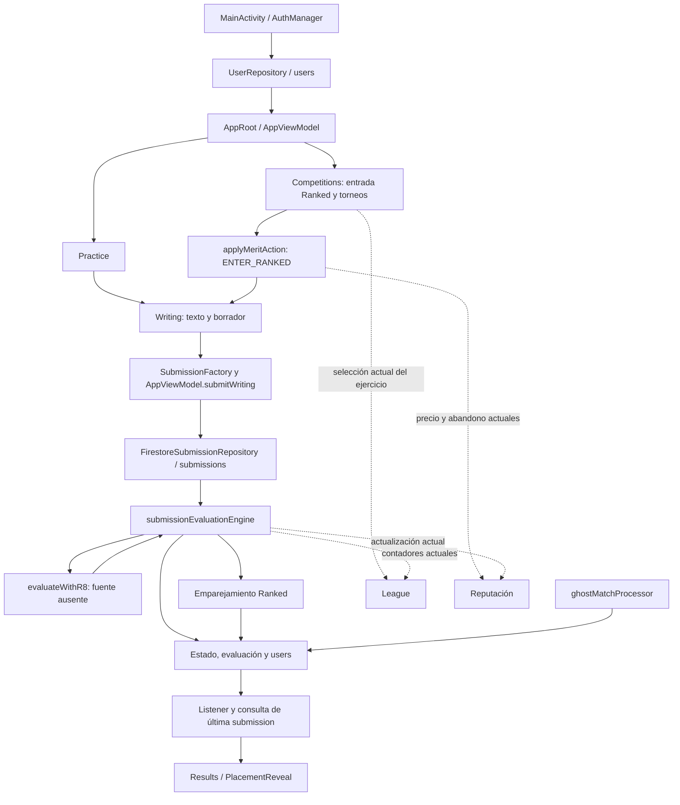

# Nota de edición para GitHub

Versión publicable de un análisis histórico: se adaptaron enlaces locales a referencias del repositorio y al índice de fuentes; las copias locales completas permanecen preservadas. Las frases de permisos o estado de la etapa anterior no sustituyen [STATUS](../STATUS.md) ni la autorización documental U5. No se publican capturas privadas ni originales completos del profesor. Algunas conclusiones históricas fueron precisadas en [REFACTOR_SCOPE](../REFACTOR_SCOPE.md), especialmente exclusiones específicas de D1.

# Mapa técnico del núcleo Inkr8 y sus dependencias

**Fecha:** 3 de octubre de 2026. **Estado:** análisis de lectura; no es un diseño aprobado ni una instrucción de implementación.

**Versión examinada:** `64983846d6dbf4cdfafcdd508464cd140a2a862e`, rama master de [Inkr8-ISW2](https://github.com/Rnz5/Inkr8-ISW2/tree/64983846d6dbf4cdfafcdd508464cd140a2a862e). El remoto conservaba ese commit al comprobarlo en esta etapa.

Este mapa complementa la [auditoría de contextualización](AUDIT_2026-10-02.md). La delimitación D1 aprobada por el grupo y U2/U3 gobiernan el alcance: núcleo de escritura/evaluación, Practice, Ranked y rating conservados; torneos, ligas, reputación y Merit —ganancias y todos sus usos incluidos— retirados del producto objetivo; temporadas por incorporar.

Se distinguen **hechos observados**, **impactos derivados** y **decisiones pendientes del equipo**. Las flechas representan llamadas y persistencia existentes, no una arquitectura propuesta. No se modificaron producción, fuentes originales, baseline, GitHub ni AGENTS.md.

**Actualización U3:** la [captura del PO aportada por Marco](../SOURCE_INDEX.md#decisiones-y-autorizaciones-de-este-chat) resuelve Merit: «volarlos» incluye «merit, la ganancia y su uso para ranked y demás cosas». Se retira también el pago en Merit para Ranked. Las tablas de código describen el comportamiento anterior existente, no una intención de conservar su economía. No se define una moneda o mecanismo sustituto.

## 1. Resultado que condiciona la intervención

Las funciones retiradas atraviesan el flujo conservado. No corresponde traducir las exclusiones a una lista de archivos que se puedan borrar automáticamente.

- **Competitions contiene la entrada a Ranked y los torneos.** Además, la liga del usuario decide qué ejercicio Ranked se ofrece.
- **Merit y reputación intervienen en la entrada y el abandono de Ranked.** U3 retira Merit completo; deben separarse autenticación, condiciones no económicas y estado de sesión de los cobros y penalizaciones retirados.
- **El evaluador normal mezcla evaluación, recompensas, placement, reputación, emparejamiento y contadores de ligas.**
- **El perfil y la cabecera compartida muestran ligas, Pantheon y datos económicos.** Alcanzan pantallas del núcleo.
- **Los snapshots diarios/semanales/mensuales son estadísticas agregadas.** No existe en el código examinado una implementación identificable de las temporadas solicitadas.

Esto obliga a separar tres tipos de trabajo en la trazabilidad: preservación interna del núcleo, retirada funcional aprobada e incorporación de temporadas. La recuperación del build constituye otra tarea de infraestructura.

## 2. Flujo observado del núcleo

La evaluación y el emparejamiento son etapas distintas: `status=EVALUATED` puede coexistir con `matchStatus=PENDING`. La aplicación resuelve la pantalla de espera por el estado de evaluación. Un resultado Ranked puede recibir después la actualización del emparejamiento.

Evidencia: [navegación](https://github.com/Rnz5/Inkr8-ISW2/blob/64983846d6dbf4cdfafcdd508464cd140a2a862e/app/src/main/java/com/inkr8/AppRoot.kt#L32), [envío](https://github.com/Rnz5/Inkr8-ISW2/blob/64983846d6dbf4cdfafcdd508464cd140a2a862e/app/src/main/java/com/inkr8/viewmodel/AppViewModel.kt#L140), [persistencia](https://github.com/Rnz5/Inkr8-ISW2/blob/64983846d6dbf4cdfafcdd508464cd140a2a862e/app/src/main/java/com/inkr8/repository/FirestoreSubmissionRepository.kt#L19), [trigger de evaluación](https://github.com/Rnz5/Inkr8-ISW2/blob/64983846d6dbf4cdfafcdd508464cd140a2a862e/functions/src/submissions/submissionEvaluationEngine.ts#L95), [espera y resolución](https://github.com/Rnz5/Inkr8-ISW2/blob/64983846d6dbf4cdfafcdd508464cd140a2a862e/app/src/main/java/com/inkr8/viewmodel/AppViewModel.kt#L278).

## 3. Piezas del núcleo y límites de conservación

| Pieza | Archivos / evidencia | Papel observado y límite |
|---|---|---|
| Acceso y usuario | [MainActivity](https://github.com/Rnz5/Inkr8-ISW2/blob/64983846d6dbf4cdfafcdd508464cd140a2a862e/app/src/main/java/com/inkr8/MainActivity.kt), [AuthManager](https://github.com/Rnz5/Inkr8-ISW2/blob/64983846d6dbf4cdfafcdd508464cd140a2a862e/app/src/main/java/com/inkr8/AuthManager.kt), [UserRepository](https://github.com/Rnz5/Inkr8-ISW2/blob/64983846d6dbf4cdfafcdd508464cd140a2a862e/app/src/main/java/com/inkr8/repository/UserRepository.kt), [userInitializer](https://github.com/Rnz5/Inkr8-ISW2/blob/64983846d6dbf4cdfafcdd508464cd140a2a862e/functions/src/users/userInitializer.ts) | Autenticación, carga/creación y observación del usuario. El inicializador crea también campos de reputación y torneos; conservar el acceso no exige conservar esos campos como funciones. |
| Navegación y estado | [AppRoot](https://github.com/Rnz5/Inkr8-ISW2/blob/64983846d6dbf4cdfafcdd508464cd140a2a862e/app/src/main/java/com/inkr8/AppRoot.kt#L32), [AppViewModel](https://github.com/Rnz5/Inkr8-ISW2/blob/64983846d6dbf4cdfafcdd508464cd140a2a862e/app/src/main/java/com/inkr8/viewmodel/AppViewModel.kt#L19), [MainPagerScreen](https://github.com/Rnz5/Inkr8-ISW2/blob/64983846d6dbf4cdfafcdd508464cd140a2a862e/app/src/main/java/com/inkr8/screens/MainPagerScreen.kt#L16), [Screen](https://github.com/Rnz5/Inkr8-ISW2/blob/64983846d6dbf4cdfafcdd508464cd140a2a862e/app/src/main/java/com/inkr8/data/Screen.kt) | Coordina varias áreas. El pager pasa callbacks y un Tournament opcional a la escritura compartida. La forma final de coordinación es decisión del equipo. |
| Practice y elección del ejercicio | [Practice](https://github.com/Rnz5/Inkr8-ISW2/blob/64983846d6dbf4cdfafcdd508464cd140a2a862e/app/src/main/java/com/inkr8/screens/Practice.kt), [Gamemodes](https://github.com/Rnz5/Inkr8-ISW2/blob/64983846d6dbf4cdfafcdd508464cd140a2a862e/app/src/main/java/com/inkr8/data/Gamemodes.kt), [ThemeRepository](https://github.com/Rnz5/Inkr8-ISW2/blob/64983846d6dbf4cdfafcdd508464cd140a2a862e/app/src/main/java/com/inkr8/repository/ThemeRepository.kt), [TopicRepository](https://github.com/Rnz5/Inkr8-ISW2/blob/64983846d6dbf4cdfafcdd508464cd140a2a862e/app/src/main/java/com/inkr8/repository/TopicRepository.kt) | Standard y On-Topic, carga de temas/topics. La cabecera compartida arrastra la presentación de ligas/Pantheon. |
| Entrada Ranked | [Competitions](https://github.com/Rnz5/Inkr8-ISW2/blob/64983846d6dbf4cdfafcdd508464cd140a2a862e/app/src/main/java/com/inkr8/screens/Competitions.kt#L51), [botón ENTER_RANKED](https://github.com/Rnz5/Inkr8-ISW2/blob/64983846d6dbf4cdfafcdd508464cd140a2a862e/app/src/main/java/com/inkr8/screens/Competitions.kt#L216), [acción de entrada](https://github.com/Rnz5/Inkr8-ISW2/blob/64983846d6dbf4cdfafcdd508464cd140a2a862e/functions/src/users/applyMeritAction.ts#L164) | Ranked convive con el feed de torneos. Selección ligada a ligas y entrada ligada a Merit/reputación. Requiere criterios funcionales antes de reemplazar estas reglas. |
| Escritura y borrador | [Writing](https://github.com/Rnz5/Inkr8-ISW2/blob/64983846d6dbf4cdfafcdd508464cd140a2a862e/app/src/main/java/com/inkr8/screens/Writing.kt#L37), [DraftManager](https://github.com/Rnz5/Inkr8-ISW2/blob/64983846d6dbf4cdfafcdd508464cd140a2a862e/app/src/main/java/com/inkr8/utils/DraftManager.kt), [WordRepository](https://github.com/Rnz5/Inkr8-ISW2/blob/64983846d6dbf4cdfafcdd508464cd140a2a862e/app/src/main/java/com/inkr8/repository/WordRepository.kt), [ValidationUtils](https://github.com/Rnz5/Inkr8-ISW2/blob/64983846d6dbf4cdfafcdd508464cd140a2a862e/app/src/main/java/com/inkr8/utils/ValidationUtils.kt#L9) | Carga palabras, cuenta/valida texto y gestiona borradores. Incluye ramas Tournament y claves con tournamentId. La compatibilidad de borradores se debe tratar explícitamente. |
| Construcción y persistencia del envío | [SubmissionFactory](https://github.com/Rnz5/Inkr8-ISW2/blob/64983846d6dbf4cdfafcdd508464cd140a2a862e/app/src/main/java/com/inkr8/evaluation/SubmissionFactory.kt), [Submissions](https://github.com/Rnz5/Inkr8-ISW2/blob/64983846d6dbf4cdfafcdd508464cd140a2a862e/app/src/main/java/com/inkr8/data/Submissions.kt), [SubmissionMapper](https://github.com/Rnz5/Inkr8-ISW2/blob/64983846d6dbf4cdfafcdd508464cd140a2a862e/app/src/main/java/com/inkr8/mappers/SubmissionMapper.kt#L37), [FirestoreSubmissionRepository](https://github.com/Rnz5/Inkr8-ISW2/blob/64983846d6dbf4cdfafcdd508464cd140a2a862e/app/src/main/java/com/inkr8/repository/FirestoreSubmissionRepository.kt#L19) | Crea ID y metadatos, convierte dominio a DTO y escribe en la colección raíz submissions. El contrato cruza Kotlin y TypeScript. |
| Evaluación y resultados | [submissionEvaluationEngine](https://github.com/Rnz5/Inkr8-ISW2/blob/64983846d6dbf4cdfafcdd508464cd140a2a862e/functions/src/submissions/submissionEvaluationEngine.ts#L95), [EvaluationMapper](https://github.com/Rnz5/Inkr8-ISW2/blob/64983846d6dbf4cdfafcdd508464cd140a2a862e/app/src/main/java/com/inkr8/mappers/EvaluationMapper.kt), [Results](https://github.com/Rnz5/Inkr8-ISW2/blob/64983846d6dbf4cdfafcdd508464cd140a2a862e/app/src/main/java/com/inkr8/screens/Results.kt#L55), [LoadingScreen](https://github.com/Rnz5/Inkr8-ISW2/blob/64983846d6dbf4cdfafcdd508464cd140a2a862e/app/src/main/java/com/inkr8/screens/LoadingScreen.kt) | Trigger, evaluación y feedback. Falta el evaluador R8; lectura estática no valida una ejecución real. La economía y Ranked están entrelazados con la evaluación. |
| Rating y emparejamiento | [placement](https://github.com/Rnz5/Inkr8-ISW2/blob/64983846d6dbf4cdfafcdd508464cd140a2a862e/functions/src/submissions/submissionEvaluationEngine.ts#L303), [tryMatchRankedSubmission](https://github.com/Rnz5/Inkr8-ISW2/blob/64983846d6dbf4cdfafcdd508464cd140a2a862e/functions/src/submissions/submissionEvaluationEngine.ts#L420), [ghostMatchProcessor](https://github.com/Rnz5/Inkr8-ISW2/blob/64983846d6dbf4cdfafcdd508464cd140a2a862e/functions/src/submissions/ghostMatchProcessor.ts#L5) | Rating conservado; las escrituras de reputación y de contadores de ligas pertenecen a funciones retiradas. No se equipara rating con liga. |
| Perfil e historial | [Profile](https://github.com/Rnz5/Inkr8-ISW2/blob/64983846d6dbf4cdfafcdd508464cd140a2a862e/app/src/main/java/com/inkr8/screens/Profile.kt#L37), [SubmissionsScreen](https://github.com/Rnz5/Inkr8-ISW2/blob/64983846d6dbf4cdfafcdd508464cd140a2a862e/app/src/main/java/com/inkr8/screens/SubmissionsScreen.kt), [SavedSubmissionsScreen](https://github.com/Rnz5/Inkr8-ISW2/blob/64983846d6dbf4cdfafcdd508464cd140a2a862e/app/src/main/java/com/inkr8/screens/SavedSubmissionsScreen.kt), [Users](https://github.com/Rnz5/Inkr8-ISW2/blob/64983846d6dbf4cdfafcdd508464cd140a2a862e/app/src/main/java/com/inkr8/data/Users.kt#L3) | Perfil básico/historial conservados conforme al alcance. Campos, compras y estadísticas avanzadas deben clasificarse por función; no se conserva automáticamente toda la pantalla. |
| Cierre de sesión Ranked | [finishRankedSession](https://github.com/Rnz5/Inkr8-ISW2/blob/64983846d6dbf4cdfafcdd508464cd140a2a862e/app/src/main/java/com/inkr8/repository/UserRepository.kt#L339), [rankedSessionCleaner](https://github.com/Rnz5/Inkr8-ISW2/blob/64983846d6dbf4cdfafcdd508464cd140a2a862e/functions/src/users/rankedSessionCleaner.ts#L5) | Mantiene estado de sesión. El mantenimiento programado también penaliza reputación; eliminarlo entero dejaría sin esa limpieza a Ranked. |
| Servicios compartidos | [Firebase admin](https://github.com/Rnz5/Inkr8-ISW2/blob/64983846d6dbf4cdfafcdd508464cd140a2a862e/functions/src/firebase/admin.ts), [SystemConfig](https://github.com/Rnz5/Inkr8-ISW2/blob/64983846d6dbf4cdfafcdd508464cd140a2a862e/app/src/main/java/com/inkr8/utils/SystemConfig.kt), [índices Firestore](https://github.com/Rnz5/Inkr8-ISW2/blob/64983846d6dbf4cdfafcdd508464cd140a2a862e/firestore.indexes.json) | Configuración, nombres y consultas compartidas. No son módulos eliminables por su uso en torneos. Los índices requieren revisión por consultas vigentes, no limpieza masiva. |

La presencia de publicidad o compras en el flujo no constituye una ampliación del alcance. Se inventarían requisitos si se decidiera aquí su comportamiento objetivo sin consultar D1 y los criterios de aceptación.

## 4. Fronteras entre núcleo y funciones retiradas

| ID | Conexión comprobada | Impacto derivado | Lo que debe concretar el equipo |
|---|---|---|---|
| F01 | [MainPagerScreen](https://github.com/Rnz5/Inkr8-ISW2/blob/64983846d6dbf4cdfafcdd508464cd140a2a862e/app/src/main/java/com/inkr8/screens/MainPagerScreen.kt#L22) pasa Tournament y callbacks de torneos; [AppRoot](https://github.com/Rnz5/Inkr8-ISW2/blob/64983846d6dbf4cdfafcdd508464cd140a2a862e/app/src/main/java/com/inkr8/AppRoot.kt#L58) conecta la escritura. | Retirar rutas de torneos afecta firmas y coordinación compartidas con Practice/Ranked. | Mantener caminos de navegación y retorno del núcleo sin rutas alcanzables de torneos. |
| F02 | [AppViewModel](https://github.com/Rnz5/Inkr8-ISW2/blob/64983846d6dbf4cdfafcdd508464cd140a2a862e/app/src/main/java/com/inkr8/viewmodel/AppViewModel.kt#L22) recibe un repositorio de torneos; [submitWriting](https://github.com/Rnz5/Inkr8-ISW2/blob/64983846d6dbf4cdfafcdd508464cd140a2a862e/app/src/main/java/com/inkr8/viewmodel/AppViewModel.kt#L140) bifurca entre Tournament y envío normal. | Retirar la rama Tournament no equivale a reemplazar el envío entero. | Delimitar estado/callbacks retirados y comportamiento esperado ante éxito/error del envío normal. |
| F03 | [Competitions](https://github.com/Rnz5/Inkr8-ISW2/blob/64983846d6dbf4cdfafcdd508464cd140a2a862e/app/src/main/java/com/inkr8/screens/Competitions.kt#L85) selecciona Standard para SCRIBE/STYLIST y para otras ligas puede elegir Standard u On-Topic. | La eliminación de ligas deja sin fundamento una regla de selección del ejercicio Ranked. | Regla de selección del ejercicio sin ligas, con ejemplos verificables. No se propone una regla por defecto. |
| F04 | [RankedCostCalculator](https://github.com/Rnz5/Inkr8-ISW2/blob/64983846d6dbf4cdfafcdd508464cd140a2a862e/app/src/main/java/com/inkr8/economy/RankedCostCalculator.kt) y [calculateRankedEntryCost](https://github.com/Rnz5/Inkr8-ISW2/blob/64983846d6dbf4cdfafcdd508464cd140a2a862e/functions/src/utils/meritCalculator.ts#L11) usan rachas y reputación. | U3 retira todo cobro Merit; las fórmulas actuales dejan de ser reglas del producto objetivo. | Verificar entrada Ranked sin pago Merit y sin presentación/cálculo de costes de esa moneda. |
| F05 | [ENTER_RANKED / ABANDON_RANKED](https://github.com/Rnz5/Inkr8-ISW2/blob/64983846d6dbf4cdfafcdd508464cd140a2a862e/functions/src/users/applyMeritAction.ts#L164) penalizan abandono y actualizan estado/rachas junto a reputación. | El archivo también autentica, verifica condiciones de entrada y gestiona sesiones; esas responsabilidades no económicas no desaparecen automáticamente al retirar Merit. | Qué condiciones no económicas de entrada, límite diario, rachas y cierre permanecen; retirar cobros Merit y efectos de reputación. |
| F06 | [evaluación Ranked](https://github.com/Rnz5/Inkr8-ISW2/blob/64983846d6dbf4cdfafcdd508464cd140a2a862e/functions/src/submissions/submissionEvaluationEngine.ts#L303) termina sesiones y modifica reputación/placement; [emparejamiento](https://github.com/Rnz5/Inkr8-ISW2/blob/64983846d6dbf4cdfafcdd508464cd140a2a862e/functions/src/submissions/submissionEvaluationEngine.ts#L529) actualiza ligas. | El mismo proceso contiene reglas conservadas y retiradas. | Preservación de score/rating y resultados; ausencia de mutaciones de reputación y de contadores de ligas. |
| F07 | [ghostMatchProcessor](https://github.com/Rnz5/Inkr8-ISW2/blob/64983846d6dbf4cdfafcdd508464cd140a2a862e/functions/src/submissions/ghostMatchProcessor.ts#L75) cambia rating y contadores de ligas. | La retirada de ligas alcanza un proceso programado que resuelve Ranked pendiente. | Aceptación del fallback Ranked, separada de la eliminación de su contabilidad de ligas. |
| F08 | [rankedSessionCleaner](https://github.com/Rnz5/Inkr8-ISW2/blob/64983846d6dbf4cdfafcdd508464cd140a2a862e/functions/src/users/rankedSessionCleaner.ts#L21) reinicia sesiones y reduce reputación en el mismo batch. | Quitar el archivo completo quitaría ambas funciones. | Conservación o regla explícita del cierre de sesiones caducadas; reputación retirada. |
| F09 | [UserHeaderCard](https://github.com/Rnz5/Inkr8-ISW2/blob/64983846d6dbf4cdfafcdd508464cd140a2a862e/app/src/main/java/com/inkr8/utils/UserHeaderCard.kt#L31), [Profile](https://github.com/Rnz5/Inkr8-ISW2/blob/64983846d6dbf4cdfafcdd508464cd140a2a862e/app/src/main/java/com/inkr8/screens/Profile.kt#L49) y [PlacementRevealScreen](https://github.com/Rnz5/Inkr8-ISW2/blob/64983846d6dbf4cdfafcdd508464cd140a2a862e/app/src/main/java/com/inkr8/screens/PlacementRevealScreen.kt#L22) dependen de League. | Cambian presentación y mensajes incluso fuera de Competitions. | Cómo se presenta rating y resultado de placement sin ligas; limitar ajustes visuales a los necesarios por el cambio funcional. |
| F10 | [AppViewModel.observePantheonStatus](https://github.com/Rnz5/Inkr8-ISW2/blob/64983846d6dbf4cdfafcdd508464cd140a2a862e/app/src/main/java/com/inkr8/viewmodel/AppViewModel.kt#L127) y [getTop100Users](https://github.com/Rnz5/Inkr8-ISW2/blob/64983846d6dbf4cdfafcdd508464cd140a2a862e/app/src/main/java/com/inkr8/repository/UserRepository.kt#L306) consultan ranking global; perfil/cabeceras lo muestran. | El ranking global heredado y Pantheon no son por sí mismos un ranking por temporada. | Reconciliar la retirada/simplificación de rankings de D1 con la incorporación de ranking e historial por temporada; no reutilizarlo como solución aprobada. |
| F11 | [Users](https://github.com/Rnz5/Inkr8-ISW2/blob/64983846d6dbf4cdfafcdd508464cd140a2a862e/app/src/main/java/com/inkr8/data/Users.kt#L3) y [userInitializer](https://github.com/Rnz5/Inkr8-ISW2/blob/64983846d6dbf4cdfafcdd508464cd140a2a862e/functions/src/users/userInitializer.ts#L16) mezclan datos del núcleo, torneos, reputación y economía. | La limpieza lógica, compatibilidad con datos existentes y borrado físico son operaciones distintas. | Política de compatibilidad de lecturas y tratamiento de datos históricos. La exclusión no autoriza borrar Firestore. |
| F12 | [dailyStatsSnapshot](https://github.com/Rnz5/Inkr8-ISW2/blob/64983846d6dbf4cdfafcdd508464cd140a2a862e/functions/src/stats/dailyStatsSnapshot.ts#L96) contabiliza torneos; [weeklyStatsSnapshot](https://github.com/Rnz5/Inkr8-ISW2/blob/64983846d6dbf4cdfafcdd508464cd140a2a862e/functions/src/stats/weeklyStatsSnapshot.ts#L60) y [monthlyStatsSnapshot](https://github.com/Rnz5/Inkr8-ISW2/blob/64983846d6dbf4cdfafcdd508464cd140a2a862e/functions/src/stats/monthlyStatsSnapshot.ts#L51) agregan ese dato. | La dependencia de torneos continúa fuera de su carpeta, junto a métricas de Practice/Ranked y Merit. | Ubicar estadísticas en el alcance vigente y separar cualquier retirada de la conservación de métricas autorizadas. |

## 5. Candidatos propios de las áreas retiradas

Esta clasificación por responsabilidad observada sirve para organizar la revisión futura. **No es autorización para borrar archivos, exportaciones, despliegues ni datos.**

- **Torneos Android:** FirestoreTournamentRepository; Tournament y TournamentLeaderboardEntry; CreateTournamentScreen, TournamentDetalis —nombre real del archivo— y TournamentResultsScreen; TournamentCard; TournamentTimingConfig; TournamentEconomyCalculator, TournamentEconomyProjection y TournamentRewardCalculator.
- **Torneos Functions:** los 13 archivos de `functions/src/tournaments/` y `utils/tournamentRewards.ts`. Sus 9 exportaciones actuales están al inicio de [index.ts](https://github.com/Rnz5/Inkr8-ISW2/blob/64983846d6dbf4cdfafcdd508464cd140a2a862e/functions/src/index.ts#L1).
- **Ligas:** [Leagues.kt](https://github.com/Rnz5/Inkr8-ISW2/blob/64983846d6dbf4cdfafcdd508464cd140a2a862e/app/src/main/java/com/inkr8/rating/Leagues.kt) y [leagueManager.ts](https://github.com/Rnz5/Inkr8-ISW2/blob/64983846d6dbf4cdfafcdd508464cd140a2a862e/functions/src/utils/leagueManager.ts); usos y contadores en los archivos compartidos enumerados en F03/F06/F07/F09.
- **Reputación:** [ReputationManager.kt](https://github.com/Rnz5/Inkr8-ISW2/blob/64983846d6dbf4cdfafcdd508464cd140a2a862e/app/src/main/java/com/inkr8/rating/ReputationManager.kt) y [reputationManager.ts](https://github.com/Rnz5/Inkr8-ISW2/blob/64983846d6dbf4cdfafcdd508464cd140a2a862e/functions/src/utils/reputationManager.ts); llamadas y campos compartidos en F04/F05/F06/F08/F11.
- **Merit:** EconomyConfig, RankedCostCalculator y meritCalculator; ramas de ganancia/cobro/transacciones de applyMeritAction, evaluación y guardado; meritReleaseController y systemTaxController; datos y presentación de saldo/cap/hold y compras de esa moneda. La revisión alcanza dependencias compartidas: no borrar funciones conservadas de perfil, guardado o Ranked por tener hoy un coste.
- **Ranking global/Pantheon:** [Leaderboard](https://github.com/Rnz5/Inkr8-ISW2/blob/64983846d6dbf4cdfafcdd508464cd140a2a862e/app/src/main/java/com/inkr8/screens/Leaderboard.kt), [PantheonManager](https://github.com/Rnz5/Inkr8-ISW2/blob/64983846d6dbf4cdfafcdd508464cd140a2a862e/app/src/main/java/com/inkr8/rating/PantheonManager.kt), consulta Top100 y sus consumidores. Su tratamiento sigue D1 y debe distinguirse de las HU de temporadas.

El grafo compartido de importaciones, listeners, modelos y exportaciones es parte del cierre de cada futura retirada. El plan debe revisar también consumidores de campos existentes, no sólo los nombres de archivo.

## 6. Ranked actual: reglas observadas, no nuevas decisiones

| Etapa | Comportamiento encontrado | Evidencia |
|---|---|---|
| Selección | Liga decide Standard o selección que puede incluir On-Topic; si falta tema/topic hay fallback Standard. | [Competitions](https://github.com/Rnz5/Inkr8-ISW2/blob/64983846d6dbf4cdfafcdd508464cd140a2a862e/app/src/main/java/com/inkr8/screens/Competitions.kt#L85) |
| Entrada | Cliente muestra coste y comprueba Merit. Servidor exige autenticación, verifica el usuario, limita a 5 envíos Ranked diarios usando día UTC, calcula/descuenta coste y marca sesión activa. | [botón de entrada](https://github.com/Rnz5/Inkr8-ISW2/blob/64983846d6dbf4cdfafcdd508464cd140a2a862e/app/src/main/java/com/inkr8/screens/Competitions.kt#L216), [ENTER_RANKED](https://github.com/Rnz5/Inkr8-ISW2/blob/64983846d6dbf4cdfafcdd508464cd140a2a862e/functions/src/users/applyMeritAction.ts#L164) |
| Escritura | Standard: 4 palabras requeridas, mínimo 50 y máximo 150 palabras. On-Topic: 2 requeridas, mínimo 50 y máximo 200. No hay límite temporal configurado en esos modelos. | [Gamemodes](https://github.com/Rnz5/Inkr8-ISW2/blob/64983846d6dbf4cdfafcdd508464cd140a2a862e/app/src/main/java/com/inkr8/data/Gamemodes.kt) |
| Envío | AppViewModel asigna autor, PENDING y evaluation nula; el repositorio escribe el DTO con ID propio. | [submitWriting](https://github.com/Rnz5/Inkr8-ISW2/blob/64983846d6dbf4cdfafcdd508464cd140a2a862e/app/src/main/java/com/inkr8/viewmodel/AppViewModel.kt#L140), [addSubmission](https://github.com/Rnz5/Inkr8-ISW2/blob/64983846d6dbf4cdfafcdd508464cd140a2a862e/app/src/main/java/com/inkr8/repository/FirestoreSubmissionRepository.kt#L19) |
| Evaluación | Trigger de creación de submission; filtra calidad, llama R8 y persiste score/feedback/recompensas. Para Ranked modifica campos de sesión y placement. | [submissionEvaluationEngine](https://github.com/Rnz5/Inkr8-ISW2/blob/64983846d6dbf4cdfafcdd508464cd140a2a862e/functions/src/submissions/submissionEvaluationEngine.ts#L95) |
| Placement | Acumula 6 evaluaciones Ranked; al completar establece rating inicial como mínimo entre 120 y floor(promedio/100 × 120). Marca isPlaced y cierra sesión. | [placement](https://github.com/Rnz5/Inkr8-ISW2/blob/64983846d6dbf4cdfafcdd508464cd140a2a862e/functions/src/submissions/submissionEvaluationEngine.ts#L303) |
| Emparejamiento | Busca otras submissions Ranked EVALUATED/PENDING de las últimas 48 horas, excluye mismo autor y acepta diferencia de rating de hasta 20; compara scores y escribe MATCHED. | [tryMatchRankedSubmission](https://github.com/Rnz5/Inkr8-ISW2/blob/64983846d6dbf4cdfafcdd508464cd140a2a862e/functions/src/submissions/submissionEvaluationEngine.ts#L420) |
| Cambio de rating | Usa la función local calculateDynamicRatingChange, con ajuste por diferencia de rating y restricciones por tramo; aplica actualización de rating a usuarios ya colocados. | [fórmula local](https://github.com/Rnz5/Inkr8-ISW2/blob/64983846d6dbf4cdfafcdd508464cd140a2a862e/functions/src/submissions/submissionEvaluationEngine.ts#L24), [uso real](https://github.com/Rnz5/Inkr8-ISW2/blob/64983846d6dbf4cdfafcdd508464cd140a2a862e/functions/src/submissions/submissionEvaluationEngine.ts#L477) |
| Sin rival | Proceso horario busca pendientes de más de 48 horas, hasta 50. Usa promedio de últimos 10 scores si hay al menos 3, o 65; margen ±2; cambio WIN +2, LOSS −4, DRAW +1; actualiza rating sólo si isPlaced. | [ghostMatchProcessor](https://github.com/Rnz5/Inkr8-ISW2/blob/64983846d6dbf4cdfafcdd508464cd140a2a862e/functions/src/submissions/ghostMatchProcessor.ts#L5) |
| Sesión caducada | Proceso cada 15 minutos limpia sesiones activas con inicio de hace 60 minutos o más y reduce reputación. | [rankedSessionCleaner](https://github.com/Rnz5/Inkr8-ISW2/blob/64983846d6dbf4cdfafcdd508464cd140a2a862e/functions/src/users/rankedSessionCleaner.ts#L5) |
| Espera de resultado | Listener y consulta cada 3 segundos de la última submission del usuario; timeout cuando elapsed supera 90 segundos. EVALUATED navega a resultados o reveal; FAILED vuelve a home. | [startLoadingResult](https://github.com/Rnz5/Inkr8-ISW2/blob/64983846d6dbf4cdfafcdd508464cd140a2a862e/app/src/main/java/com/inkr8/viewmodel/AppViewModel.kt#L278) |

**Precaución de lectura:** `utils/ratingCalculator.ts` exporta calculateNewRating, pero no se encontró una llamada a ella en `functions/src`. No representa por su nombre la fórmula ejecutada en el emparejamiento observado. Tampoco se han validado concurrencia, idempotencia o comportamiento desplegado.

## 7. Contratos y puntos de verificación

| ID | Hecho de código | Consecuencia que puede afirmarse | Verificación pendiente |
|---|---|---|---|
| C01 | Kotlin serializa gamemodeName en [SubmissionMapper](https://github.com/Rnz5/Inkr8-ISW2/blob/64983846d6dbf4cdfafcdd508464cd140a2a862e/app/src/main/java/com/inkr8/mappers/SubmissionMapper.kt#L44) y [FirestoreSubmission](https://github.com/Rnz5/Inkr8-ISW2/blob/64983846d6dbf4cdfafcdd508464cd140a2a862e/app/src/main/java/com/inkr8/repository/FirestoreSubmission.kt#L14). El evaluador lee data.gamemode y usa STANDARD si falta, en [entrada a R8](https://github.com/Rnz5/Inkr8-ISW2/blob/64983846d6dbf4cdfafcdd508464cd140a2a862e/functions/src/submissions/submissionEvaluationEngine.ts#L219). dailyStats lee gamemodeName. | Hay una diferencia estática de nombres entre productor y consumidor del mismo flujo. | Contrato real y documentos de ejemplo sin datos personales; efecto sobre R8, que no está disponible. No se corrige aquí. |
| C02 | DTO Kotlin contiene themeId/topicId, pero no themeName/topicName. R8 recibe esos nombres desde data o null, en [entrada a R8](https://github.com/Rnz5/Inkr8-ISW2/blob/64983846d6dbf4cdfafcdd508464cd140a2a862e/functions/src/submissions/submissionEvaluationEngine.ts#L221). | Este productor no aporta esos nombres en el DTO examinado. | Cómo recupera el evaluador el contexto temático; contrato esperado, con R8 original. |
| C03 | Se escribe en colección raíz submissions, y [getLastSubmission](https://github.com/Rnz5/Inkr8-ISW2/blob/64983846d6dbf4cdfafcdd508464cd140a2a862e/app/src/main/java/com/inkr8/repository/FirestoreSubmissionRepository.kt#L137) recupera por usuario/orden temporal. La espera no sigue explícitamente el ID que acaba de enviarse. | Identidad del resultado y orden de actualizaciones deben formar parte de la caracterización del flujo. | Casos de varios envíos, actualización tardía y timeout. Riesgo derivado; no fallo reproducido. |
| C04 | [SubmissionMapper](https://github.com/Rnz5/Inkr8-ISW2/blob/64983846d6dbf4cdfafcdd508464cd140a2a862e/app/src/main/java/com/inkr8/mappers/SubmissionMapper.kt#L22) transforma status desconocido en PENDING. Los estados de evaluación y emparejamiento son campos distintos. | Un contrato incompleto puede quedar representado como pendiente; EVALUATED no significa MATCHED. | Valores admitidos, errores y presentación tras actualización de matchResult. |
| C05 | Users contiene rating, rachas, placement, reputación, torneos y economía; varios procesos escriben sobre users. | El modelo compartido no se puede clasificar entero como función retirada. | Compatibilidad con documentos antiguos, valores predeterminados y escritores vigentes. |
| C06 | El UML/BD histórico representa algunas rutas distintas del código —users/submissions y themes/topics anidados frente a colecciones raíz actuales— según la auditoría. | El modelo histórico no se debe usar como especificación exacta del contrato actual. | Reconciliación posterior del modelo con alcance y código aceptados por el equipo. |

Estos puntos sirven para priorizar caracterización e integración. No son resultados de tests de Firebase ni una declaración de fallos en producción.

## 8. Temporadas: incorporación aprobada y evidencia faltante

Las HU **3.27** y **3.28** del informe ISW1 mencionan ranking de temporada actual e historial de temporadas. Marco confirmó su incorporación. La búsqueda de referencias `season/Season/temporada/Temporada` en el Kotlin de producción y en `functions/src` no encontró una implementación identificable.

Los snapshots existentes guardan registros diarios/semanales/mensuales de estadísticas. No definen identidad o ciclo de temporada, participantes, ranking por temporada ni historial individual. Por tanto, no acreditan la implementación de esas HU.

Antes de diseñar datos o lógica, el equipo necesita recuperar los criterios originales del backlog, que no apareció como Anexo A independiente entre las fuentes disponibles, y concretar:

1. Inicio, fin, duración y zona horaria de los períodos.
2. Participación: qué usuarios y qué envíos pertenecen a una temporada.
3. Magnitud que ordena el ranking, desempates y elegibilidad.
4. Relación entre rating general, placement y cambio de temporada.
5. Resultado del cierre: qué se conserva en historial y cómo se consulta.
6. Tratamiento de envíos pendientes o emparejados después del cierre y de los datos previos.

La inclusión está decidida; estas reglas no lo están. No se eligieron resets, fórmulas, colecciones, jobs ni índices de temporadas. Retirar el ranking global heredado no autoriza suponer que el ranking por temporada usará la misma consulta.

## 9. Baseline disponible y relación con este mapa

El baseline fue ejecutado durante la auditoría del 2 de octubre: **22 casos, 0 fallos, 0 errores y 0 omitidos**. En esta etapa se revisaron sus XML existentes; no se volvió a ejecutarlo porque no hubo cambios. [Configuración del arnés](https://github.com/Rnz5/Inkr8-ISW2/blob/64983846d6dbf4cdfafcdd508464cd140a2a862e/testing-baseline/build.gradle.kts) y [índice y límites de la ejecución](../TESTING_BASELINE.md).

| Suite | Casos | Relación con el alcance vigente |
|---|---:|---|
| EconomyConfigTest | 2 | Economía retirada por U3; caracterización histórica, sin obligación de conservarla. |
| RankedCostCalculatorTest | 5 | Precio Merit actual con reputación; ambos retirados. Evidencia histórica, no requisito de coste del Ranked futuro. |
| TournamentEconomyCalculatorTest | 3 | Área retirada; evidencia histórica, no obligación de conservar torneos. |
| TournamentRewardCalculatorTest | 3 | Área retirada; evidencia histórica. |
| ReputationManagerTest | 5 | Área retirada; evidencia histórica. |
| ValidationUtilsTest | 4 | Parte conservada de validación de texto en Kotlin; no cubre la pantalla completa ni el filtro de TypeScript. |

El arnés compila siete archivos Kotlin reales de producción. **No cubre** AppViewModel, repositorios Firebase, navegación, DTOs, TypeScript, R8, integración cliente-servidor ni temporadas. Las pruebas futuras deberán distinguir la caracterización del núcleo de la aceptación de retiradas y adiciones. No se modifica el baseline histórico para hacer parecer que los nuevos comportamientos ya existían.

Posibles objetivos de verificación posterior —lista de necesidades, no plan de pruebas aprobado—:

- Identidad y estados del envío, éxito, FAILED, timeout y actualización tardía.
- Concordancia Kotlin/TypeScript del contrato del ejercicio, evaluación y resultado Ranked.
- Rating/placement/emparejamiento conservados y ausencia de escrituras de reputación/ligas.
- Entrada y cierre de sesión Ranked sin cobro Merit, con las condiciones no económicas que el equipo confirme.
- Navegación del núcleo sin torneos y compatibilidad de datos/borradores vigentes.
- Temporadas con sus criterios humanos de límites, ranking, cierre e historial.

Las obligaciones de pruebas por integrante siguen la rúbrica oficial: el baseline no prueba por sí solo el cumplimiento individual.

## 10. Bloqueos de ejecución y límites de la evidencia

| Bloqueo comprobado en el checkout | Qué impide afirmar | Acción previa a una ejecución integral |
|---|---|---|
| Faltan archivos de build raíz/app; no está completo el wrapper principal. | No se verificó una compilación Android del producto completo. | Recuperar configuración original y versiones, sin inventar una reconstrucción como parte de esta auditoría. |
| Faltan package.json, lockfile y tsconfig de Functions. | No se instaló, compiló ni probó todo TypeScript. | Recuperar manifiestos y configuración auténticos. |
| evaluateWithR8.ts se importa desde dos motores y no existe en el checkout. | No se puede inspeccionar/ejecutar el evaluador ni confirmar el efecto de C01/C02. | Recuperar su fuente y contrato; no asumir modelo, prompts ni resultados. |
| No se dispone de configuración/reglas Firebase completas. | Índices presentes no prueban permisos, contratos ni despliegue operativo. | Recuperar configuración no secreta y entorno de prueba autorizado. |
| res sólo contiene strings.xml y pfpexample.png; hay referencias a R.drawable.defaultpng y R.drawable.r8pfp en archivos del núcleo. | Se observa incompletitud adicional de recursos; no se ejecutó el compilador para diagnosticarla. | Recuperar recursos originales o su fuente auténtica de generación. |

Ejemplo del último hallazgo: [UserHeaderCard](https://github.com/Rnz5/Inkr8-ISW2/blob/64983846d6dbf4cdfafcdd508464cd140a2a862e/app/src/main/java/com/inkr8/utils/UserHeaderCard.kt#L34). No se atribuyen todos los bloqueos a la refactorización: existen en el estado auditado anterior a ella.

## 11. Orden de trabajo que este mapa habilita

1. **Concretar alcance operativo y aceptación.** Usar F03–F09 para determinar reglas del núcleo tras retirar ligas/reputación/Merit y concretar las HU de temporadas. La permanencia de Merit ya está resuelta por U3. No reabrir exclusiones aprobadas.
2. **Recuperar ejecutabilidad y contrato real.** Reunir configuración original y R8; caracterizar C01–C05 en entorno de prueba. Puede avanzar en paralelo documental con el punto 1, sin decisiones de diseño.
3. **Diagnosticar responsabilidades y acoplamientos por un flujo acotado.** Candidatos para analizar: coordinación del envío en AppViewModel, entrada Ranked y evaluación. Elegir clases sólo con problema y evidencia; este mapa no decide patrones.
4. **Preparar propuesta humana de intervención y pruebas.** Separar cambios internos, retiradas y temporadas; acordar autoría, responsable y aceptación conforme a guía IA/rúbrica.
5. **Implementar únicamente cuando una etapa posterior lo autorice.** La contextualización actual no otorga permiso de modificación.

Esto no fija una secuencia de commits ni una arquitectura. La prioridad se deriva de dependencias y decisiones pendientes.

## 12. Siguiente chat recomendado y traspaso

**Nombre propuesto:** Inkr8 — Alcance operativo y criterios de aceptación.

**Objetivo:** convertir D1 y U2/U3 en criterios verificables para las conexiones de este mapa; selección del ejercicio Ranked sin ligas, entrada sin pago Merit, comportamiento tras retirar reputación y reglas de temporadas. Conservar la distinción entre refactorización y cambios funcionales.

**Entradas:** auditoría actualizada con U3, este mapa, captura del PO, delimitación D1, decisiones D2, reglas del profesor y HU reales disponibles. Este chat no requiere crear código ni AGENTS.md. Si sólo se dispone de títulos de HU, deberá declarar esa limitación.

**Entregable de salida:** matriz función/HU → decisión humana vigente → comportamiento observado → criterio confirmado o propuesta pendiente → evidencia → responsable de validar. No presentar criterios propuestos por IA como aprobados.

### Texto inicial listo para usar

> Actúa como coordinador de alcance y aceptación de Inkr8. Lee la auditoría y el mapa técnico adjuntos, y sus fuentes D1/D2 y las reglas oficiales del curso. D1 está aprobado por el grupo y es la fuente principal. Torneos, ligas, reputación y Merit quedan fuera; U3 confirma retirar la moneda Merit, sus ganancias y todos sus usos, incluido el pago para Ranked. Practice, Ranked, escritura/evaluación, perfil básico y rating se conservan según D1; temporadas se incorporarán por las HU 3.27/3.28. No reabras la permanencia de Merit ni inventes una moneda sustituta. Tu tarea es producir una matriz verificable de alcance y aceptación, concentrándote en F03–F09 y temporadas. Recupera criterios ya existentes antes de proponer otros, distingue hechos, propuestas y decisiones humanas, y plantea sólo las preguntas que falten. No modifiques código, documentos originales, GitHub, arquitectura o patrones, ni crees AGENTS.md. Las reglas todavía pendientes —selección del ejercicio Ranked sin ligas, condiciones no económicas de entrada y detalle de temporadas— y las decisiones de diseño corresponden al equipo.

**Documentos locales para adjuntar:**

- [Auditoría actualizada](AUDIT_2026-10-02.md)
- [Este mapa técnico](TECHNICAL_MAP_2026-10-03.md)

Los enlaces de código de esta edición publicable apuntan al commit auditado. Las fuentes privadas se localizan mediante SOURCE_INDEX; no se publican originales ni capturas. El nuevo chat no se ha creado automáticamente.

## 13. Registro de esta etapa

Se leyó el código del checkout auditado, se verificó la coincidencia del commit remoto, se revisaron importaciones, llamadas, exportaciones, modelos, mappers, consultas, procesos programados y resultados XML previos. Se produjo sólo este documento derivado fuera del repositorio y un enlace desde la auditoría. No se ejecutó la aplicación ni se comprobó un servicio desplegado. No se escogieron patrones ni se sustituyeron decisiones humanas.
